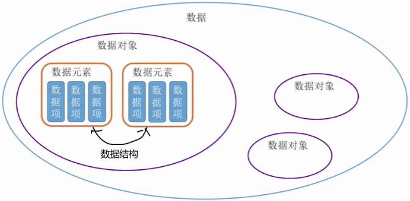
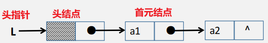
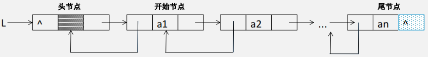
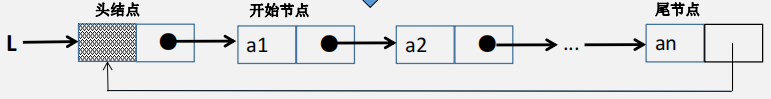
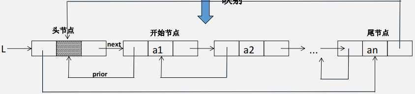
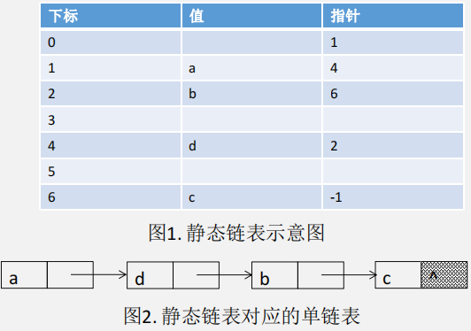
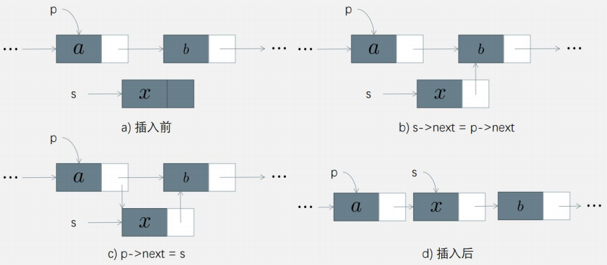
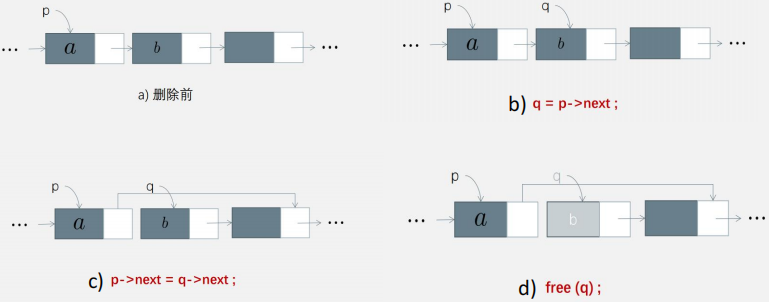
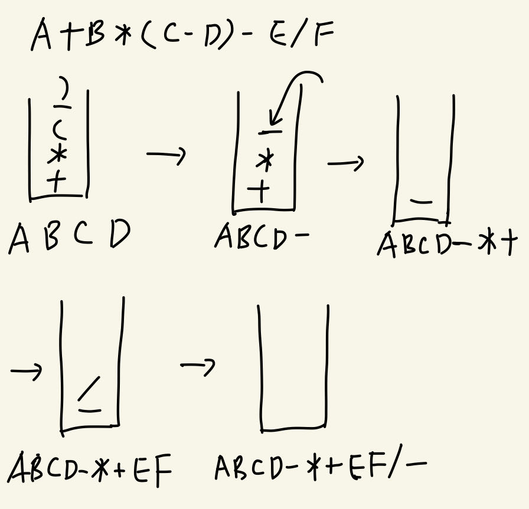
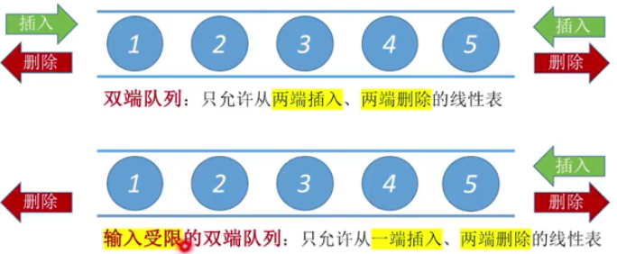

# 第一章 绪论

## 基本概念

数据：能输入到计算机中处理的符号的集合

数据项：**最小单位**

数据元素：**基本单位**，一个数据元素由若干个数据项组成

数据结构：存在一种或多种特定关系的数据元素的集合

数据对象：**相同性质**的数据元素的集合

数据类型：值的集合以及定义在该集合上的一组操作

抽象数据类型ADT：逻辑结构+数据的运算

## 数据结构三要素

**1.逻辑结构**

- 集合
- 线性结构
- 树形结构
- 图形结构

**2.存储结构（物理结构）**

- 顺序存储
  - 逻辑上相邻的运算在物理上也相邻
  - 优点：随机存取
  - 缺点：可能产生外部碎片
- 链式存储
  - 逻辑上相邻的元素在物理上可以不相邻
  - 优点：不产生外部碎片
  - 缺点：只能顺序存取，指针占用了额外的存储空间
- 索引存储
  - 建立索引表，存储（关键字，地址）
  - 优点：改查数据快
  - 缺点：增删数据需要修改索引表，增加了时间的开销；索引表占用了额外的存储空间
- 散列存储（哈希存储）
  - 根据关键字直接计算出元素的存储地址
  - 优点：增删改查快
  - 缺点：散列函数的设计；解决元素存储单元的冲突增加了时间和空间的开销

**3.数据的运算**

- 运算的定义是针对逻辑结构的
- 运算的实现是针对存储结构的

## 算法

**算法的定义**：

- 特定问题的求解步骤
- 指令的有限序列，每个指令表示一个或多个操作

**算法的特性**：

- 0个或多个输入
- 1个或多个输出

- 有穷性：必须执行有限步骤后完成
  - 算法是有穷的，程序可以无穷
- 确定性：每一步必须有确切的定义（相同的输入有相同的输出）
- 可行性：任何步骤都能被分解为基本的可执行操作，每个操作都能在有限时间内完成

**算法的评价**：

- 正确性：算法可以正确解决问题
- 可读性：算法程序应该易读，好理解
- 健壮性（鲁棒性）：可以处理非法数据、边界条件
- 高效率和低存储量

## 时间复杂度

复杂度运算规则：
$$
O(f(n))+O(g(n))=O(max(f(n),g(n))\\
O(f(n)) \times O(g(n))=O(f(n)\times g(n))
$$
常见的时间复杂度排序：
$$
O(1)\leq O(log_{2}{n})\leq O(n) \leq O(nlog_{2}{n}) \leq O(n^2) \leq O(n^3) \leq ... \leq O(n^k) \leq O(2^n) \leq O(n!) \leq O(n^n)
$$

- O($$n^2$$)表示执行时间与$$n^2$$成正比
- O(1)表示执行时间为常量，与问题规模n无关

~~~c++
int i;
int count = 0;
for(i=1; i<=n; i++){
	count++;
}
~~~

$$
\sum_{i=1}^{n}1=n => O(n^2)
$$

~~~c++
int i;
int count = 0;
for(i=1; i<=n; i*=2){
    count++;
}
~~~

设自增k次退出循环，此时$$2^k$$=n，则有
$$
\sum_{i=1}^{2^k}1=k+1=log_{2}{n}+1=>O(log_{2}{n})
$$

~~~c++
int i,j;
int count = 0;
for(i=1; i<=n; i++){
    for(j=1; j<=n; j++){
    	count++;
    }
}
~~~

$$
\sum_{i=1}^{n}\sum_{j=1}^{n}1=\sum_{i=1}^{n}n=n\sum_{i=1}^{n}1=n^2=>O(n^2)
$$

~~~c++
int i,j;
int count = 0;
for(i=1; i<=n; i++){
    for(j=1; j<=i; j++){
    	count++;
    }
}
~~~

$$
\sum_{i=1}^{n}\sum_{j=1}^{i}1=\sum_{i=1}^{n}i=\frac{(1+n)n}{2}=>O(n^2)
$$

~~~c++
int i,j;
int count = 0;
for(i=1; i<=n; i++){
    for(j=1; j<=i; j*=2){
    	count++;
    }
}
~~~

设j自增k次退出循环, 则有$$2^k$$=i
$$
\sum_{i=1}^{n}\sum_{j=1}^{2^k}1=\sum_{i=1}^{n}(k+1)=\sum_{i=1}^{n}(log_{2}{i}+1)=log_{2}{n!}+n=>O(log_{2}{n!})=O(nlog_{2}{n})
$$

~~~c++
int i,j;
int count = 0;
for(i=1; i<=n; i*=2){
    for(j=1; j<=i; j++){
    	count++;
    }
}
~~~

设i自增k次退出循环, 此时$$2^k$$=n, k=$$log_{2}{n}$$
$$
\sum_{i=1}^{2^k}\sum_{j=1}^{i}1=\sum_{i=1}^{2^k}i=1+2+...+2^k=2^{k+1}-1=2n-1=>O(n)
$$

~~~c++
for(int i=1;i<=n;i++){
	for(int j=1;j<=i;j++){
        for(int k=1;k<=j;k++){
			count++;
        }
    }
}
~~~

$$
\sum_{i=1}^{n}\sum_{j=1}^{i}\sum_{k=1}^{j}1=\sum_{i=1}^{n}\sum_{j=1}^{i}\frac{(1+i)i}{2}=\frac{1}{2}(\sum_{i=1}^{n}i+\sum_{i=1}^{n}i^2)=\frac{1}{2}[\frac{(1+n)n}{2}+\frac{n(n+1)(2n+1)}{6}]
$$

**while循环**

~~~c++
int y=0;
while((y+1)*(y+1) <= n){
    y = y+1;
}
~~~

$$
O(log_{2}{n})
$$

**循环体内的语句**

~~~c++
int i,j;
int count=0;
for(i=1; i<n; i++){
    for(j=1; j<n; j++){
        count++;
        i++;
    }
}
~~~

$$
O(n)
$$

## 空间复杂度

用于计算空间复杂度的：形参，局部变量，数组

- O($$n^2$$)表示所需辅助空间大小与$$n^2$$成正比
- O(1)表示所需辅助空间大小为常量，与问题规模n无关，称为**原地工作**

~~~c++
int foo(int n){  //n 4B
	int i=1;     //i 4B
    while(i<=n){
		i++;
    }
}

// 空间复杂度为O(8)=O(1) -> 算法原地工作
~~~

~~~c++
int foo(int n){    //4
	int arr[n][n]; //4n^2
    int arr2[n];   //4n
    int i;         //4
}

// 空间复杂度为O(4n^2+4n+8)=O(n^2)
~~~

**递归型**

~~~c++
int foo(int n){
	int a,b,c;
    if(n>1)
        foo(n-1);
}

int main(){
    // 以3为例
	foo(3);
}
~~~

| n递归次数 | 空间消耗    |
| --------- | ----------- |
| n=3       | n+a+b+c=16B |
| n=2       | n+a+b+c=16B |
| n=1       | n+a+b+c=16B |

- 故空间复杂度为O(16n)=O(n)

~~~c++
int foo(int n){
	int arr[n];
    if(n>1)
        foo(n-1);
}

int main(){
    // 以3为例
	foo(3);
}
~~~

| n递归次数 | 空间消耗            |
| --------- | ------------------- |
| n=3       | arr[n]+n = (3*4+4)B |
| n=2       | arr[n]+n = (2*4+4)B |
| n=1       | arr[n]+n = (1*4+4)B |

- 故空间复杂度为O([(1+2+...+n)*4+4n])=O($$n^2$$)

# 第二章 线性表

## 线性表的逻辑结构

线性表：n(n≥0)个相同数据类型的数据元素的有限序列

- **逻辑上**有先后顺序，而非物理位置上的前后次序

- 除表头元素外，每个元素有且仅有一个直接前驱

- 除表尾元素外，每个元素有且仅有一个直接后继

## 线性表的存储结构

### 顺序存储结构—顺序表

~~~c++
// 静态分配
typedef struct{
	ElemType data[MaxSize];
    int length;
}SeqList;
~~~

~~~c++
//动态分配
typedef struct{
	ElemType *data;
    int MaxSize,length;
}SeqList;

//C: (Elemtype*)malloc(sizeof(Elemtype)*Size)
//C++: new Elemtype[Size]
~~~

### 链式存储结构—链表

**单链表**

~~~c++
// 结点的定义
typedef struct LNode{ 
    Elemtype data;
	struct LNode *next;
}LNode;

// 链表的定义
typedef struct LinkedList{
	LNode *head;
    int length;
}LinkedList;
~~~

- 头结点：一般没有数据域
- 头指针：指向第一个结点的指针，故头指针可能指向头结点或首元结点

- 首元结点（开始结点）：第一个存放数据的结点

- 单链表一般都是带头结点的，但是在做选择题的时候如果题目没有声明，那就是不带头结点

**双链表**

~~~c++
// 结点的定义
typedef struct DNode{ 
    Elemtype data;
    struct DNode *prior;
    struct DNode *next;
}DNode;
~~~

**循环单链表**

**循环双链表**

**静态链表**

~~~c++
typedef struct{
    Elemtype data;
    int cur; //游标（数组下标）
}SLinkList[100]; //假设申请了100个连续的内存空间
~~~

## 线性表的运算

**插入节点**

**删除节点**

**查找节点**

- 按序查找
- 按值查找

# 第三章 栈、队列、串、矩阵

## 栈

### 逻辑结构

栈：只能在一端插入或删除的线性表

- 栈顶（top）：允许进行插入删除操作的一端。

- 栈底（bottom）：固定不变，不允许进行任何操作。

- 先进后出（FILO）的特性

卡特兰数：n 个不同元素进栈，能在任意时刻出栈，则出栈元素不同的排列顺序的个数为$$\frac{1}{n+1}C_{2n}^{n}$$

### 存储结构

**顺序栈**

~~~c++
typedef struct {
    Elemtype data[maxSize];
    int top; 
}SeqStack;

// 初始化
SeqStack S;
S.top = -1; //栈顶指针top指向栈顶元素

// 入栈
S.data[++S.top] = e;

// 出栈
e = S.data[S.top--];

// 获取栈顶元素
S.data[S.top];

// 判满
S.top == maxSize-1;

// 判空
S.top == -1;
~~~

~~~c++
typedef struct{
    Elemtype data[maxSize];
    int top; 
}SeqStack;

// 初始化
SeqStack S;
S.top = 0; //栈顶指针top指向栈顶元素的下一个元素

// 入栈
S.data[S.top++] = e;

// 出栈
e = S.data[--S.top];

// 获取栈顶元素
S.data[S.top-1];

// 判满
S.top-1 == maxSize-1;

// 判空
S.top == 0;
~~~

**共享栈**

~~~c++
typedef struct{
    Elemtype data[maxSize];
    int top0,top1; 
}ShareStack;

// 初始化
ShareStack S;
S.top0 = -1;
S.top1 = maxSize;

// 判满
S.top0+1 == S.top1; //top0入栈时栈满
S.top1-1 == S.top0; //top1入栈时栈满

// 判空
S.top == -1 && S.top1 == maxSize;
~~~

**链栈**

~~~c++
// 链栈结点定义
typedef struct {
	Elemtype data;
 	struct LinkNode *next;    
}LinkNode;

// 链栈定义
typedef struct {
    LinkNode *top;
}LinkStack;
~~~

### **括号匹配**

~~~c++
~~~

### 进制转换

~~~c++
~~~

### **表达式求值**

#### 表达式的概念

表达式：一个表达式由操作数、运算符、界限符组成。**界限符反映了运算的顺序**

- **前后缀表达式不用界限符符也可以表达运算顺序**

中缀表达式：运算符在操作数中间

前缀表达式（波兰表达式）：运算符在操作数之前

后缀表达式（逆波兰表达式）：运算符在操作数之后

#### **中缀转后缀**

**手算**

从左到右遍历中缀表达式

1. 确定中缀表达式中**各个运算符的运算顺序（左优先）**
   - 左优先：只要左边运算符能先计算，则优先计算左边的
2. 按照**“左操作数 右操作数 运算符”**组成一个新的操作数
3. 验证：运算符升序，操作数相对顺序不变

~~~bash
# 中缀表达式
A+B*(C-D)-E/F
 3 2  1  5 4
 
# 后缀表达式
ABCD-*+EF/-
    123  45
~~~

**机算**

从左到右遍历中缀表达式

1. 操作数：直接加入后缀表达式

2. 界限符："("入栈，若遇到")"则依次弹出()内的所有运算符，加入到后缀表达式

3. 运算符：

   - 若栈顶元素优先级≥当前运算符优先级，则依次弹出栈中优先级≥当前运算符的所有运算符，栈顶为"("或空则停止弹出，且当前运算符入栈

   - 若栈顶元素优先级<当前运算符优先级，则当前运算符入栈

#### 后缀表达式求值

**手算**

**从左到右**遍历后缀表达式，每遇到一个运算符，则将运算符**前**最近的两个操作数运算，运算结果作为一个操作数

- 运算符前的第一个操作数为左操作数（**左** 右 根）
- 运算符前的第二个操作数为右操作数（左 **右** 根）

~~~bash
# 后缀表达式
ABCD-*+EF/-

# 中缀表达式
# C-D
# B*(C-D)
# A+B*(C-D)
# A+B*(C-D) E/F
# A+B*(C-D)-E/F
A+B*(C-D)-E/F
~~~

**机算**

**从左到右遍历后缀表达式**

1. 所有字符依次入栈
2. 每遇到一个运算符，则将栈内的操作数出栈。先出栈的操作数作为**右操作数**
3. 将2的运算结果再入栈，可作为下个操作数

#### 中缀转前缀

**手算**

从右到左遍历中缀表达式

1. 确定中缀表达式中**各个运算符的运算顺序（右优先）**
   - 右优先：只要右边运算符能先计算，则优先计算右边的
2. 按照**“运算符 左操作数 右操作数”**组成一个新的操作数
3. 验证：运算符降序，操作数相对顺序不变

~~~bash
# 中缀表达式
A+B*(C-D)-E/F
 5 3  2  4 1

# 前缀表达式
+A-*B-CD/EF
5 43 2  1
~~~

**机算**

从右到左遍历中缀表达式

1. 操作数：直接加入前缀表达式

2. 界限符：")"入栈，若遇到"("则依次弹出()内的所有运算符，加入到前缀表达式

3. 运算符：

   - 若栈顶元素优先级≥当前运算符优先级，则依次弹出栈中优先级≥当前运算符的所有运算符，栈顶为"("或空则停止弹出，且当前运算符入栈

   - 若栈顶元素优先级<当前运算符优先级，则当前运算符入栈

#### 前缀表达式求值

**手算**

**从右到左**遍历前缀表达式，每遇到一个运算符，则将运算符**后**最近的两个操作数运算，运算结果作为一个操作数

- 运算符后的第一个操作数为左操作数（根 **左** 右）
- 运算符后的第二个操作数为右操作数（根 左 **右**）

~~~bash
# 前缀表达式
+A-*B-CD/EF

# 中缀表达式
# E/F
# C-D E/F
# B*(C-D) E/F
# B*(C-D)-E/F
# A B*(C-D)-E/F
# A+B*(C-D)-E/F
A+B*(C-D)-E/F
~~~

**机算**

**从右到左遍历前缀表达式**

1. 所有字符依次入栈
2. 每遇到一个运算符，则将栈内的操作数出栈。先出栈的操作数作为**左操作数**
3. 将2的运算结果再入栈，可作为下个操作数

#### 中缀表达式求值

**机算**

### 函数调用栈、递归

## 队列

### 逻辑结构

队列：只允许在一端插入，另一端删除的线性表

- 队头（front）：允许删除的一端。
- 队尾（rear）：允许插入的一端。

- 先进先出（FIFO）的特性

### 存储结构

**顺序队列**

~~~c++
typedef struct{
    Elemtype data[MaxSize];
    int front, rear;
}SeqQueue;

// 初始化
SeqQueue Q;
Q.front = 0; //front指向当前队头元素
Q.rear = 0;  //rear指向队尾元素的下一个元素

// 入队
Q.data[Q.rear++] = e;

// 出队
e = Q.data[Q.front++];

// 判空
Q.front == Q.rear;
    
// 判满
Q.rear == MaxSize; //存在假溢出
~~~

**循环队列**

~~~c++
typedef struct{
    Elemtype data[MaxSize];
    int front, rear;
}SeqQueue;

// 初始化
SeqQueue Q;
Q.front = 0; //front指向当前队头元素
Q.rear = 0;  //rear指向队尾元素的下一个元素

// 入队
Q.data[Q.rear] = e;
Q.rear = (Q.rear+1)%MaxSize;

// 出队
e = Q.data[Q.front];
Q.front = (Q.front+1)%MaxSize;
    
// 元素个数
(Q.rear-Q.front+MaxSize)%MaxSize;

// 判空

    
// 判满

~~~

**链式队列**

无头结点的链式队列：

~~~c++
// 链队列的结点
typedef struct{
	ElemType data;
    struct LinkNode *next;
}LinkNode;

// 链队列
typedef struct{
	LinkNode *front, *rear;
}LinkQueue;

// 初始化
LinkQueue Q;
Q.front = NULL;
Q.rear = NULL;

// 入队
LinkNode *s = (LinkNode *)malloc(sizeof(LinkNode));
s.data = e;
s.next = NULL;
Q.rear->next = s;
Q.rear = s;

// 出队
x = Q.front->data;
if(Q.front->next == null){ //被删除结点是不是队列最后一个元素
    Q.front = null;
    Q.rear = null;
}else{
    Q.front = Q.front->next;
}
~~~

**双端队列**

### 队列的应用

1. 判断双端队列中合法的出队顺序
2. 树的层序遍历
3. 图的广度优先搜索
4. 解决主机与外部设备速度不匹配问题——利用队列作为缓冲区
5. 解决多个进程使用有限的系统资源问题——FCFS（First Come First Service）策略
6. 页面替换算法

## 串

## 矩阵

# 第四章 树与二叉树

# 第五章 图

# 第六章 查找

# 第七章 排序

