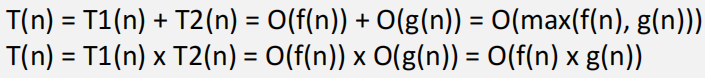
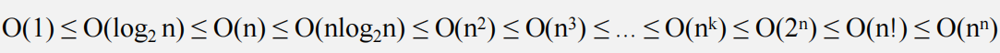

# 第一章 绪论

## 基本概念

数据：能输入到计算机中处理的符号的集合

数据项：**最小单位**

数据元素：**基本单位**，一个数据元素由若干个数据项组成

数据结构：存在一种或多种特定关系的数据元素的集合

数据对象：**相同性质**的数据元素的集合

数据类型：值的集合以及定义在该集合上的一组操作

抽象数据类型ADT：逻辑结构+数据的运算

## 数据结构三要素

**1.逻辑结构**

- 集合
- 线性结构
- 树形结构
- 图形结构

**2.存储结构（物理结构）**

- 顺序存储
  - 逻辑上相邻的运算在物理上也相邻
  - 优点：随机存取
  - 缺点：可能产生外部碎片
- 链式存储
  - 逻辑上相邻的元素在物理上可以不相邻
  - 优点：不产生外部碎片
  - 缺点：只能顺序存取，指针占用了额外的存储空间
- 索引存储
  - 建立索引表，存储（关键字，地址）
  - 优点：改查数据快
  - 缺点：增删数据需要修改索引表，增加了时间的开销；索引表占用了额外的存储空间
- 散列存储（哈希存储）
  - 根据关键字直接计算出元素的存储地址
  - 优点：增删改查快
  - 缺点：散列函数的设计；解决元素存储单元的冲突增加了时间和空间的开销

**3.数据的运算**

- 运算的定义是针对逻辑结构的
- 运算的实现是针对存储结构的

## 算法

**算法的定义**：

- 特定问题的求解步骤
- 指令的有限序列，每个指令表示一个或多个操作

**算法的特性**：

- 0个或多个输入
- 1个或多个输出

- 有穷性：必须执行有限步骤后完成
  - 算法是有穷的，程序可以无穷
- 确定性：每一步必须有确切的定义（相同的输入有相同的输出）
- 可行性：任何步骤都能被分解为基本的可执行操作，每个操作都能在有限时间内完成

**算法的评价**：

- 正确性：算法可以正确解决问题
- 可读性：算法程序应该易读，好理解
- 健壮性（鲁棒性）：可以处理非法数据、边界条件
- 高效率和低存储量

## 时间复杂度

复杂度运算规则：

常见的时间复杂度排序：

- O($$n^2$$)表示执行时间与$$n^2$$成正比
- O(1)表示执行时间为常量，与问题规模n无关

~~~c++
int i;
int count = 0;
for(i=1; i<=n; i++){
	count++;
}
~~~

$$
\sum_{i=1}^{n}1=n => O(n^2)
$$

~~~c++
int i;
int count = 0;
for(i=1; i<=n; i*=2){
    count++;
}
~~~

设自增k次退出循环，此时$$2^k$$=n，则有
$$
\sum_{i=1}^{2^k}1=k+1=log_{2}{n}+1=>O(log_{2}{n})
$$

~~~c++
int i,j;
int count = 0;
for(i=1; i<=n; i++){
    for(j=1; j<=n; j++){
    	count++;
    }
}
~~~

$$
\sum_{i=1}^{n}\sum_{j=1}^{n}1=\sum_{i=1}^{n}n=n\sum_{i=1}^{n}1=n^2=>O(n^2)
$$

~~~c++
int i,j;
int count = 0;
for(i=1; i<=n; i++){
    for(j=1; j<=i; j++){
    	count++;
    }
}
~~~

$$
\sum_{i=1}^{n}\sum_{j=1}^{i}1=\sum_{i=1}^{n}i=\frac{(1+n)n}{2}=>O(n^2)
$$

~~~c++
int i,j;
int count = 0;
for(i=1; i<=n; i++){
    for(j=1; j<=i; j*=2){
    	count++;
    }
}
~~~

设j自增k次退出循环, 则有$$2^k$$=i
$$
\sum_{i=1}^{n}\sum_{j=1}^{2^k}1=\sum_{i=1}^{n}(k+1)=\sum_{i=1}^{n}(log_{2}{i}+1)=log_{2}{n!}+n=>O(log_{2}{n!})=O(nlog_{2}{n})
$$

~~~c++
int i,j;
int count = 0;
for(i=1; i<=n; i*=2){
    for(j=1; j<=i; j++){
    	count++;
    }
}
~~~

设i自增k次退出循环, 此时$$2^k$$=n, k=$$log_{2}{n}$$
$$
\sum_{i=1}^{2^k}\sum_{j=1}^{i}1=\sum_{i=1}^{2^k}i=1+2+...+2^k=2^{k+1}-1=2n-1=>O(n)
$$

~~~c++
for(int i=1;i<=n;i++){
	for(int j=1;j<=i;j++){
        for(int k=1;k<=j;k++){
			count++;
        }
    }
}
~~~

$$
\sum_{i=1}^{n}\sum_{j=1}^{i}\sum_{k=1}^{j}1=\sum_{i=1}^{n}\sum_{j=1}^{i}\frac{(1+i)i}{2}=\frac{1}{2}(\sum_{i=1}^{n}i+\sum_{i=1}^{n}i^2)=\frac{1}{2}[\frac{(1+n)n}{2}+\frac{n(n+1)(2n+1)}{6}]
$$

**while循环**

~~~c++
int y=0;
while((y+1)*(y+1) <= n){
    y = y+1;
}
~~~

$$
O(log_{2}{n})
$$

**循环体内的语句**

~~~c++
int i,j;
int count=0;
for(i=1; i<n; i++){
    for(j=1; j<n; j++){
        count++;
        i++;
    }
}
~~~

$$
O(n)
$$

## 空间复杂度

用于计算空间复杂度的：形参，局部变量，数组

- O($$n^2$$)表示所需辅助空间大小与$$n^2$$成正比
- O(1)表示所需辅助空间大小为常量，与问题规模n无关，称为**原地工作**

~~~c++
int foo(int n){  //n 4B
	int i=1;     //i 4B
    while(i<=n){
		i++;
    }
}

// 空间复杂度为O(8)=O(1) -> 算法原地工作
~~~

~~~c++
int foo(int n){    //4
	int arr[n][n]; //4n^2
    int arr2[n];   //4n
    int i;         //4
}

// 空间复杂度为O(4n^2+4n+8)=O(n^2)
~~~

**递归型**

~~~c++
int foo(int n){
	int a,b,c;
    if(n>1)
        foo(n-1);
}

int main(){
    // 以3为例
	foo(3);
}
~~~

| n递归次数 | 空间消耗    |
| --------- | ----------- |
| n=3       | n+a+b+c=16B |
| n=2       | n+a+b+c=16B |
| n=1       | n+a+b+c=16B |

- 故空间复杂度为O(16n)=O(n)

~~~c++
int foo(int n){
	int arr[n];
    if(n>1)
        foo(n-1);
}

int main(){
    // 以3为例
	foo(3);
}
~~~

| n递归次数 | 空间消耗            |
| --------- | ------------------- |
| n=3       | arr[n]+n = (3*4+4)B |
| n=2       | arr[n]+n = (2*4+4)B |
| n=1       | arr[n]+n = (1*4+4)B |

- 故空间复杂度为O([(1+2+...+n)*4+4n])=O($$n^2$$)

