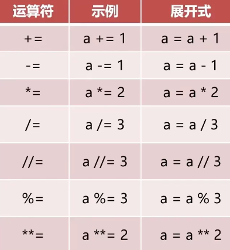

## 算术运算

1. +-*/
2. // 整除
3. % 取余
4. ** 幂次

## 赋值运算符
1.=

~~~python
# a、b、c分别赋值
a,b,c=1,2,3

# d、e赋相同的值
d=e=4
~~~

2.复合赋值运算符

~~~python
a = 1

# a b c都赋值为1
a = b = c = 1

# a b c分别赋值为1 2 3 
a,b,c = 1,2,3

# 跳过赋值 
a,_ = 1,2
~~~

## 比较运算符

1. ==
2. !=
3. `> >= < <=`

## 逻辑运算

按照优先级排序：

1. not
2. and
3. or