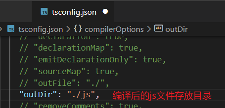
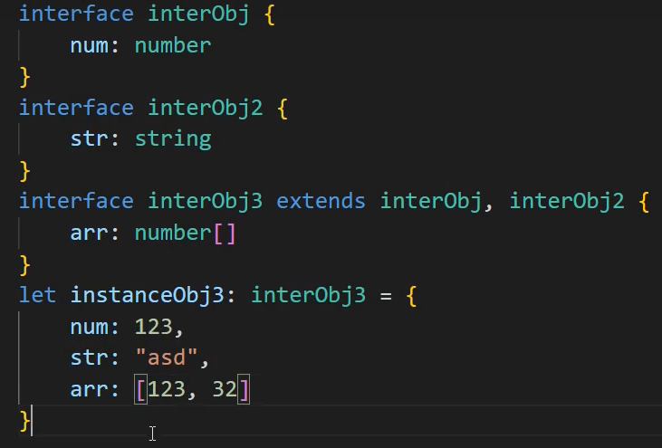
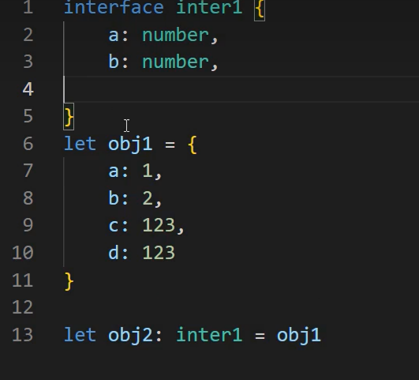
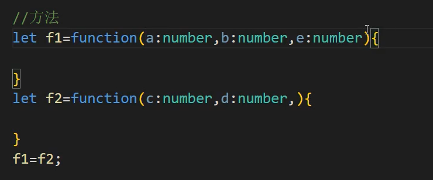
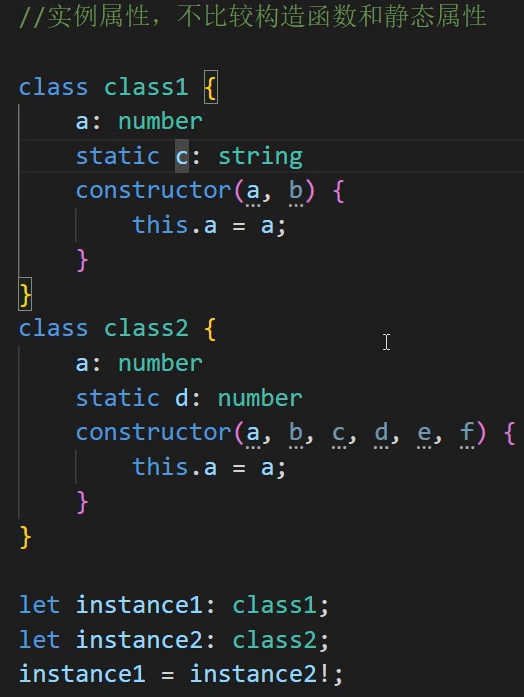
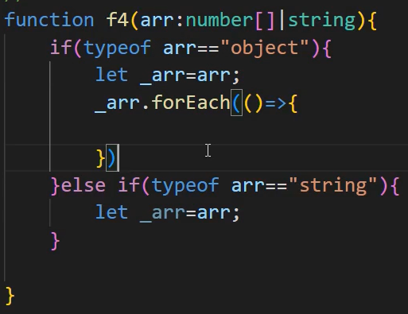
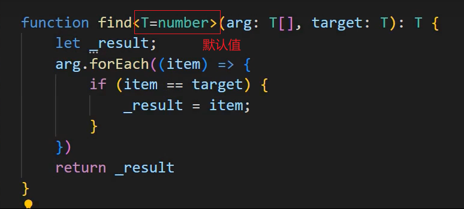
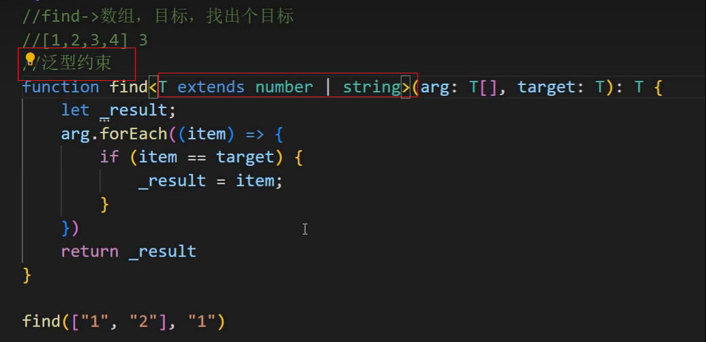
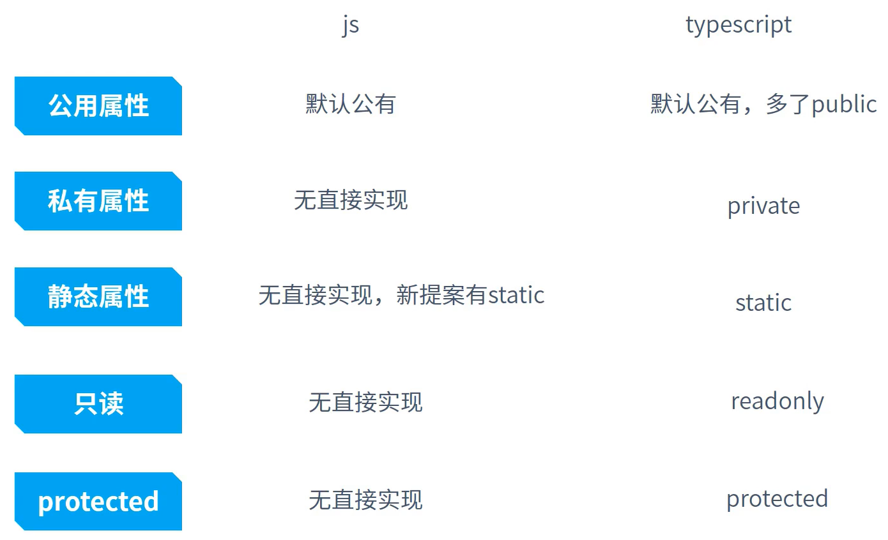
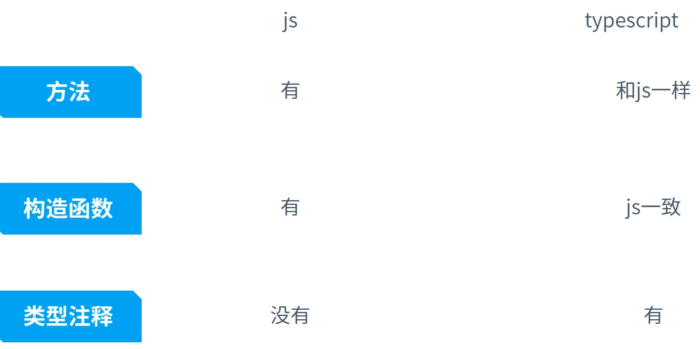

# TS编译运行

ts不是在终端运行，是一门中间语言，最终编译为js运行。

~~~bash
// 1. ts编译为js
npm i -g typescript
// 查看版本
tsc -v

// 2. 直接运行，主要用来查看是否报错
npm i -g ts-node
// 查看版本
ts-node -v
~~~

1.手动编译ts代码

~~~bash
tsc .\test.ts
~~~

2.自动编译

~~~bash
tsc --init
~~~

终端->运行任务->tsc监视

# 非引用类型

非引用类型：
number、string、boolean、undefined、null、Symbol

~~~tsx
// 非引用类型：
// number、string、boolean、undefined、null、Symbol、BigInt
let num:number = 10
let num2:number = 0b110
let num3:number = NaN
let num4:number = Infinity
let flag:boolean = false
let str:string = '123'
let str2:string = "abc"
let unde:undefined = undefined
let nu:null = null
// 表示唯一，即使内容一样也表示唯一
let s1:symbol = Symbol('k1')
let s2:symbol = Symbol('k1')
let person = {
    [k1]:'v1',
    [k1]:'v2'
}

// 字面量类型
var ENV:"production"|"development"|"test"='development'
let age:99|100 = 99
~~~

# 引用类型

引用类型：object、array、function

## 数组

~~~tsx
// 只能空数组
let arr1:[] = []
let arr2:number[] = [1,2,3]
let arr3:Array<number> = [1,2,3]

// 数组内有字符串和数字类型
var arr:(string|number)[] = ['cjc',999]

// 字符串数组或数字数组
var arr2: string[] | number[] = ['a', 'b']
var arr3: string[] | number[] = [1, 2]

// 元祖，顺序和类型都要满足
// 最后任意类型且可有可无
var arr4: [string, number, any?] = ['cjc', 999, true]

// 不定参数
var arr4: [string, number, ...(number|string)[]] = ['cjc', 999, 1,2,3]
~~~

## 对象

~~~tsx
let obj:object = {}
let obj2:{} = {name:'cjc'}
let obj3:{name:string,age:number} = {name:'cjc',age:999}

// 键名数字类型
var obj4: { [propNmae: number]: string } = { 1: 'a', 2: 'b' }

// 可选
var obj5: { x: number, y?: boolean } = { x: 1 }
~~~

## 函数

~~~tsx
// 1.函数定义
function sumFun(a: number, ...args: number[]): number {
  return a + args.reduce((preVal: number, curVal: number) => {
    return preVal + curVal
  })
}
console.log(sumFun(1, 2, 3)); //6

// 2.函数变量
let foo2: (a: string) => string = function (a) {
  return a
}

// this处理
function foo3(this:void,a:number){}
foo3(1)
~~~

函数重载：函数名相同，形参不同

~~~tsx
//输入数字 `123` 的时候，输出反转的数字 `321`，输入字符串 `'hello'` 的时候，输出反转的字符串 `'olleh'`
function reverse(x: number): number;
function reverse(x: string): string;
function reverse(x: number | string): number | string | void {
    if (typeof x === 'number') {
        return Number(x.toString().split('').reverse().join(''));
    } else if (typeof x === 'string') {
        return x.split('').reverse().join('');
    }
}
~~~

# 枚举类型

~~~tsx
enum nums {
  one = 1,
  two,
  three
}

// 从1开始递增
// 3
console.log(nums.three);
// 通过名称拿到值
// 也能从值拿到名称
// { '1': 'one', '2': 'two', '3': 'three', one: 1, two: 2, three: 3 }
console.log(nums);
~~~

# unknow和any

any、unknow、never都能赋值任何类型的值

~~~tsx
// 1.any
let a: any = 123
let b: string = a

// 2.unknow
// unknow比any更安全，unknow类型只能赋值给unknow或any
let a2: unknown = 123
//不能将类型“unknown”分配给类型“string”
// let b2:string = a2
let b2: any = a2

// 3.never
// never类型不能有任何值，没有返回值可以使用never
let a3:never
~~~

# 联合类型交叉类型

~~~tsx
// 1.联合类型
class className1 {
  a: number
}

class className2 {
  b: number
}

// 同时有a和b两个属性
let obj: className1 & className2 = {
  a: 1,
  b: 2
}

// 2.交叉类型
let res:string|number = 1
~~~

# type类型别名

~~~tsx
// 1.type类型别名
// 常用于基础类型、联合、交叉
type sn = string | number
let str: sn = '123'

type namesType = "a" | "b" | "c"
let name1:namesType = "a"
~~~

# interface接口

## 对象接口

~~~tsx
// 定义对象接口
interface Person {
  // 1.只读属性
  readonly id: number,
  name: string,
  age: number,
  // 2.可选属性
  gender?: string,
  // 3.任意属性，创建的对象可以添加任意属性
  [attrName: string]: any
}

let p1: Person = {
  id: 1,
  name: 'cjc',
  age: 999,
  song: 'jinitaimei'
}
~~~

## 类接口

~~~tsx
interface person {
  age: number,
  eat(food: string): string
}

// 类实现接口
class stu implements person {
  age: number
  eat(food: string): string
  eat(food: string) {
    return 'apple'
  }
}
~~~

## 函数接口

~~~tsx
// 函数接口
interface Ifun{
  // 参数a,b
  // 返回值bool类型 
  (a:string,b:string):boolean
}

const func1:Ifun = function(a:string,b:string):boolean{
  return a.search(b) !== -1
}
~~~

## 数组接口

数组（可索引类型）

~~~tsx
// 数组的接口
interface IArray{
  // 属性名为number类型（即数组下标为number）
  // 属性值为任意类型any
  [index:number]:any
}

let arr5:IArray = [1,2,'a',true]
~~~

## 接口的继承合并

# 类型推导机制

## 类型推断

~~~tsx
// 变量定义，未指定类型，看右边赋值的类型
let a = 100

// 变量声明，any类型
let b;
b = 100
b = 'a'
~~~

## 类型兼容

结构相似

## 类型保护

一般通过typeof判断，窄化TS类型推断的范围

# 泛型

接收不同类型参数，做出不同处理，类似于函数重载

~~~tsx
function find<T>(args: T[], target: T): T {
  let res
  args.forEach((item) => {
    if (item === target) {
      res = item
    }
  })
  return res
}

// 自动类型推断
// T推断为number
find([1,2,3],4)

// 指定类型
// 指定T为string
find<string>(['a','b'],'c')
~~~

# 类型断言

断言：当TS的类型推断和想要的类型冲突时，指定想要的类型

~~~tsx
interface objInter {
  a: number,
  b: number
}

// 类型推断为空对象
// 类型“{}”缺少类型“objInter”中的以下属性: a, b
// let obj: objInter = {}

// 断言
let obj: objInter = {} as objInter
obj.a = 1
obj.b = 2
~~~

~~~tsx
function foo(a: number[] | string) {
  // 类型推断为string
  // 类型“string”上不存在属性“forEach”
  // a.forEach(ele => {});

  // 断言为number[]类型
  let _a = a as number[]
  _a.forEach(element => { });
}
~~~

# 类

~~~tsx
~~~

# tsconfig

~~~bash
// 1. ts编译为js
npm i -g typescript
// 查看版本
tsc -v

// 2. 直接运行，主要用来查看是否报错
npm i -g ts-node
// 查看版本
ts-node -v
~~~

