# express-generator

## 创建项目

1.创建项目

~~~powershell
# 全局安装express-generator
npm i -g express-generator@4

# 创建express-generator项目
express --no-view express-api

# 在项目根目录下安装依赖
npm i
~~~

2.在routes/index.js中将响应改为json格式

~~~js
router.get('/', function(req, res, next) {
  res.json({
    "message": "Hello World"
  });
});
~~~

3.删除public/index.html

4.将var换成es6的const或let

5.热启动

~~~powershell
# 安装nodemon
npm i nodemon

# 启动
npm run start

# 可以通过 http://localhost:3000 来访问
~~~

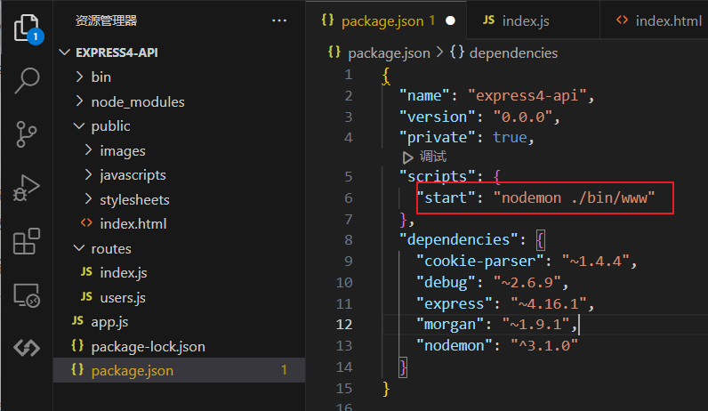


## 使用docker安装mysql

安装docker桌面版，配置镜像源

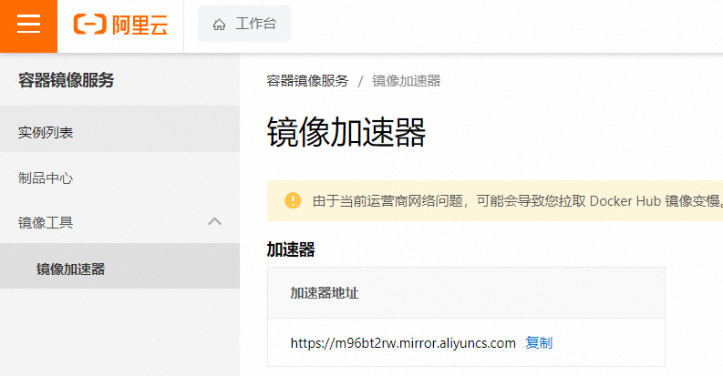

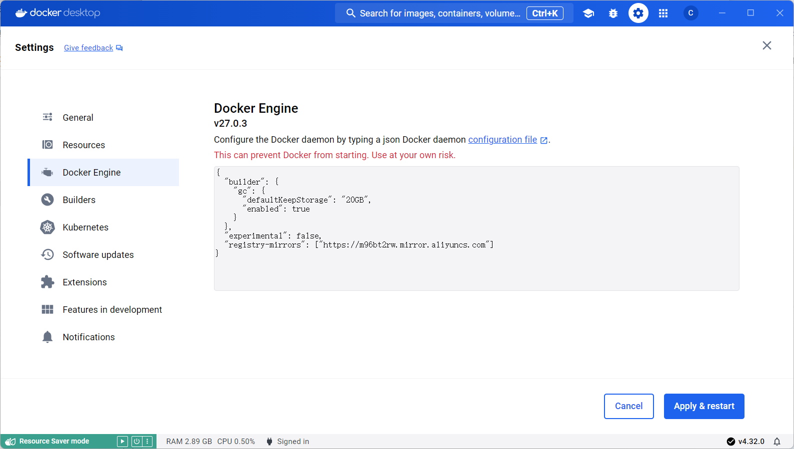

~~~bash
{
  "builder": {
    "gc": {
      "defaultKeepStorage": "20GB",
      "enabled": true
    }
  },
  "experimental": false,
  "registry-mirrors": ["https://m96bt2rw.mirror.aliyuncs.com"]
}
~~~


2.在项目根目录下创建`docker-compose.yml`文件

3.配置内容

~~~yaml
services:
  mysql:
    image: mysql:8.3.0
    command:
      --default-authentication-plugin=mysql_native_password
      --character-set-server=utf8mb4
      --collation-server=utf8mb4_general_ci
    environment:
      - MYSQL_ROOT_PASSWORD=root1234
      - MYSQL_LOWER_CASE_TABLE_NAMES=0
    ports:
      - "3306:3306"
    volumes:
      - ./data/mysql:/var/lib/mysql
~~~

- `./data/mysql:/var/lib/mysql`映射到了宿主机Ubuntu的`/data/mysql`目录下

4.在vscode中打开终端，在项目根目录下安装并运行mysql

~~~powershell
docker-compose up -d
~~~


## navicat操作mysql

### 连接数据库

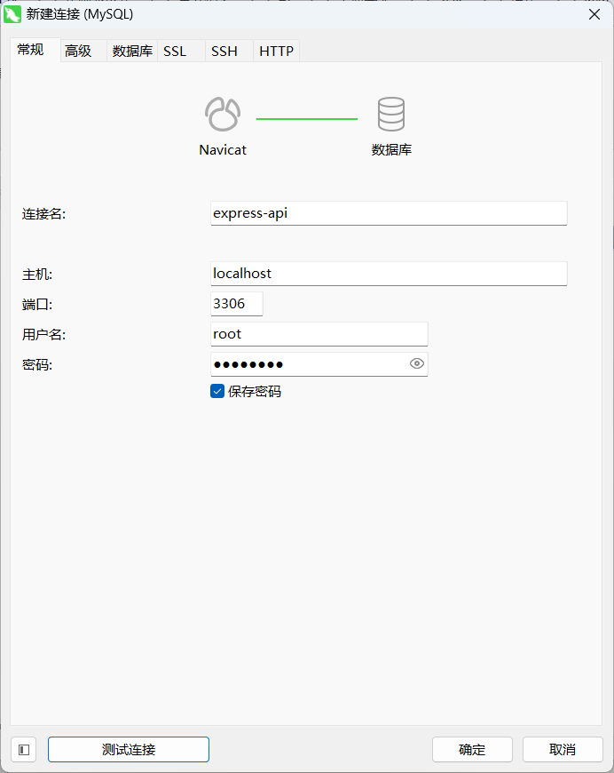

### 创建数据库

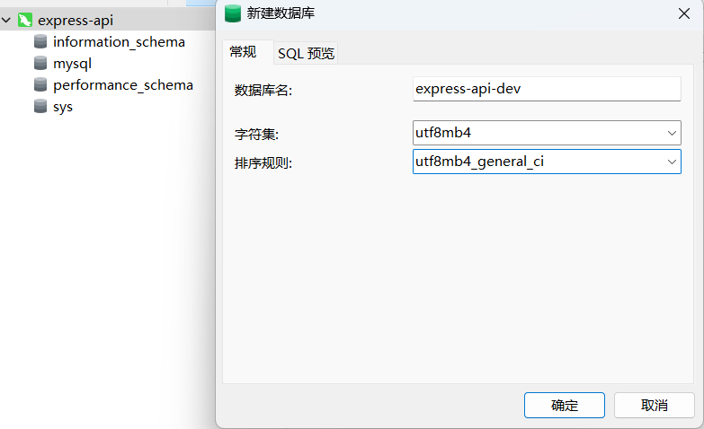

### 创建表

- 表名首字母大写
- 表名用复数形式

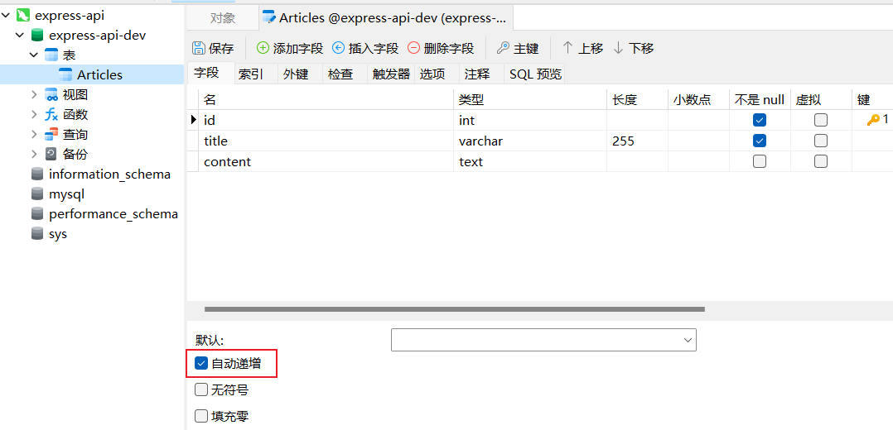

| 类型                 | 含义   | 说明                                                         |
| :------------------- | :----- | :----------------------------------------------------------- |
| int                  | 整数   | 需要设定长度                                                 |
| decimal              | 小数   | 金额常用，需要设定长度。如 decimal(10, 2) 表示共存 10 位数，其中小数占 2 位 |
| char、varchar        | 字符串 | 文字类的常用，需要设定长度。例如身份证号、文章的标题使用。   |
| text                 | 文本   | 存储大文本，无需设定长度。一般会用文字很多的时候，例如文章的正文部分。 |
| date、time、datetime | 日期   | 记录时间                                                     |

### 设计表模型

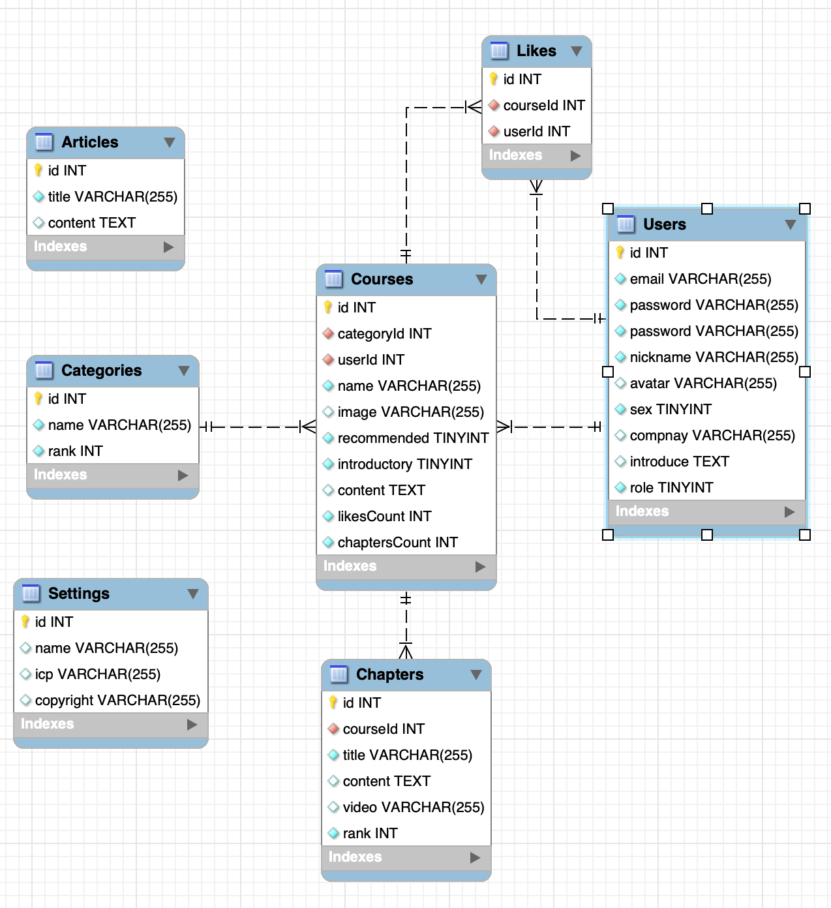


## Sequelize操作mysql

### 安装及目录结构

~~~bash
# 安装
npm i -g sequelize-cli
npm i sequelize mysql2

# sequelize初始化
sequelize init
~~~

目录结构

~~~bash
.
├── config
│   └── config.json
├── migrations
├── models
│   └── index.js
└── seeders
~~~

- **config**：`sequelize`连接数据库的配置文件
- **models（模型）**：每个模型对应一张表，增删改查、表单验证等
- **migrations（迁移）**：新增表、修改字段、修改表模型、删除表等
- **seeders（种子）**：添加测试数据到表中


### config配置

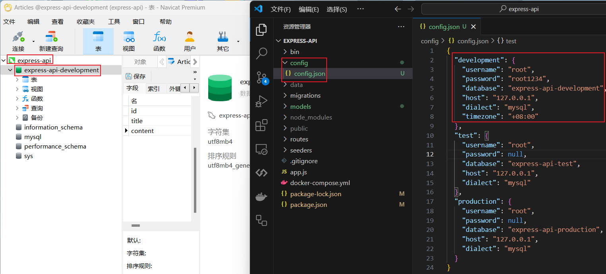


### models模型

#### 示例：创建Articles表

1.删除在navicat中手动创建的Articles表

2.使用sequelize创建

~~~bash
# sequelize model:generate --name 表名单数 --attributes 字段1:类型1,字段2:类型2
sequelize model:generate --name Article --attributes title:string,content:text
~~~

- 在sequelize命令中，**表名使用单数**，创建得到的表是**复数形式**

执行命令后，会同时创建以下两个文件：

1. **模型文件**：models/article.js文件，其中title是string类型，对应到 MySQL 数据库里，它就会自动变成`varchar`。content部分，则是`text`类型

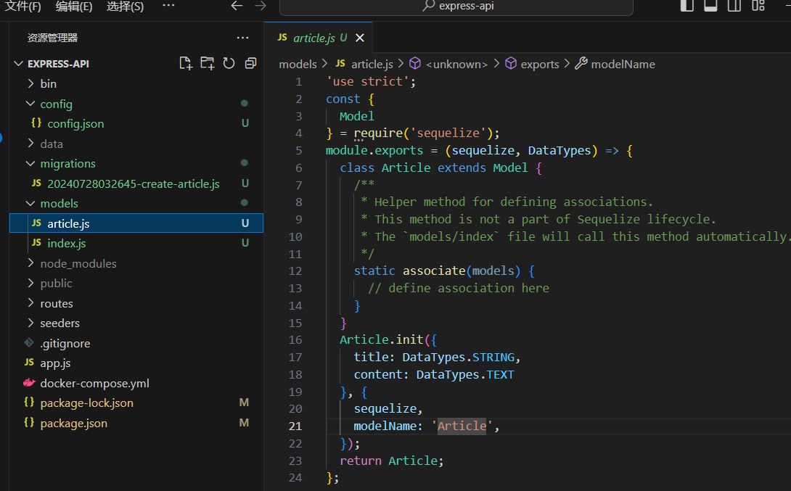

2. **迁移文件**：migrations/20240728032645-create-article.js文件，可以修改字段约束（如非空、唯一、无符号数、索引等），使之符合表模型的设计

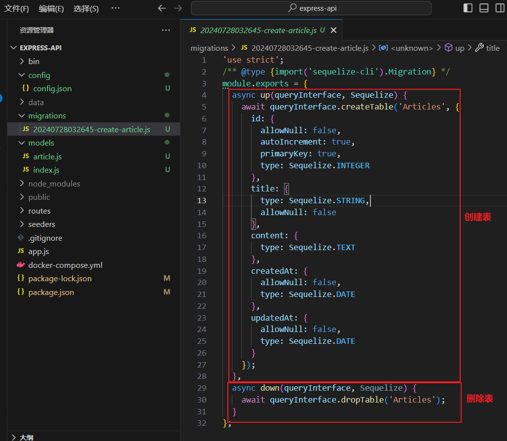

#### 创建其余表

1.创建表模型

~~~bash
# Category
sequelize model:generate --name Category --attributes name:string,rank:integer

# User
sequelize model:generate --name User --attributes email:string,username:string,password:string,nickname:string,sex:tinyint,company:string,introduce:text,role:tinyint

# Course
sequelize model:generate --name Course --attributes categoryId:integer,userId:integer,name:string,image:string,recommended:boolean,introductory:boolean,content:text,likesCount:integer,chaptersCount:integer

# Chapter
sequelize model:generate --name Chapter --attributes courseId:integer,title:string,content:text,video:string,rank:integer

# Like
sequelize model:generate --name Like --attributes courseId:integer,userId:integer

# Setting
sequelize model:generate --name Setting --attributes name:string,icp:string,copyright:string
~~~

2.修改模型文件中的字段约束，以**Users**表为例

| 字段                | 类型    | 允许 Null | 无符号 | 自增 | 索引    | 默认值 | 备注                   |
| :------------------ | :------ | :-------- | :----- | :--- | :------ | :----- | :--------------------- |
| id(编号)            | integer | NO        | YES    | YES  | PRIMARY | -      |                        |
| email(邮箱)         | varchar | NO        | -      | -    | UNIQUE  | -      |                        |
| username(用户名)    | varchar | NO        | -      | -    | UNIQUE  | -      |                        |
| password(密码)      | varchar | NO        | -      | -    | -       | -      |                        |
| nickname(昵称)      | varchar | NO        | -      | -    | -       | -      |                        |
| sex(性别)           | tinyint | NO        | -      | -    | -       | 2      | 0-男，1-女，2-未选择   |
| avatar(头像)        | varchar | -         | -      | -    | -       | -      |                        |
| company(公司)       | varchar | -         | -      | -    | -       | -      |                        |
| introduce(自我介绍) | text    | -         | -      | -    | -       | -      |                        |
| role(用户组)        | tinyint | NO        | YES    | -    | INDEX   | 0      | 0-普通用户，100-管理员 |

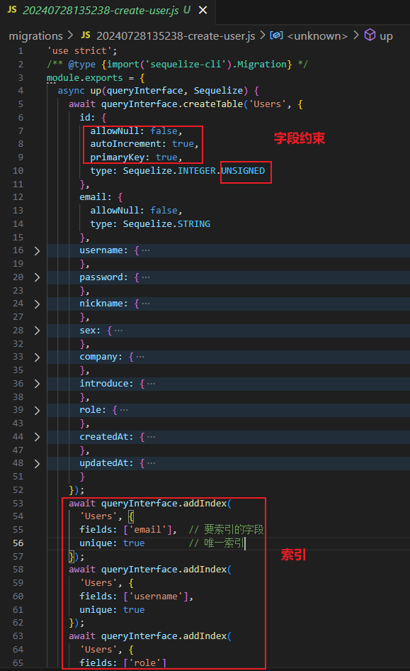

3.运行迁移文件，创建表

~~~bash
sequelize db:migrate
~~~


### migrate迁移

#### 运行迁移文件

~~~powershell
# 运行迁移文件，创建表
sequelize db:migrate
~~~

- 刷新navicat即可查看创建的表Articles（表名为复数形式）
- 另外一张表`SequelizeMeta`是我们运行迁移命令时，自动生成的。这张表里记录了当前已经跑过了哪些迁移，这样当你再次运行`sequelize db:migrate`时，已经运行过的迁移文件，就不会重复再次执行了。

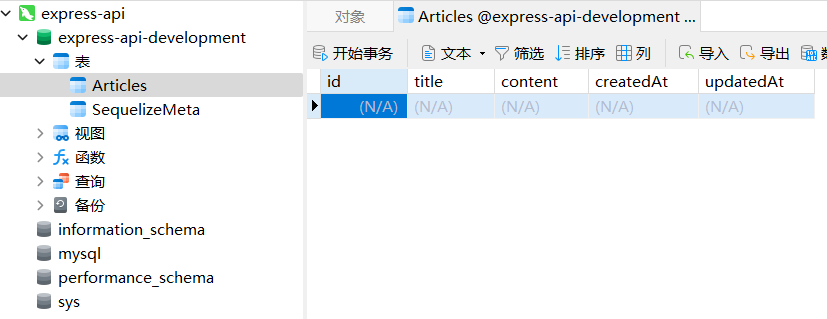

#### 回滚迁移

例如：建好了`Articles`表。但是发现`id`字段，忘记增加`无符号`了

~~~bash
# 回滚迁移
# 表中没啥数据，可以直接回滚迁移，也就是删除当前的表
sequelize db:migrate:undo
~~~

运行命令后，会回滚上一次运行的迁移，也就是删掉`Articles`表，然后我们给迁移文件里，增加`UNSIGNED`

~~~bash
id: {
  //... 
  type: Sequelize.INTEGER.UNSIGNED
},
~~~

再次运行迁移和种子命令

~~~bash
sequelize db:migrate
sequelize db:seed --seed .\seeders\20240728051236-article.js
~~~


#### 添加新迁移、修改表模型

例如：用户的头像字段没有设计

添加另一个迁移，在表中添加、修改、删除字段

~~~bash
# 运行新的迁移文件
sequelize migration:create --name add-avatar-to-user
~~~

打开生成的迁移文件后，修改为

```js
async up (queryInterface, Sequelize) {
  await queryInterface.addColumn('Users', 'avatar', {
    type: Sequelize.STRING
  })
},

async down (queryInterface, Sequelize) {
  await queryInterface.removeColumn('Users', 'avatar')
}
```

然后运行一下迁移命令

```bash
sequelize db:migrate
```

去`User`模型文件里，自己手动增加`avatar`字段。

```js
User.init({
  // ... 
  avatar: DataTypes.STRING
}
```

### seeders种子文件

#### 创建种子文件

~~~powershell
# sequelize seed:generate --name 表名单数
sequelize seed:generate --name article
~~~

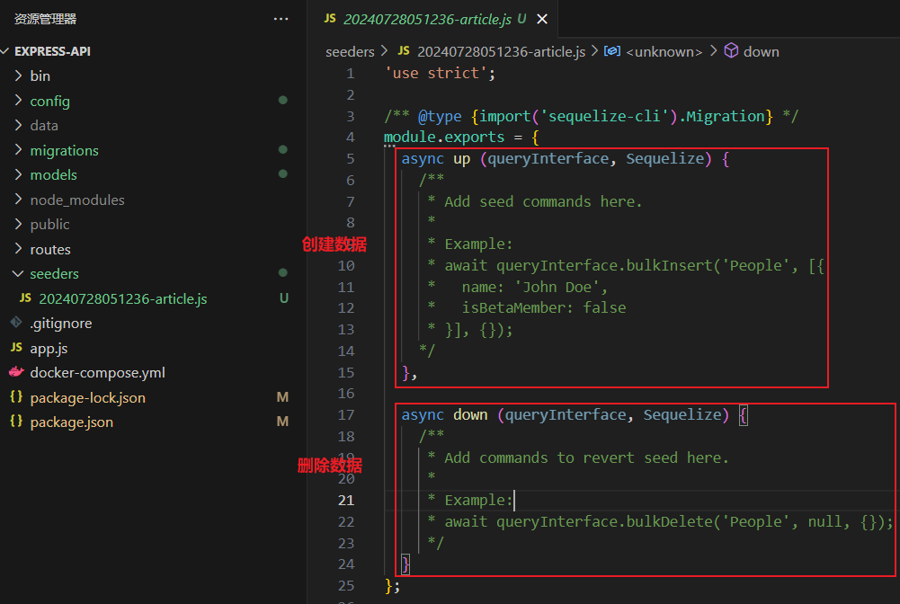

#### 生成数据

~~~js
'use strict';

/** @type {import('sequelize-cli').Migration} */
module.exports = {
  async up(queryInterface, Sequelize) {
    const articles = [];
    const counts = 100;

    for (let i = 1; i <= counts; i++) {
      const article = {
        title: `文章的标题 ${i}`,
        content: `文章的内容 ${i}`,
        createdAt: new Date(),
        updatedAt: new Date(),
      };

      articles.push(article);
    }

    await queryInterface.bulkInsert('Articles', articles, {});
  },


  async down(queryInterface, Sequelize) {
    await queryInterface.bulkDelete('Articles', null, {});
  }

};
~~~

#### 执行种子文件

~~~powershell
# sequelize db:seed --seed 种子文件所在路径
sequelize db:seed --seed .\seeders\20240728051236-article.js

# 执行所有种子文件
sequelize db:seed:all
~~~


## 常见后台接口

### 接口规范

| 参数类型                    | 形式                                      | 获取方式   |
| --------------------------- | ----------------------------------------- | ---------- |
| query参数(查询参数)         | /admin/articles?currentPage=1&pageSize=10 | req.query  |
| params参数(path参数)        | /admin/articles/{id}                      | req.params |
| body参数(通过POST、PUT携带) | post请求+/admin/articles                  | req.body   |

- 能同时携带多个不同的参数类型

- RESTful风格的api：请求的url地址`/admin/articles`不变，通过不同的请求方法（get、post、put、delete）完成增删改查


### 配置路由

1.在routes文件夹下创建admin文件夹，存放后台路由文件

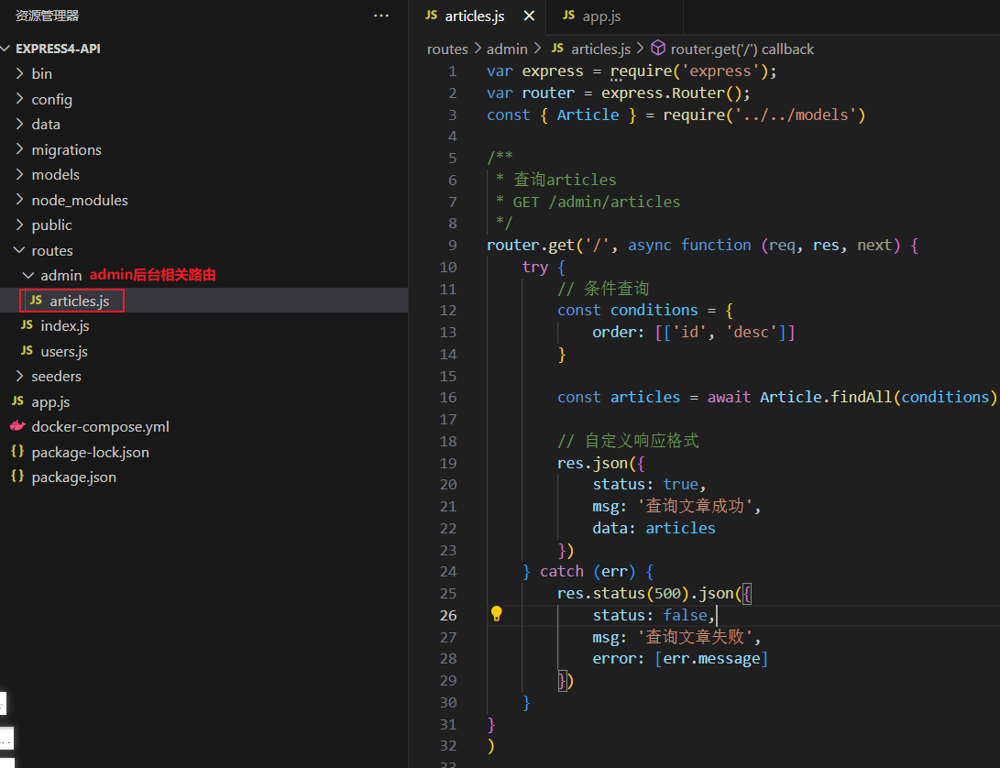

2.配置路由

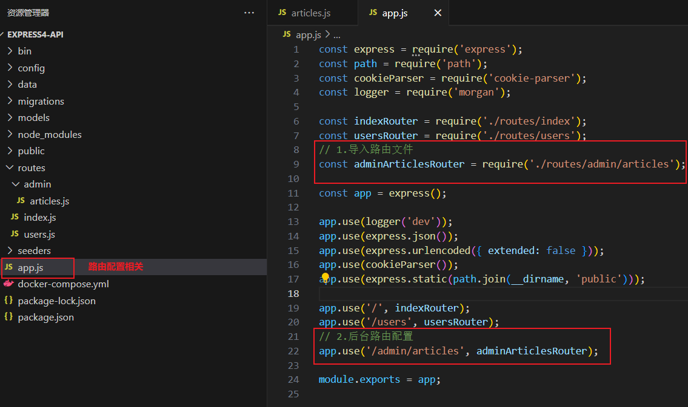

### 示例：articles接口

#### 路由的增删改查

1.查询文章列表

~~~js
const express = require('express');
const router = express.Router();
const { Article } = require('../../models');

/**
 * 查询文章列表
 * GET /admin/articles
 */
router.get('/', async function (req, res, next) {
    try {
        const conditions = {
            order: [['id', 'DESC']],
        };

        const articles = await Article.findAll(conditions);

        res.json({
            status: true,
            message: '查询文章列表成功',
            data: articles
        })
    } catch (error) {
        res.status(500).json({
            status: false,
            message: '查询文章列表失败',
            data: {
                errors: [error.message]
            }
        })
    }
});

module.exports = router;
~~~

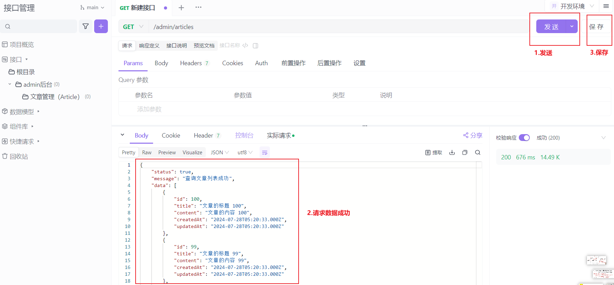

2.查询文章详情

~~~js
/**
 * 查询文章详情
 * GET /admin/articles/:id
 */
router.get('/:id', async function (req, res, next) {
    try {
        const { id } = req.params;

        const article = await Article.findByPk(id);

        if (article) {
            return res.json({
                status: true,
                message: '查询文章详情成功',
                data: article
            })
        } else {
            return res.status(404).json({
                status: false,
                message: '文章不存在',
            })
        }
    } catch (error) {
        res.status(500).json({
            status: false,
            message: '查询文章详情失败',
            data: {
                errors: [error.message]
            }
        })
    }
})
~~~

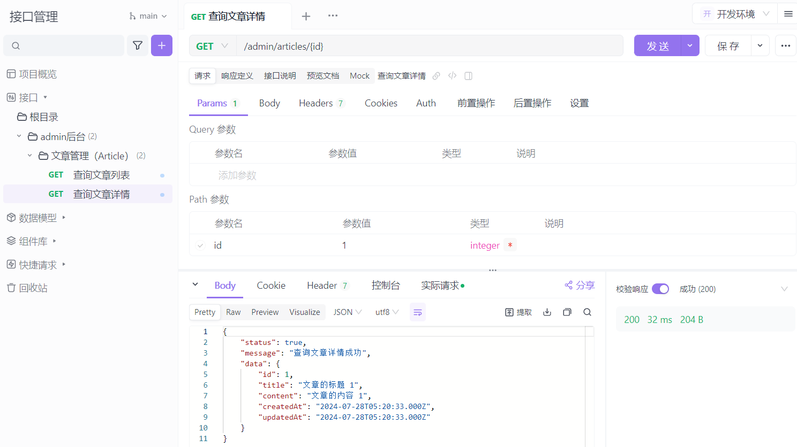

3.创建文章

~~~js
/**
 * 创建文章
 * POST /admin/articles
 */
router.post('/', async function (req, res, next) {
    try {
        const { title, content } = req.body;

        const article = await Article.create({
            title,
            content
        });

        // 201表示新建了资源
        res.status(201).json({
            status: true,
            message: '创建文章成功',
            data: article
        })

    } catch (error) {
        res.status(500).json({
            status: false,
            message: '创建文章失败',
            data: {
                errors: [error.message]
            }
        })
    }
})
~~~

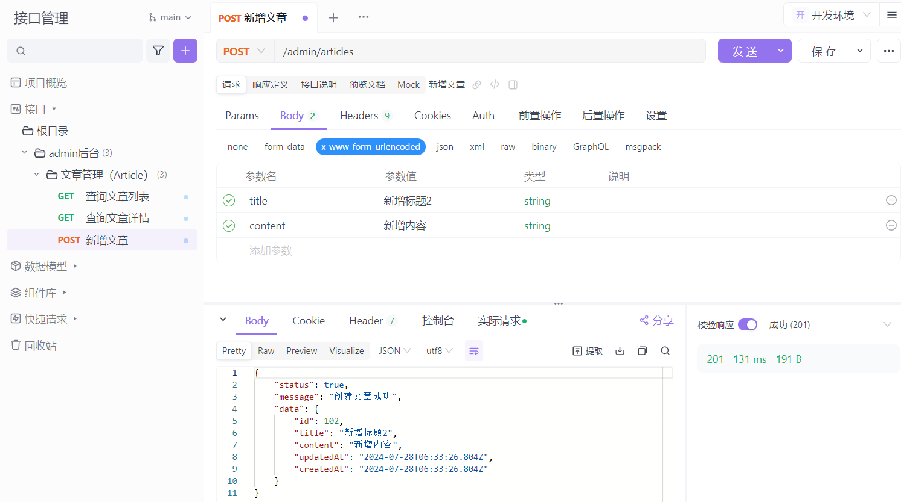

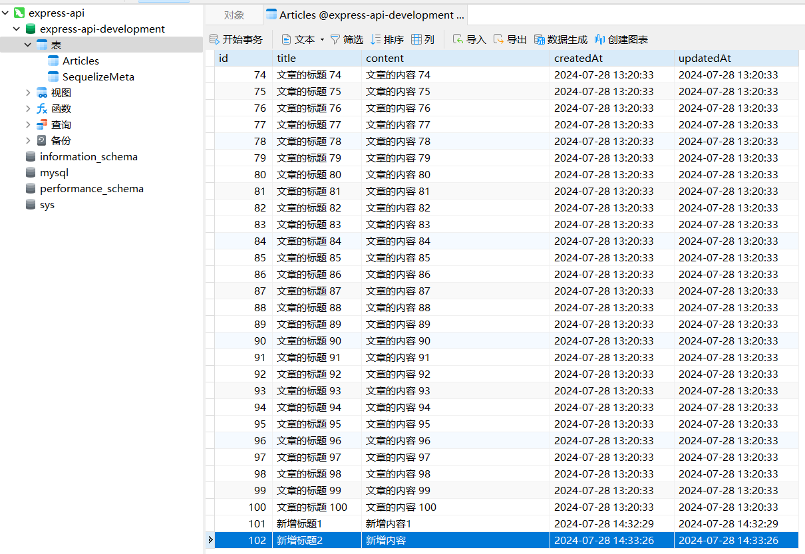

4.删除文章

~~~js
/**
 * 删除文章
 * DELETE /admin/articles/:id
 */
router.delete('/:id', async function (req, res, next) {
    try {
        const { id } = req.params;

        const article = await Article.findByPk(id);

        if (article) {
            await article.destroy();

            res.json({
                status: true,
                message: '删除文章成功',
            })

        } else
            res.status(404).json({
                status: false,
                message: '文章不存在',
            })
    } catch (error) {
        res.status(500).json({
            status: false,
            message: '删除文章失败',
            data: {
                errors: [error.message]
            }
        })
    }
})
~~~

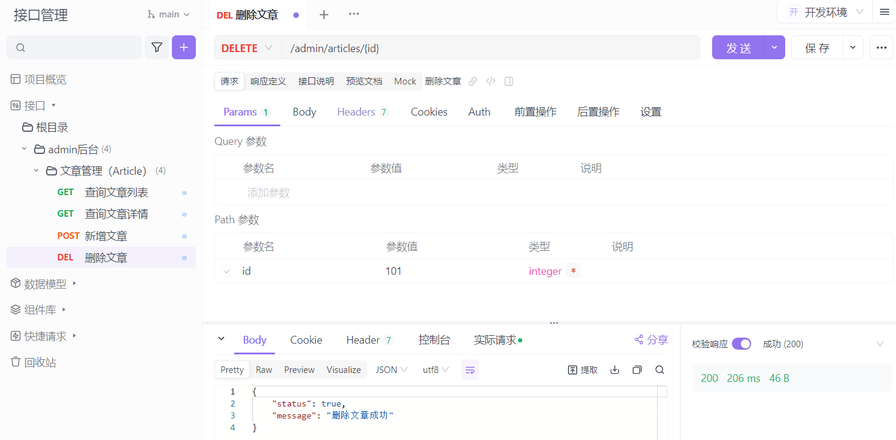

5.更新文章

~~~js
/**
 * 更新文章
 * PUT /admin/articles/:id
 */
router.put('/:id', async function (req, res, next) {
    try {
        const { id } = req.params;
        const { title, content } = req.body;

        const article = await Article.findByPk(id);

        if (article) {
            await article.update({
                title,
                content
            });

            res.json({
                status: true,
                message: '更新文章成功',
                data: article
            })
        } else
            res.status(404).json({
                status: false,
                message: '文章不存在',
            })

    } catch (error) {
        res.status(500).json({
            status: false,
            message: '更新文章失败',
            data: {
                errors: [error.message]
            }
        })
    }
})
~~~

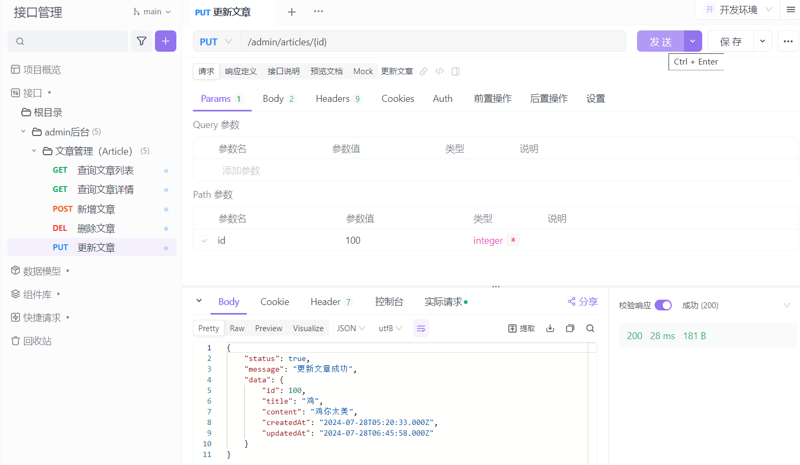

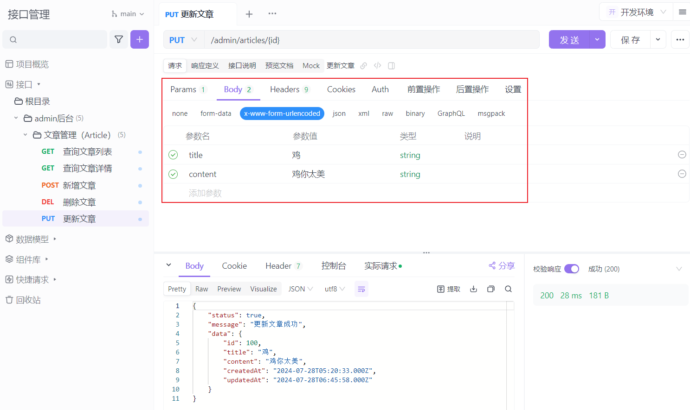

#### 模糊查询、数据分页

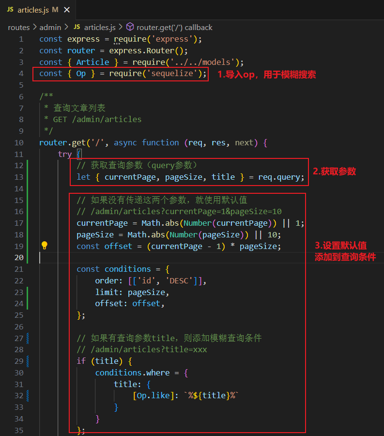

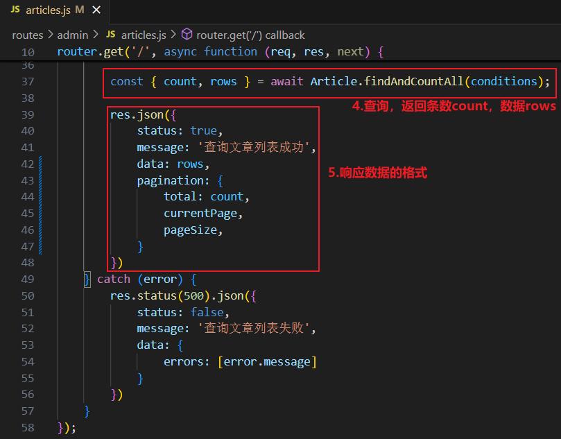

~~~js
/**
 * 查询文章列表
 * GET /admin/articles
 */
router.get('/', async function (req, res, next) {
    try {
        // 获取查询参数（query参数）
        let { currentPage, pageSize, title } = req.query;

        // 如果没有传递这两个参数，就使用默认值
        // /admin/articles?currentPage=1&pageSize=10
        currentPage = Math.abs(Number(currentPage)) || 1;
        pageSize = Math.abs(Number(pageSize)) || 10;
        const offset = (currentPage - 1) * pageSize;

        const conditions = {
            order: [['id', 'DESC']],
            limit: pageSize,
            offset: offset,
        };

        // 如果有查询参数title，则添加模糊查询条件
        // /admin/articles?title=xxx
        if (title) {
            conditions.where = {
                title: {
                    [Op.like]: `%${title}%`
                }
            }
        };

        const { count, rows } = await Article.findAndCountAll(conditions);

        res.json({
            status: true,
            message: '查询文章列表成功',
            data: rows,
            pagination: {
                total: count,
                currentPage,
                pageSize,
            }
        })
    } catch (error) {
        res.status(500).json({
            status: false,
            message: '查询文章列表失败',
            data: {
                errors: [error.message]
            }
        })
    }
});
~~~

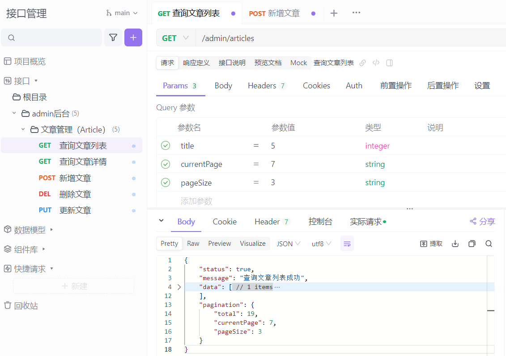

#### 白名单过滤

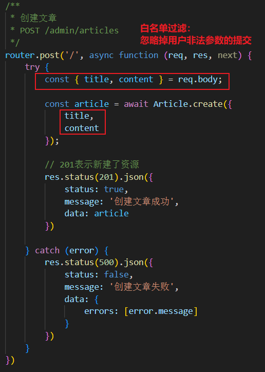

~~~js
/**
 * 公共方法：白名单过滤
 * @param req
 * @returns {{title, content: (string|string|DocumentFragment|*)}}
 */
function filterBody(req) {
    // 返回白名单过滤后的body参数，忽略用户上传的非法字段
    return {
        title: req.body.title,
        content: req.body.content
    };
}
~~~

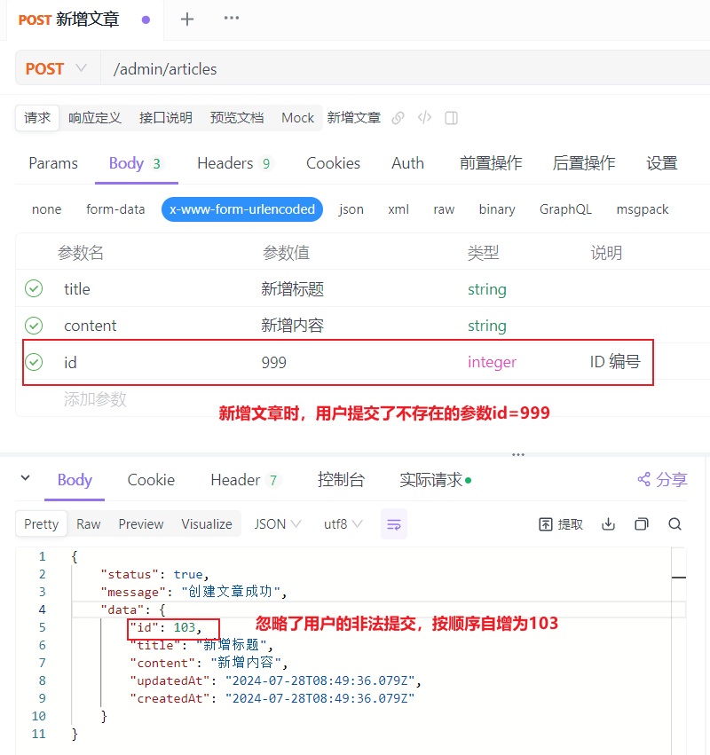


#### 表单验证

参数验证文档：

https://www.sequelize.cn/core-concepts/validations-and-constraints

1.在models/article.js中使用参数验证

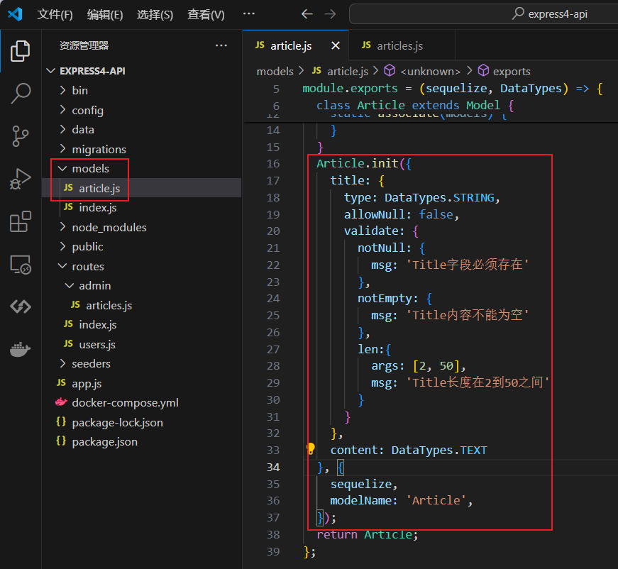

2.在routes/admin/articles.js中捕获错误，返回响应

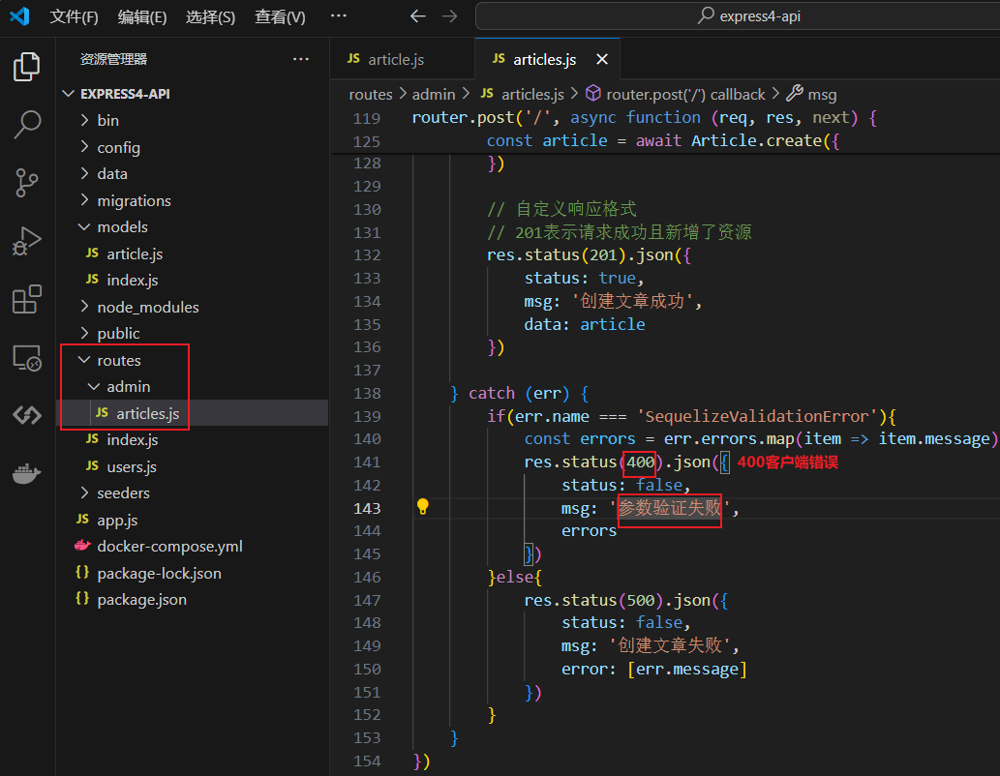

#### 优化代码

1.封装/utils/response.js

~~~js
/**
 * 自定义 404 错误类
 */
class NotFoundError extends Error {
    constructor(message) {
        super(message);
        this.name = 'NotFoundError';
    }
}

/**
 * 请求成功
 * @param res
 * @param message
 * @param data
 * @param code
 */
function success(res, message, data = {}, code = 200) {
    res.status(code).json({
        status: true,
        message,
        data
    });
}

/**
 * 请求失败
 * @param res
 * @param error
 */
function failure(res, error) {
    if (error.name === 'SequelizeValidationError') {
        const errors = error.errors.map(e => e.message);
        return res.status(400).json({
            status: false,
            message: '请求参数错误',
            errors
        });
    }

    if (error.name === 'NotFoundError') {
        return res.status(404).json({
            status: false,
            message: '资源不存在',
            errors: [error.message]
        });
    }

    res.status(500).json({
        status: false,
        message: '服务器错误',
        errors: [error.message]
    });
}

module.exports = {
    NotFoundError,
    success,
    failure
}
~~~

2.简化路由文件/routes/admin/articles.js的代码

~~~js
const express = require('express');
const router = express.Router();
const { Article } = require('../../models');
const { Op } = require('sequelize');
const {
    NotFoundError,
    success,
    failure
} = require('../../utils/response');

/**
 * 查询文章列表 
 * GET /admin/articles
 */
router.get('/', async function (req, res, next) {
    try {
        // 获取查询参数（query参数）
        let { currentPage, pageSize, title } = req.query;

        // 分页查询
        // /admin/articles?currentPage=1&pageSize=10
        currentPage = Math.abs(Number(currentPage)) || 1;
        pageSize = Math.abs(Number(pageSize)) || 10;
        const offset = (currentPage - 1) * pageSize;
        const conditions = {
            order: [['id', 'DESC']],
            limit: pageSize,
            offset: offset,
        };

        // 模糊查询
        // /admin/articles?title=xxx
        if (title) {
            conditions.where = {
                title: {
                    [Op.like]: `%${title}%`
                }
            }
        };

        // 操作数据库：查找所有文章
        const { count, rows } = await Article.findAndCountAll(conditions);

        // 成功响应
        success(res, '查询文章列表成功', {
            articles: rows,
            pagination: {
                total: count,
                currentPage,
                pageSize,
            }
        })
    } catch (error) {
        // 错误响应
        failure(res, error);
    }
});


/**
 * 查询文章详情
 * GET /admin/articles/:id
 */
router.get('/:id', async function (req, res, next) {
    try {
        // 查询当前文章
        const article = await getArticleByID(req)

        success(res, `查询文章详情成功`, { article })
    } catch (error) {
        failure(res, error);
    }
})


/**
 * 创建文章
 * POST /admin/articles
 */
router.post('/', async function (req, res, next) {
    try {
        // 获取body参数
        const body = filterBody(req);

        // 操作数据库： 创建文章
        const article = await Article.create(body);

        success(res, '创建文章成功', { article }, 201); // 201表示新建了资源
    } catch (error) {
        failure(res, error);
    }
})


/**
 * 删除文章
 * DELETE /admin/articles/:id
 */
router.delete('/:id', async function (req, res, next) {
    try {
        // 查询当前文章
        const article = await getArticleByID(req)

        // 操作数据库：删除文章
        await article.destroy();

        success(res, '删除文章成功')
    } catch (error) {
        failure(res, error);
    }
})


/**
 * 更新文章
 * PUT /admin/articles/:id
 */
router.put('/:id', async function (req, res, next) {
    try {
        // 查询当前文章
        const article = await getArticleByID(req);

        // 获取body参数
        const body = filterBody(req);

        // 操作数据库： 更新文章
        await article.update(body);

        success(res, '更新文章成功', { article });
    } catch (error) {
        failure(res, error);
    }
})

/**
 * 公共方法：查询当前文章
 */
async function getArticleByID(req) {
    // 获取params参数（path参数）
    const { id } = req.params;

    // 操作数据库： 查询当前文章通过id
    const article = await Article.findByPk(id);

    if (!article) {
        throw new NotFoundError(`ID: ${id}的文章未找到。`)
    }

    // 返回响应数据
    return article;
}

/**
 * 公共方法：白名单过滤
 * @param req
 * @returns {{title, content: (string|string|DocumentFragment|*)}}
 */
function filterBody(req) {
    // 返回白名单过滤后的body参数，忽略用户上传的非法字段
    return {
        title: req.body.title,
        content: req.body.content
    };
}

module.exports = router;
~~~


### 分类接口

#### 种子文件

1.创建种子文件

~~~bash
# 创建种子文件
# sequelize seed:generate --name 表名单数
sequelize seed:generate --name category
~~~


2.生成数据

在/seeders/20240728164907-category.js文件下

~~~js
'use strict';

/** @type {import('sequelize-cli').Migration} */
module.exports = {
  async up(queryInterface, Sequelize) {
    await queryInterface.bulkInsert('Categories', [
      { name: '前端开发', rank: 1, createdAt: new Date(), updatedAt: new Date() },
      { name: '后端开发', rank: 2, createdAt: new Date(), updatedAt: new Date() },
      { name: '移动端开发', rank: 3, createdAt: new Date(), updatedAt: new Date() },
      { name: '数据库', rank: 4, createdAt: new Date(), updatedAt: new Date() },
      { name: '服务器运维', rank: 5, createdAt: new Date(), updatedAt: new Date() },
      { name: '公共', rank: 6, createdAt: new Date(), updatedAt: new Date() },
    ], {});
  },

  async down(queryInterface, Sequelize) {
    await queryInterface.bulkDelete('Categories', null, {});
  }

};
~~~


3.执行种子文件

~~~bash
# sequelize db:seed --seed 种子文件所在路径
sequelize db:seed --seed .\seeders\20240728164907-category.js
~~~


#### 修改模型，增加验证

在\models\category.js文件下

~~~js
'use strict';
const {
  Model
} = require('sequelize');
module.exports = (sequelize, DataTypes) => {
  class Category extends Model {
    /**
     * Helper method for defining associations.
     * This method is not a part of Sequelize lifecycle.
     * The `models/index` file will call this method automatically.
     */
    static associate(models) {
      // define association here
    }
  }
  Category.init({
    name: {
      type: DataTypes.STRING,
      allowNull: false,
      unique: { msg: '该分类名称已经存在' },
      validate: {
        notNull: { msg: '分类名称字段必传' },
        notEmpty: { msg: '分类名称内容不能为空' },
        len: { args: [2, 10], msg: '分类名称长度在2-10个字符之间' }
      }
    },
    rank: {
      type: DataTypes.INTEGER,
      allowNull: false,
      validate: {
        notNull: { msg: '排序字段必传' },
        notEmpty: { msg: '排序不能为空' },
        isInt: { msg: '排序必须为整数' },
        isPositive(value) {
          if (value <= 0) {
            throw new Error('排序必须为正整数')
          }
        }
      }
    }
  }, {
    sequelize,
    modelName: 'Category',
  });
  return Category;
};
~~~

#### 路由的增删改查

在\routes\admin\categories.js文件下

- 文章 -> 分类，先把注释和提示信息里的都替换掉
- Article -> Category，这里替换的时候，要注意，勾选上`Aa`，意思是区分大小写。不然会把一些小写的`article`和`articles`给错误替换掉的。
- articles -> categories，这是替换的查询列表里的数据
- article -> category，替换查询单条文章
- title -> name，文章表里是`title`，分类表里是`name`，所以不要搞忘了
- content -> rank，分类表里没有`content`，而是`rank`

~~~js
const express = require('express');
const router = express.Router();
const { Category } = require('../../models');
const { Op } = require('sequelize');
const {
    NotFoundError,
    success,
    failure
} = require('../../utils/response');

/**
 * 查询分类列表 
 * GET /admin/categories
 */
router.get('/', async function (req, res, next) {
    try {
        // 获取查询参数（query参数）
        let { currentPage, pageSize, name } = req.query;

        // 分页查询
        // /admin/categories?currentPage=1&pageSize=10
        currentPage = Math.abs(Number(currentPage)) || 1;
        pageSize = Math.abs(Number(pageSize)) || 10;
        const offset = (currentPage - 1) * pageSize;
        const conditions = {
            order: [['id', 'DESC']],
            limit: pageSize,
            offset: offset,
        };

        // 模糊查询
        // /admin/categories?name=xxx
        if (name) {
            conditions.where = {
                name: {
                    [Op.like]: `%${name}%`
                }
            }
        };

        // 操作数据库：查找所有分类
        const { count, rows } = await Category.findAndCountAll(conditions);

        // 成功响应
        success(res, '查询分类列表成功', {
            categories: rows,
            pagination: {
                total: count,
                currentPage,
                pageSize,
            }
        })
    } catch (error) {
        // 错误响应
        failure(res, error);
    }
});


/**
 * 查询分类详情
 * GET /admin/categories/:id
 */
router.get('/:id', async function (req, res, next) {
    try {
        // 查询当前分类
        const category = await getCategoryByID(req)

        success(res, `查询分类详情成功`, { category })
    } catch (error) {
        failure(res, error);
    }
})


/**
 * 创建分类
 * POST /admin/categories
 */
router.post('/', async function (req, res, next) {
    try {
        // 获取body参数
        const body = filterBody(req);

        // 操作数据库： 创建分类
        const category = await Category.create(body);

        success(res, '创建分类成功', { category }, 201); // 201表示新建了资源
    } catch (error) {
        failure(res, error);
    }
})


/**
 * 删除分类
 * DELETE /admin/categories/:id
 */
router.delete('/:id', async function (req, res, next) {
    try {
        // 查询当前分类
        const category = await getCategoryByID(req)

        // 操作数据库：删除分类
        await category.destroy();

        success(res, '删除分类成功')
    } catch (error) {
        failure(res, error);
    }
})


/**
 * 更新分类
 * PUT /admin/categories/:id
 */
router.put('/:id', async function (req, res, next) {
    try {
        // 查询当前分类
        const category = await getCategoryByID(req);

        // 获取body参数
        const body = filterBody(req);

        // 操作数据库： 更新分类
        await category.update(body);

        success(res, '更新分类成功', { category });
    } catch (error) {
        failure(res, error);
    }
})

/**
 * 公共方法：查询当前分类
 */
async function getCategoryByID(req) {
    // 获取params参数（path参数）
    const { id } = req.params;

    // 操作数据库： 查询当前分类通过id
    const category = await Category.findByPk(id);

    if (!category) {
        throw new NotFoundError(`ID: ${id}的分类未找到。`)
    }

    // 返回响应数据
    return category;
}

/**
 * 公共方法：白名单过滤
 * @param req
 * @returns {{name, rank: *}}
 */
function filterBody(req) {
    // 返回白名单过滤后的body参数，忽略用户上传的非法字段
    return {
        name: req.body.name,
        rank: req.body.rank
    };
}

module.exports = router;
~~~


在app.js文件下

~~~js
const adminCategoriesRouter = require('./routes/admin/categories');

// ...

app.use('/admin/categories', adminCategoriesRouter);
~~~


#### apifox新增接口

- `文章`改为`分类`
- URL地址的`articles`改为`categories`
- 字段`title`改为`name`
- 字段`content`改为`rank`

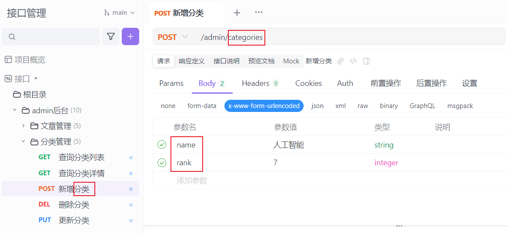

### 系统设置接口

#### 种子文件

1.创建种子文件

~~~bash
# 创建种子文件
# sequelize seed:generate --name 表名单数
sequelize seed:generate --name setting
~~~


2.生成数据

在\seeders\20240728174822-setting.js文件下

~~~js
'use strict';

/** @type {import('sequelize-cli').Migration} */
module.exports = {
  async up(queryInterface, Sequelize) {
    await queryInterface.bulkInsert('Settings', [{
      name: '网站名称',
      icp: '备案号',
      copyright: '版权信息',
      createdAt: new Date(),
      updatedAt: new Date()
    }], {});
  },

  async down(queryInterface, Sequelize) {
    await queryInterface.bulkDelete('Settings', null, {});
  }

};
~~~


3.执行种子文件

~~~bash
# sequelize db:seed --seed 种子文件所在路径
sequelize db:seed --seed xxx-setting
~~~

#### 路由的增删改查

在\routes\admin\settings.js文件下

- 文章 -> 系统设置
- Article -> Setting
- article -> setting
- :id ->       因为就一条设置的数据，不用通过id查找数据块了

~~~js
const express = require('express');
const router = express.Router();
const { Setting } = require('../../models');
const {
    NotFoundError,
    success,
    failure
} = require('../../utils/response');


/**
 * 查询系统设置详情
 * GET /admin/categories/
 */
router.get('/', async function (req, res, next) {
    try {
        // 查询当前系统设置
        const setting = await getSettingByID(req)

        success(res, `查询系统设置详情成功`, { setting })
    } catch (error) {
        failure(res, error);
    }
})


/**
 * 更新系统设置
 * PUT /admin/categories/
 */
router.put('/', async function (req, res, next) {
    try {
        // 查询当前系统设置
        const setting = await getSettingByID(req);

        // 获取body参数
        const body = filterBody(req);

        // 操作数据库： 更新系统设置
        await setting.update(body);

        success(res, '更新系统设置成功', { setting });
    } catch (error) {
        failure(res, error);
    }
})

/**
 * 公共方法：查询当前系统设置
 */
async function getSettingByID(req) {
    // 操作数据库： 查询当前系统设置
    const setting = await Setting.findByPk(1);

    if (!setting) {
        throw new NotFoundError(`ID: ${id}的系统设置未找到。`)
    }

    // 返回响应数据
    return setting;
}

/**
 * 公共方法：白名单过滤
 * @param req
 * @returns {{copyright: (string|*), icp: (string|string|DocumentFragment|*), name}}
 */
function filterBody(req) {
    return {
        name: req.body.name,
        icp: req.body.icp,
        copyright: req.body.copyright
    };
}


module.exports = router;
~~~

在app.js文件下

~~~js
const adminSettingsRouter = require('./routes/admin/settings');

//...

app.use('/admin/settings', adminSettingsRouter);
~~~


#### apifox新增接口

- `文章`改为`系统设置`
- URL地址的`articles`改为`settings`
- 字段`title`改为`name`
- 字段`content`改为`rank`

### 用户管理接口

#### 种子文件

1.创建种子文件

~~~bash
# 创建种子文件
# sequelize seed:generate --name 表名单数
sequelize seed:generate --name user
~~~


2.生成数据

在\seeders\20240728174822-setting.js文件下

~~~js
'use strict';

/** @type {import('sequelize-cli').Migration} */
module.exports = {
  async up(queryInterface, Sequelize) {
    await queryInterface.bulkInsert('Users', [
      {
        email: 'admin@clwy.cn',
        username: 'admin',
        password: '123123',
        nickname: '超厉害的管理员',
        sex: 2,
        role: 100,
        createdAt: new Date(),
        updatedAt: new Date()
      },
      {
        email: 'user1@clwy.cn',
        username: 'user1',
        password: '123123',
        nickname: '普通用户1',
        sex: 0,
        role: 0,
        createdAt: new Date(),
        updatedAt: new Date()
      },
      {
        email: 'user2@clwy.cn',
        username: 'user2',
        password: '123123',
        nickname: '普通用户2',
        sex: 0,
        role: 0,
        createdAt: new Date(),
        updatedAt: new Date()
      },
      {
        email: 'user3@clwy.cn',
        username: 'user3',
        password: '123123',
        nickname: '普通用户3',
        sex: 1,
        role: 0,
        createdAt: new Date(),
        updatedAt: new Date()
      }
    ], {});
  },

  async down(queryInterface, Sequelize) {
    await queryInterface.bulkDelete('Users', null, {});
  }

};
~~~


3.执行种子文件

~~~bash
# sequelize db:seed --seed 种子文件所在路径
sequelize db:seed --seed xxx-user
~~~


#### 修改模型，增加验证

~~~js
email: {
  type: DataTypes.STRING,
  allowNull: false,
  validate: {
    notNull: { msg: '邮箱必须填写。' },
    notEmpty: { msg: '邮箱不能为空。' },
    isEmail: { msg: '邮箱格式不正确。' },
    async isUnique(value) {
      const user = await User.findOne({ where: { email: value } })
      if (user) {
        throw new Error('邮箱已存在，请直接登录。');
      }
    }
  }
},
username: {
  type: DataTypes.STRING,
  allowNull: false,
  validate: {
    notNull: { msg: '用户名必须填写。' },
    notEmpty: { msg: '用户名不能为空。' },
    len: { args: [2, 45], msg: '用户名长度必须是2 ~ 45之间。' },
    async isUnique(value) {
      const user = await User.findOne({ where: { username: value } })
      if (user) {
        throw new Error('用户名已经存在。');
      }
    }
  },
},
password: {
  type: DataTypes.STRING,
  allowNull: false,
  validate: {
    notNull: { msg: '密码必须填写。' },
    notEmpty: { msg: '密码不能为空。' },
    len: { args: [6, 45], msg: '密码长度必须是6 ~ 45之间。' }
  }
},
nickname: {
  type: DataTypes.STRING,
  allowNull: false,
  validate: {
    notNull: { msg: '昵称必须填写。' },
    notEmpty: { msg: '昵称不能为空。' },
    len: { args: [2, 45], msg: '昵称长度必须是2 ~ 45之间。' }
  }
},
sex: {
  type: DataTypes.TINYINT,
  allowNull: false,
  validate: {
    notNull: { msg: '性别必须填写。' },
    notEmpty: { msg: '性别不能为空。' },
    isIn: { args: [[0, 1, 2]], msg: '性别的值必须是，男性：0 女性：1 未选择：2。' }
  }
},
company: DataTypes.STRING,
introduce: DataTypes.TEXT,
role: {
  type: DataTypes.TINYINT,
  allowNull: false,
  validate: {
    notNull: { msg: '用户组必须选择。' },
    notEmpty: { msg: '用户组不能为空。' },
    isIn: { args: [[0, 100]], msg: '用户组的值必须是，普通用户：0 管理员：100。' }
  }
},
avatar: {
  type: DataTypes.STRING,
  validate: {
    isUrl: { msg: '图片地址不正确。' }
  }
},
~~~


#### 路由的增删改查

在\routes\admin\users.js文件下

- 文章 -> 用户
- Article -> User
- article -> user

~~~js
const express = require('express');
const router = express.Router();
const { User } = require('../../models');
const { Op } = require('sequelize');
const {
    NotFoundError,
    success,
    failure
} = require('../../utils/response');

/**
 * 查询用户列表 
 * GET /admin/users
 */
router.get('/', async function (req, res, next) {
    try {
        // 获取查询参数（query参数）
        let { currentPage, pageSize, email, username, nickname, role } = req.query;

        // 分页查询
        // /admin/users?currentPage=1&pageSize=10
        currentPage = Math.abs(Number(currentPage)) || 1;
        pageSize = Math.abs(Number(pageSize)) || 10;
        const offset = (currentPage - 1) * pageSize;
        const conditions = {
            order: [['id', 'DESC']],
            limit: pageSize,
            offset: offset,
        };

        // 模糊查询
        // /admin/users?nickname=xxx
        if (email) {
            conditions.where = {
                email: {
                    [Op.eq]: email
                }
            };
        }

        if (username) {
            conditions.where = {
                username: {
                    [Op.eq]: username
                }
            };
        }

        if (nickname) {
            conditions.where = {
                nickname: {
                    [Op.like]: `%${nickname}%`
                }
            };
        }

        if (role) {
            conditions.where = {
                role: {
                    [Op.eq]: role
                }
            };
        }


        // 操作数据库：查找所有用户
        const { count, rows } = await User.findAndCountAll(conditions);

        // 成功响应
        success(res, '查询用户列表成功', {
            users: rows,
            pagination: {
                total: count,
                currentPage,
                pageSize,
            }
        })
    } catch (error) {
        // 错误响应
        failure(res, error);
    }
});


/**
 * 查询用户详情
 * GET /admin/users/:id
 */
router.get('/:id', async function (req, res, next) {
    try {
        // 查询当前用户
        const user = await getUserByID(req)

        success(res, `查询用户详情成功`, { user })
    } catch (error) {
        failure(res, error);
    }
})


/**
 * 创建用户
 * POST /admin/users
 */
router.post('/', async function (req, res, next) {
    try {
        // 获取body参数
        const body = filterBody(req);

        // 操作数据库： 创建用户
        const user = await User.create(body);

        success(res, '创建用户成功', { user }, 201); // 201表示新建了资源
    } catch (error) {
        failure(res, error);
    }
})


/**
 * 更新用户
 * PUT /admin/users/:id
 */
router.put('/:id', async function (req, res, next) {
    try {
        // 查询当前用户
        const user = await getUserByID(req);

        // 获取body参数
        const body = filterBody(req);

        // 操作数据库： 更新用户
        await user.update(body);

        success(res, '更新用户成功', { user });
    } catch (error) {
        failure(res, error);
    }
})

/**
 * 公共方法：查询当前用户
 */
async function getUserByID(req) {
    // 获取params参数（path参数）
    const { id } = req.params;

    // 操作数据库： 查询当前用户通过id
    const user = await User.findByPk(id);

    if (!user) {
        throw new NotFoundError(`ID: ${id}的用户未找到。`)
    }

    // 返回响应数据
    return user;
}


/**
 * 公共方法：白名单过滤
 * @param req
 * @returns {{password, role: (number|string|*), introduce: ({type: *}|*), sex: ({allowNull: boolean, type: *, validate: {notNull: {msg: string}, notEmpty: {msg: string}, isIn: {args: [number[]], msg: string}}}|{defaultValue: number, allowNull: boolean, type: *}|*), nickname: (string|*), company: ({type: *}|*), avatar: ({type: *, validate: {isUrl: {msg: string}}}|*), email: (string|*), username}}
 */
function filterBody(req) {
    return {
        email: req.body.email,
        username: req.body.username,
        password: req.body.password,
        nickname: req.body.nickname,
        sex: req.body.sex,
        company: req.body.company,
        introduce: req.body.introduce,
        role: req.body.role,
        avatar: req.body.avatar
    };
}

module.exports = router;
~~~

在app.js文件下

~~~js
const adminUsersRouter = require('./routes/admin/users');

//...

app.use('/admin/users', adminUsersRouter);
~~~


#### apifox新增接口

- `文章`改为`用户`
- URL地址的`articles`改为`users`
- 删除文章的字段，添加用户的字段


### 课程接口（关联模型）

#### 种子文件

1.创建种子文件

~~~bash
# sequelize db:seed --seed 种子文件所在路径
sequelize seed:generate --name course
~~~


2.生成数据

在\seeders\20240728174822-setting.js文件下

~~~js
async up(queryInterface, Sequelize) {
  await queryInterface.bulkInsert('Courses', [
    {
      categoryId: 1,
      userId: 1,
      name: 'CSS 入门',
      recommended: true,
      introductory: true,
      createdAt: new Date(),
      updatedAt: new Date()
    },
    {
      categoryId: 2,
      userId: 1,
      name: 'Node.js 项目实践（2024 版）',
      recommended: true,
      introductory: false,
      createdAt: new Date(),
      updatedAt: new Date()
    },
  ], {});
},

async down(queryInterface, Sequelize) {
  await queryInterface.bulkDelete('Courses', null, {});
}
~~~


3.执行种子文件

~~~bash
sequelize db:seed --seed xxx-course
~~~


#### 修改模型、增加验证

~~~js
categoryId: {
  type: DataTypes.INTEGER,
  allowNull: false,
  validate: {
    notNull: { msg: '分类ID必须填写。' },
    notEmpty: { msg: '分类ID不能为空。' },
    async isPresent(value) {
      const category = await sequelize.models.Category.findByPk(value)
      if (!category) {
        throw new Error(`ID为：${value} 的分类不存在。`);
      }
    }
  }
},
userId: {
  type: DataTypes.INTEGER,
  allowNull: false,
  validate: {
    notNull: { msg: '用户ID必须填写。' },
    notEmpty: { msg: '用户ID不能为空。' },
    async isPresent(value) {
      const user = await sequelize.models.User.findByPk(value)
      if (!user) {
        throw new Error(`ID为：${value} 的用户不存在。`);
      }
    }
  }
},
name: {
  type: DataTypes.STRING,
  allowNull: false,
  validate: {
    notNull: { msg: '名称必须填写。' },
    notEmpty: { msg: '名称不能为空。' },
    len: { args: [2, 45], msg: '名称长度必须是2 ~ 45之间。' }
  }
},
image: {
  type: DataTypes.STRING,
  validate: {
    isUrl: { msg: '图片地址不正确。' }
  }
},
recommended: {
  type: DataTypes.BOOLEAN,
  validate: {
    isIn: { args: [[true, false]], msg: '是否推荐的值必须是，推荐：true 不推荐：false。' }
  }
},
introductory: {
  type: DataTypes.BOOLEAN,
  validate: {
    isIn: { args: [[true, false]], msg: '是否入门课程的值必须是，推荐：true 不推荐：false。' }
  }
},
content: DataTypes.TEXT,
likesCount: DataTypes.INTEGER,
chaptersCount: DataTypes.INTEGER
~~~


#### 路由的增删改查

在\routes\admin\courses.js文件下

- 文章 -> 课程
- Article -> Course
- article -> course

~~~js
const express = require('express');
const router = express.Router();
const { Course } = require('../../models');
const { Op } = require('sequelize');
const {
    NotFoundError,
    success,
    failure
} = require('../../utils/response');

/**
 * 查询课程列表 
 * GET /admin/courses
 */
router.get('/', async function (req, res, next) {
    try {
        // 获取查询参数（query参数）
        let { currentPage, pageSize, categoryId, userId, name, recommended, introductory } = req.query;

        // 分页查询
        // /admin/courses?currentPage=1&pageSize=10
        currentPage = Math.abs(Number(currentPage)) || 1;
        pageSize = Math.abs(Number(pageSize)) || 10;
        const offset = (currentPage - 1) * pageSize;
        const conditions = {
            order: [['id', 'DESC']],
            limit: pageSize,
            offset: offset,
        };

        // 模糊查询
        // /admin/courses?title=xxx
        if (categoryId) {
            conditions.where = {
                categoryId: {
                    [Op.eq]: categoryId
                }
            };
        }

        if (userId) {
            conditions.where = {
                userId: {
                    [Op.eq]: userId
                }
            };
        }

        if (name) {
            conditions.where = {
                name: {
                    [Op.like]: `%${name}%`
                }
            };
        }

        if (recommended) {
            conditions.where = {
                recommended: {
                    // 需要转布尔值
                    [Op.eq]: recommended === 'true'
                }
            };
        }

        if (introductory) {
            conditions.where = {
                introductory: {
                    [Op.eq]: introductory === 'true'
                }
            };
        }

        // 操作数据库：查找所有课程
        const { count, rows } = await Course.findAndCountAll(conditions);

        // 成功响应
        success(res, '查询课程列表成功', {
            courses: rows,
            pagination: {
                total: count,
                currentPage,
                pageSize,
            }
        })
    } catch (error) {
        // 错误响应
        failure(res, error);
    }
});


/**
 * 查询课程详情
 * GET /admin/courses/:id
 */
router.get('/:id', async function (req, res, next) {
    try {
        // 查询当前课程
        const course = await getCourseByID(req)

        success(res, `查询课程详情成功`, { course })
    } catch (error) {
        failure(res, error);
    }
})


/**
 * 创建课程
 * POST /admin/courses
 */
router.post('/', async function (req, res, next) {
    try {
        // 获取body参数
        const body = filterBody(req);

        // 操作数据库： 创建课程
        const course = await Course.create(body);

        success(res, '创建课程成功', { course }, 201); // 201表示新建了资源
    } catch (error) {
        failure(res, error);
    }
})


/**
 * 删除课程
 * DELETE /admin/courses/:id
 */
router.delete('/:id', async function (req, res, next) {
    try {
        // 查询当前课程
        const course = await getCourseByID(req)

        // 操作数据库：删除课程
        await course.destroy();

        success(res, '删除课程成功')
    } catch (error) {
        failure(res, error);
    }
})


/**
 * 更新课程
 * PUT /admin/courses/:id
 */
router.put('/:id', async function (req, res, next) {
    try {
        // 查询当前课程
        const course = await getCourseByID(req);

        // 获取body参数
        const body = filterBody(req);

        // 操作数据库： 更新课程
        await course.update(body);

        success(res, '更新课程成功', { course });
    } catch (error) {
        failure(res, error);
    }
})

/**
 * 公共方法：查询当前课程
 */
async function getCourseByID(req) {
    // 获取params参数（path参数）
    const { id } = req.params;

    // 操作数据库： 查询当前课程通过id
    const course = await Course.findByPk(id);

    if (!course) {
        throw new NotFoundError(`ID: ${id}的课程未找到。`)
    }

    // 返回响应数据
    return course;
}

/**
 * 公共方法：白名单过滤
 * @param req
 * @returns {{image: *, name, introductory: (boolean|*), userId: (number|*), categoryId: (number|*), content, recommended: (boolean|*)}}
 */
function filterBody(req) {
    return {
        categoryId: req.body.categoryId,
        userId: req.body.userId,
        name: req.body.name,
        image: req.body.image,
        recommended: req.body.recommended,
        introductory: req.body.introductory,
        content: req.body.content
    };
}

module.exports = router;
~~~


在app.js文件下

~~~js
const adminCoursesRouter = require('./routes/admin/courses');

// ...

app.use('/admin/courses', adminCoursesRouter);
~~~


#### 关联模型

1.在模型文件中关联模型

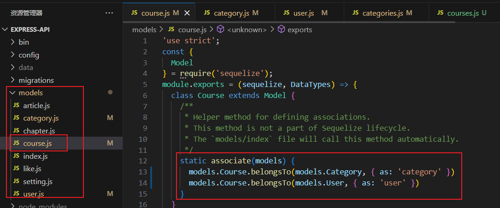

- 一门课程属于一个分类
- 一门课程属于一个用户


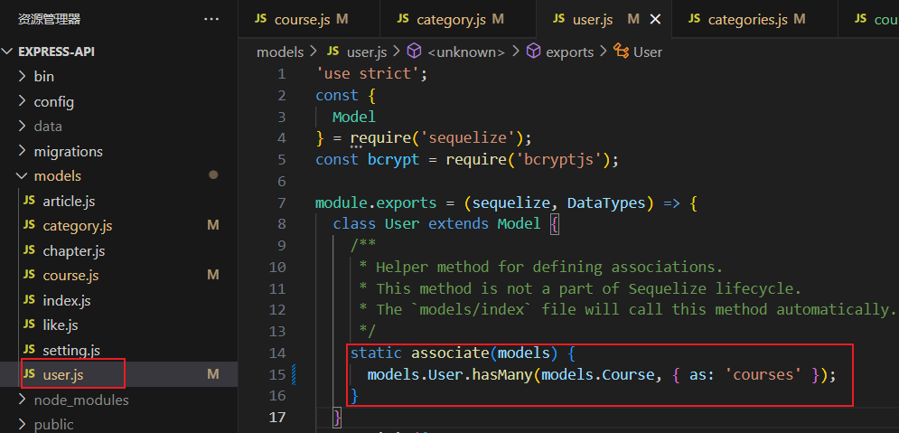

- 一个分类有多个课程
- 一个用户有多个课程

2.在路由文件中，添加查询条件

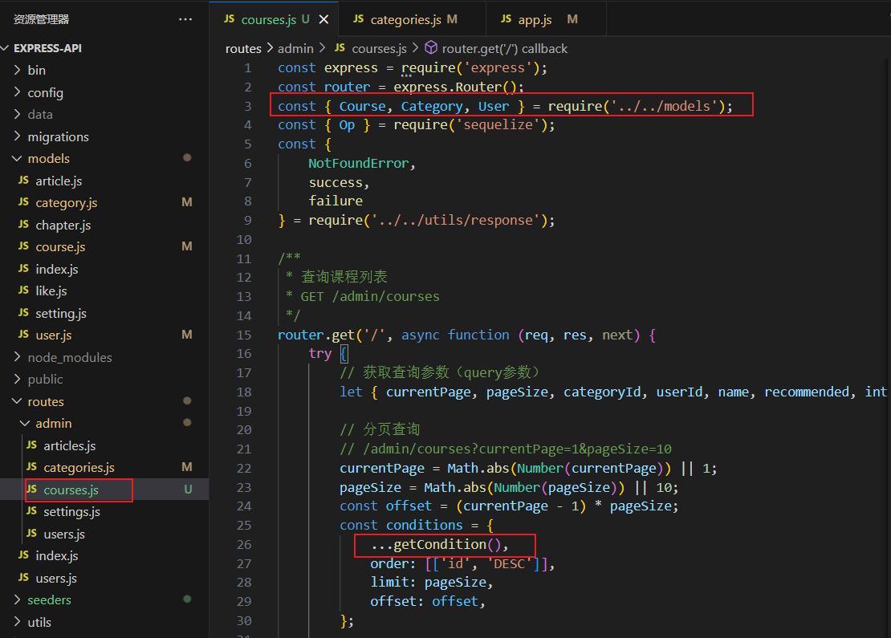

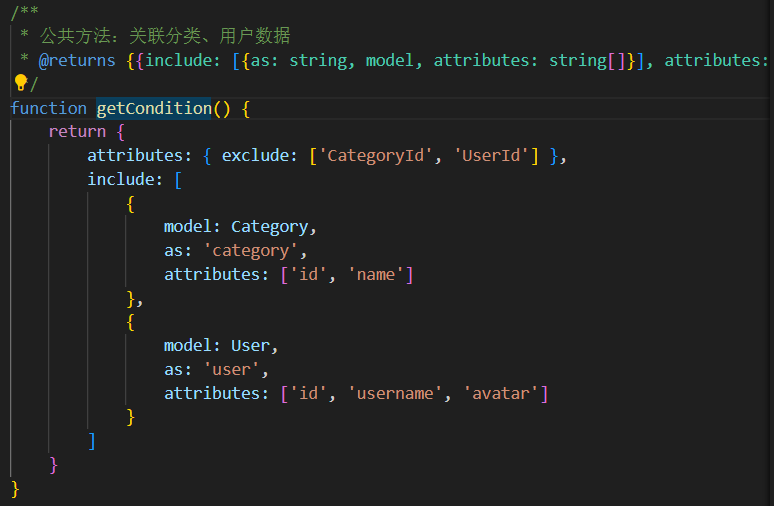

#### 孤儿模型

设想一下，我们这条数据，关联了 ID 为 1 的分类。但如果这时候，我们将 ID 为 1 的分类删掉了，那会怎样呢？这个课程，就会查不到对应的分类了。这种没有对应父表记录的数据，我们就叫它：`孤儿记录`。

要处理这种问题，有三种方法：

- 方案一：可以在数据库里，设置外键约束，确保数据完整性，这样删除的时候，就会提示错误。但要注意啊，一般在企业里，是不让用外键约束。因为使用外键约束后，数据库会产生额外的性能开销。在高并发、数据量大的情况，可能造成性能瓶颈。
- 方案二：常规做法就是在代码层面来处理了。可以在删除分类的时候，写点代码，把当前分类关联的所有课程全部删掉，这样就没有孤儿记录了。但大家思考一下，你们觉得这样做行吗？万一用户不小心点错了，把一个重要的分类删掉了。这样所有对应的课程也全都没有了，这可就好玩了。
- 方案三：在删除分类的时候，查询一下，有没有关联的课程。只要有对应的课程，就提示用户，不能删除。

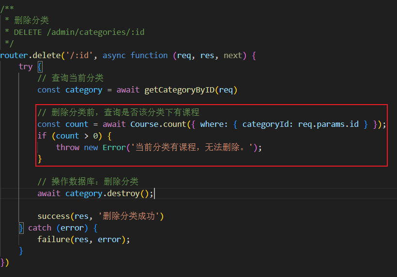

### 章节接口（关联模型）

#### 种子文件

1.创建种子文件

~~~bash
sequelize seed:generate --name chapter
~~~


2.生成数据

在\seeders\20240728174822-setting.js文件下

~~~js
async up(queryInterface, Sequelize) {
  await queryInterface.bulkInsert('Chapters', [
    {
      courseId: 1,
      title: 'CSS 课程介绍',
      content: 'CSS的全名是层叠样式表。官方的解释，我就不细说了，因为就算细说了，对新手朋友们来说，听得还是一脸懵逼。那我们就用最通俗的说法来讲，到底啥是CSS？',
      video: '',
      rank: 1,
      createdAt: new Date(),
      updatedAt: new Date()
    },
    {
      courseId: 2,
      title: 'Node.js 课程介绍',
      content: '这套课程，定位是使用 JS 来全栈开发项目。让我们一起从零基础开始，学习接口开发。先从最基础的项目搭建、数据库的入门，再到完整的真实项目开发，一步步的和大家一起完成一个真实的项目。',
      video: '',
      rank: 1,
      createdAt: new Date(),
      updatedAt: new Date()
    },
    {
      courseId: 2,
      title: '安装 Node.js',
      content: '安装Node.js，最简单办法，就是直接在官网下载了安装。但这种方法，却不是最好的办法。因为如果需要更新Node.js的版本，那就需要把之前的卸载了，再去下载安装其他版本，这样就非常的麻烦了。',
      video: '',
      rank: 2,
      createdAt: new Date(),
      updatedAt: new Date()
    },
  ], {});
},

async down(queryInterface, Sequelize) {
  await queryInterface.bulkDelete('Chapters', null, {});
}
~~~


3.执行种子文件

~~~bash
# sequelize db:seed --seed 种子文件所在路径
sequelize db:seed --seed xxx-user
~~~


#### 修改模型、增加验证

~~~js
courseId: {
  type: DataTypes.INTEGER,
  allowNull: false,
  validate: {
    notNull: { msg: '课程ID必须填写。' },
    notEmpty: { msg: '课程ID不能为空。' },
    async isPresent(value) {
      const course = await sequelize.models.Course.findByPk(value)
      if (!course) {
        throw new Error(`ID为：${ value } 的课程不存在。`);
      }
    }
  }
},
title: {
  type: DataTypes.STRING,
  allowNull: false,
  validate: {
    notNull: { msg: '标题必须填写。' },
    notEmpty: { msg: '标题不能为空。' },
    len: { args: [2, 45], msg: '标题长度必须是2 ~ 45之间。' }
  }
},
content: DataTypes.TEXT,
video: {
  type: DataTypes.STRING,
  validate: {
    isUrl: { msg: '视频地址不正确。' }
  }
},
rank: {
  type: DataTypes.INTEGER,
  allowNull: false,
  validate: {
    notNull: { msg: '排序必须填写。' },
    notEmpty: { msg: '排序不能为空。' },
    isInt: { msg: '排序必须为整数。' },
    isPositive(value) {
      if (value <= 0) {
        throw new Error('排序必须是正整数。');
      }
    }
  }
},
~~~


#### 路由的增删改查

在\routes\admin\users.js文件下

- 文章 -> 用户
- Article -> User
- article -> user


在app.js文件下

~~~js
const adminUsersRouter = require('./routes/admin/users');

//...

app.use('/admin/users', adminUsersRouter);
~~~


### Echarts数据统计接口（执行原始 SQL 语句）

#### 数据格式

饼图

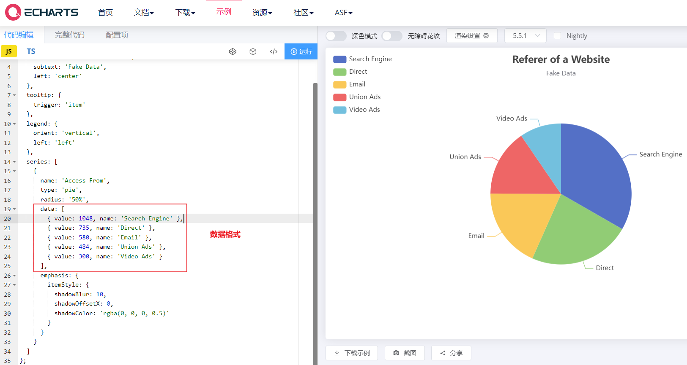

折线图

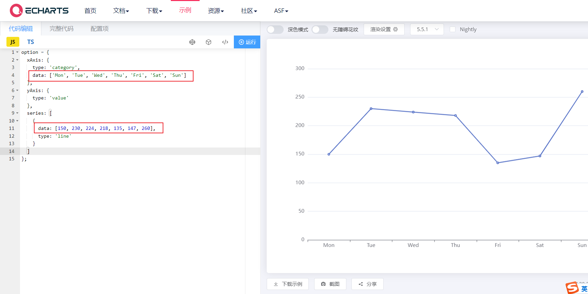


#### 路由

~~~js
const express = require('express');
const router = express.Router();
const { sequelize, User } = require('../../models');
const { Op } = require('sequelize');
const {
    NotFoundError,
    success,
    failure
} = require('../../utils/response');

/**
 * 统计用户性别
 * GET /admin/charts/sex
 */
router.get('/sex', async function (req, res, next) {
    try {
        // 查询用户性别
        const male = await User.count({ where: { sex: 0 } });
        const female = await User.count({ where: { sex: 1 } });
        const unknown = await User.count({ where: { sex: 2 } });

        // 构造数据
        const data = [
            { value: male, name: '男性' },
            { value: female, name: '女性' },
            { value: unknown, name: '未选择' }
        ];

        // 成功响应
        success(res, '统计用户性别数量成功', { data });
    } catch (error) {
        // 错误响应
        failure(res, error);
    }
});


/**
 * 统计每个月注册的用户数量
 * GET /admin/charts/user
 */
router.get('/user', async (req, res) => {
    try {
        const [results] = await sequelize.query("SELECT DATE_FORMAT(`createdAt`, '%Y-%m') AS `month`, COUNT(*) AS `value` FROM `Users` GROUP BY `month` ORDER BY `month` ASC");

        const data = {
            months: [],
            values: [],
        };

        results.forEach(item => {
            data.months.push(item.month);
            data.values.push(item.value);
        });

        success(res, '统计每个月注册的用户数量成功', { data });

    } catch (error) {
        failure(res, error);
    }
});


module.exports = router;
~~~


### 登录接口


## 加密数据

1.安装

~~~ba
npm i bcryptjs
~~~

[2.模型的get/set方法](https://www.sequelize.cn/core-concepts/getters-setters-virtuals)

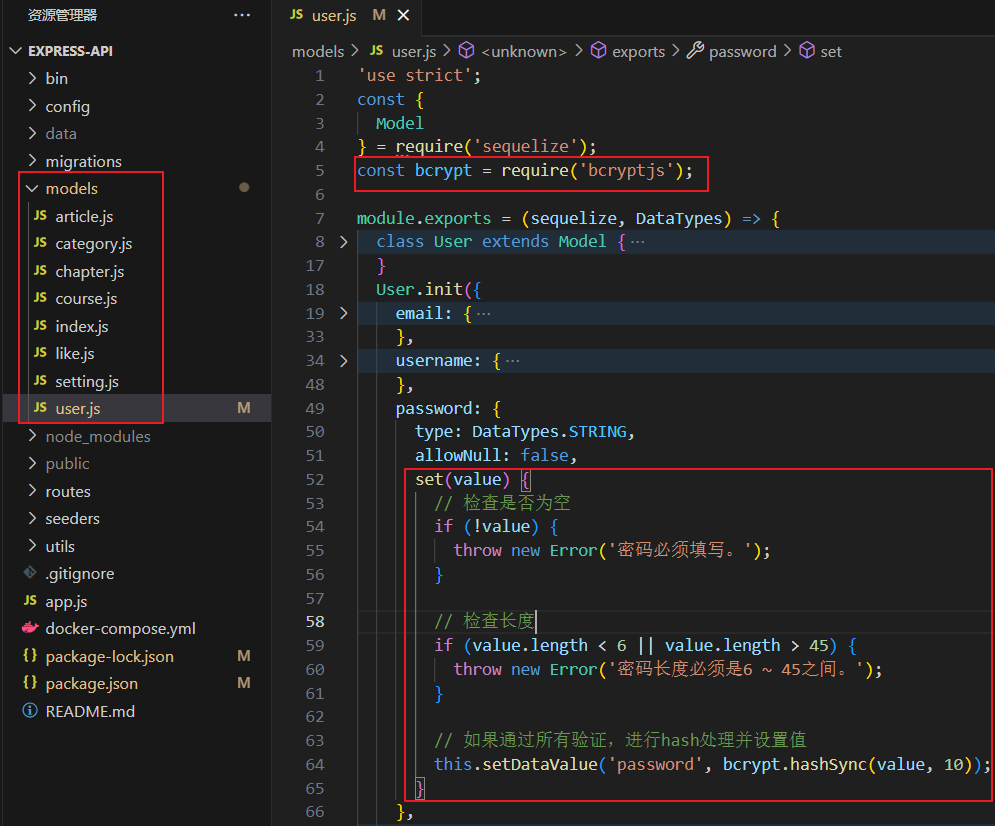

3.清空user表数据，加密数据后，运行种子文件


## apifox

### 新建团队、项目

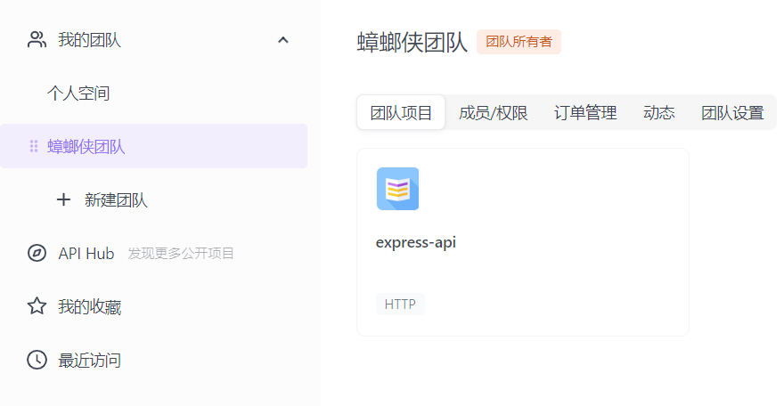

### 配置开发环境

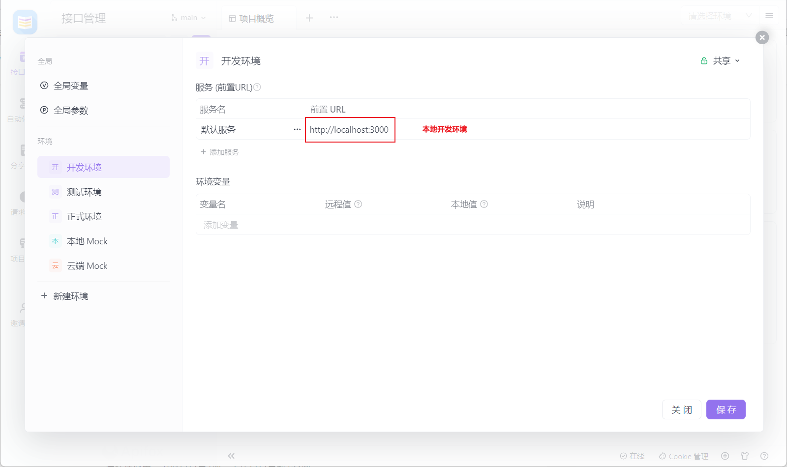


### 自定义响应状态码

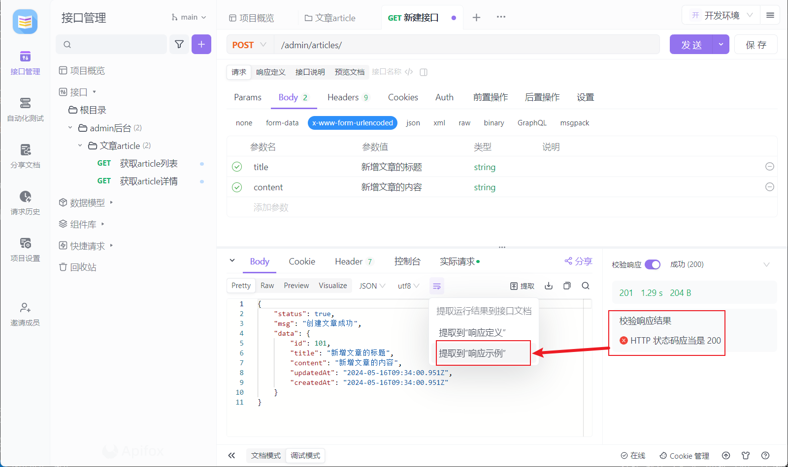