# git命令

## 配置用户信息

~~~
git config --global user.name "xxx"
git config --global user.email "xxx"
~~~

## 查看配置文件

~~~
git config --list --global
~~~

## 仓库状态

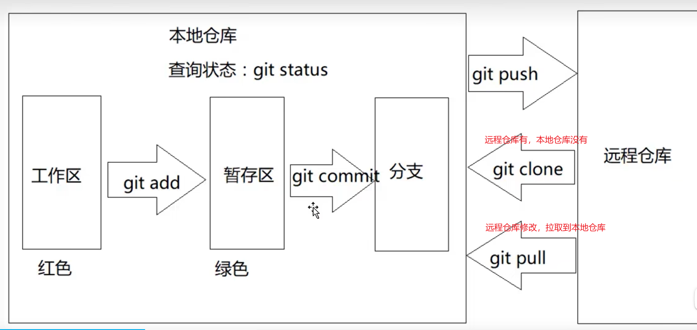

## 回溯

## 分支

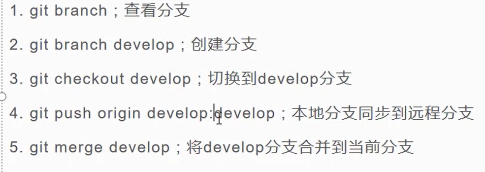

# Github

## 创建仓库

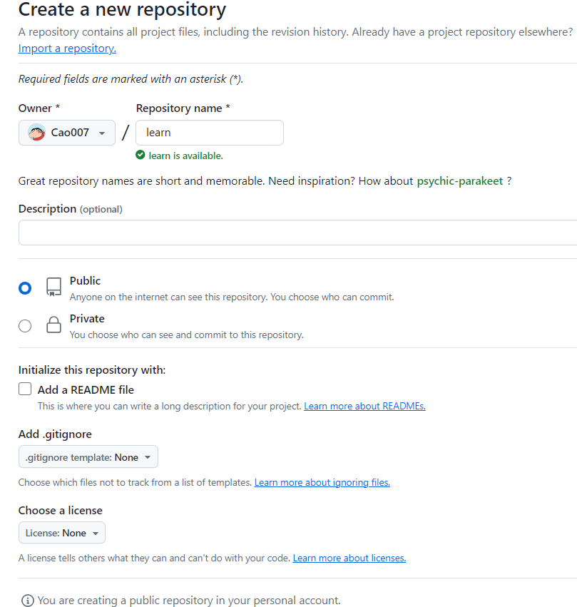

创建新仓库

~~~bash
echo "# learn" >> README.md
git init
git add README.md
git commit -m "first commit"
git branch -M main
git remote add origin https://github.com/Cao007/learn.git
git push -u origin main
~~~

推送已存在的仓库

~~~bash
git remote add origin https://github.com/Cao007/learn.git
git branch -M main
git push -u origin main
~~~

使用代理服务器

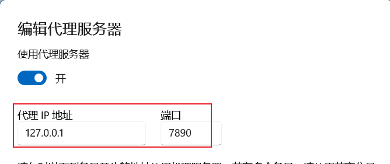

~~~bash
# 设置代理服务器
git config --global http.proxy http://127.0.0.1:7890

# 取消代理服务器
git config --global --unset http.proxy
git config --global --unset https.proxy

# 查看设置
git config --global --list
~~~

## 修改文件后提交

~~~bash
# 查看文件状态
git status -s

# 1.提交到暂存区
git add .

# 2.提交到本地分支
git commit -m "修改后"

# 3.提交到远程仓库的分支
git push
~~~

## 拉取最新代码

~~~bash
git pull
~~~

## clone项目

### https

~~~bash
git clone https://github.com/Cao007/learn.git
~~~

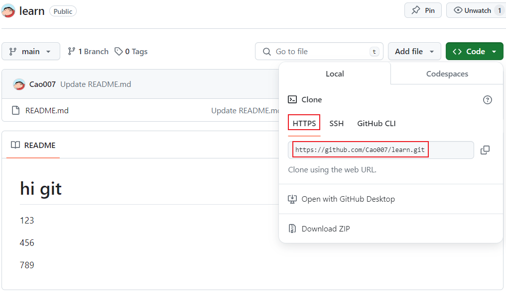

### SSH

~~~bash
# 1.生成公钥、私钥。一路回车
ssh-keygen
~~~

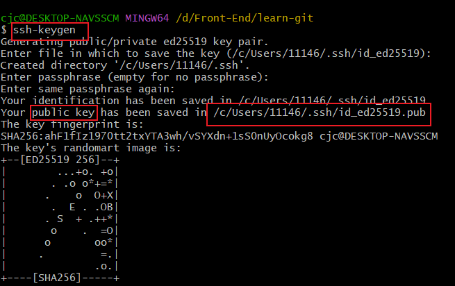

2.将公钥复制到github中的ssh中

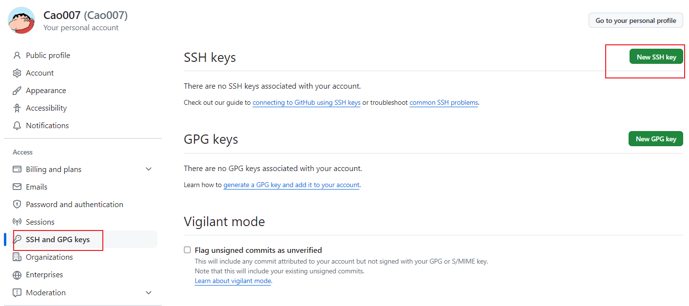

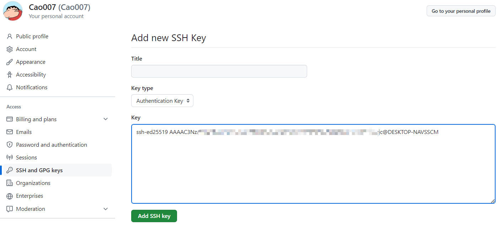

3.使用ssh地址clone项目

~~~bash
git clone git@github.com:Cao007/learn.git
~~~

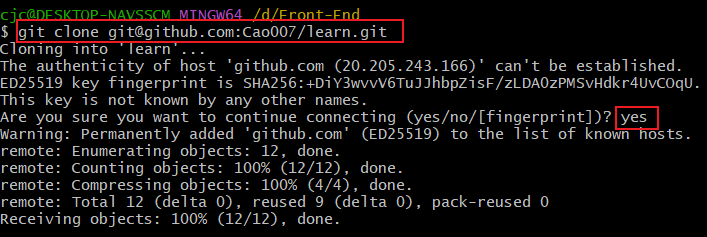

## 项目常见操作

### 项目面板

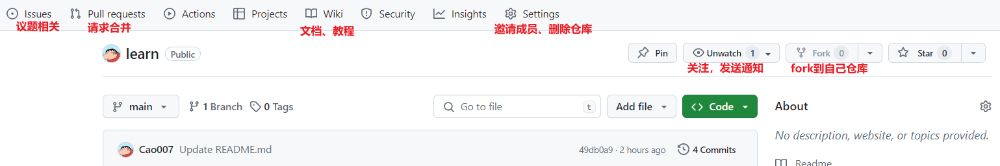

### 邀请成员

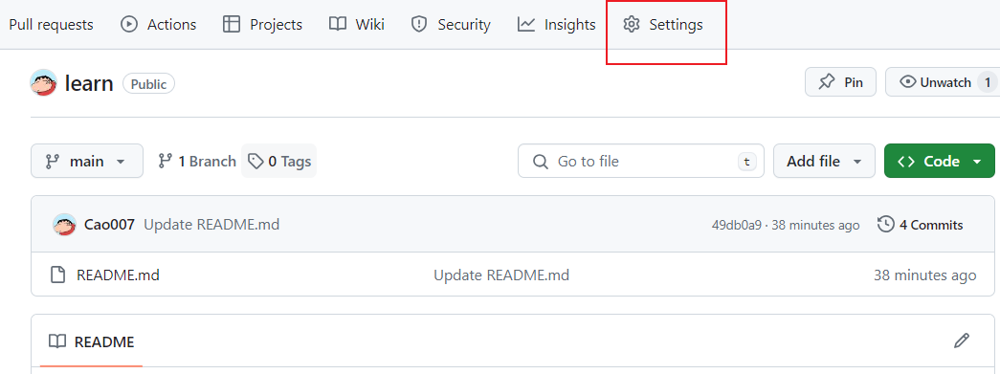

### fork项目

1.fork项目到自己的仓库

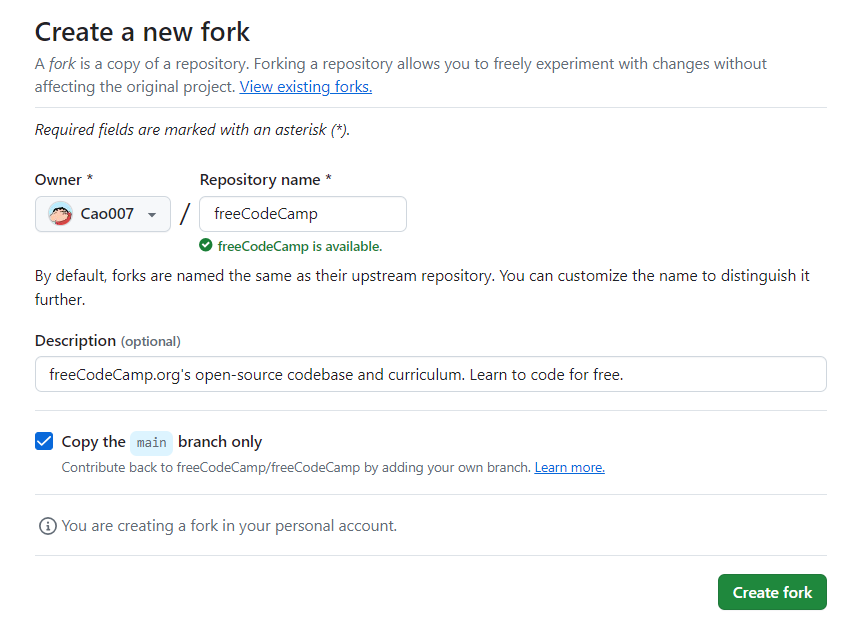

2.clone项目到本地，修改项目

3.pull request

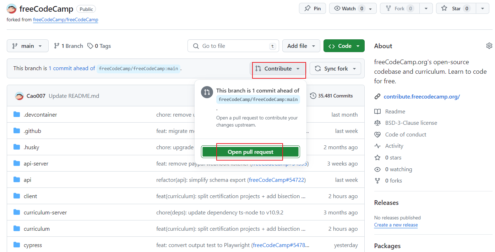

### 删除仓库

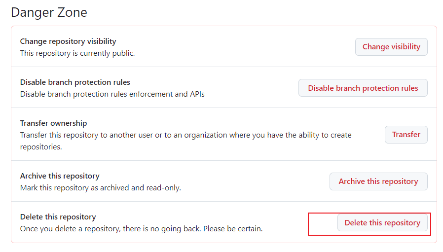

## GitHub Pages

https://pages.github.com/

### 用户页面

1.创建仓库

- 用户名.github.io

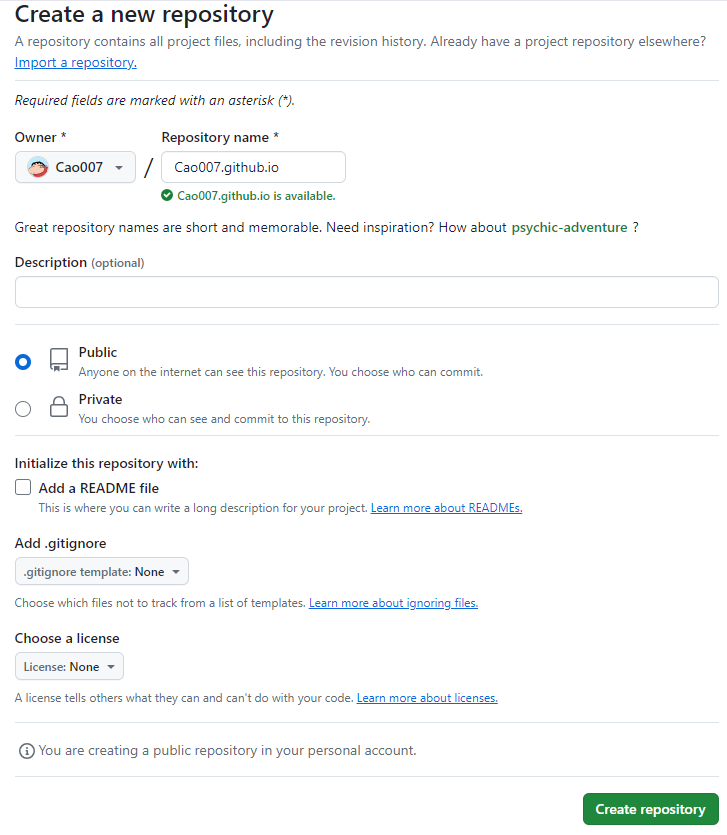

~~~bash
# 2.clone到本地
git clone https://github.com/username/username.github.io

# 3.本地写项目

# 4.https://username.github.io
https://Cao007.github.io
~~~

### 项目页面

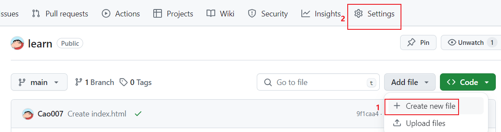

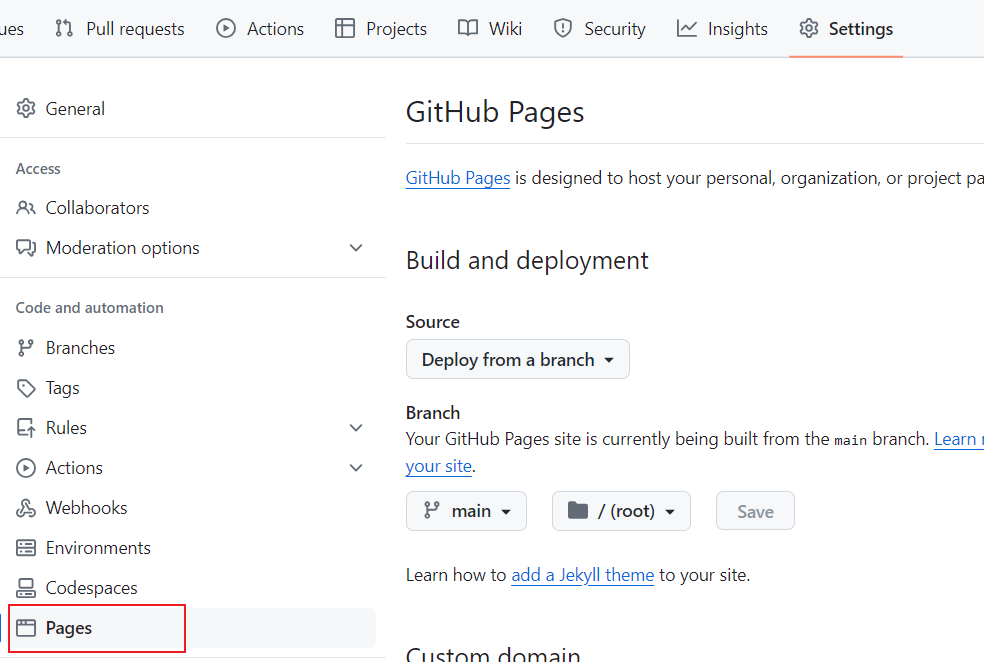
