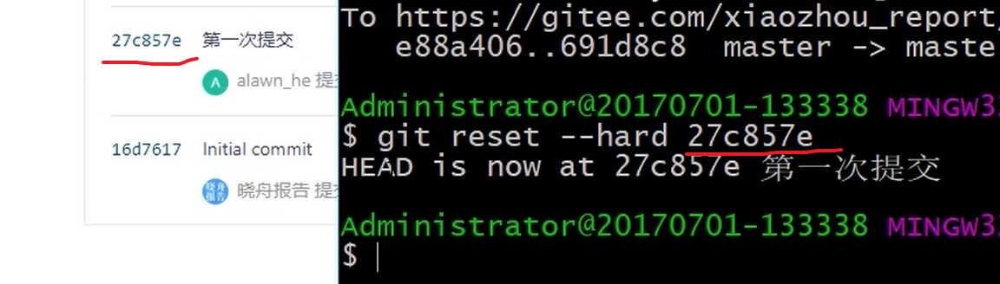
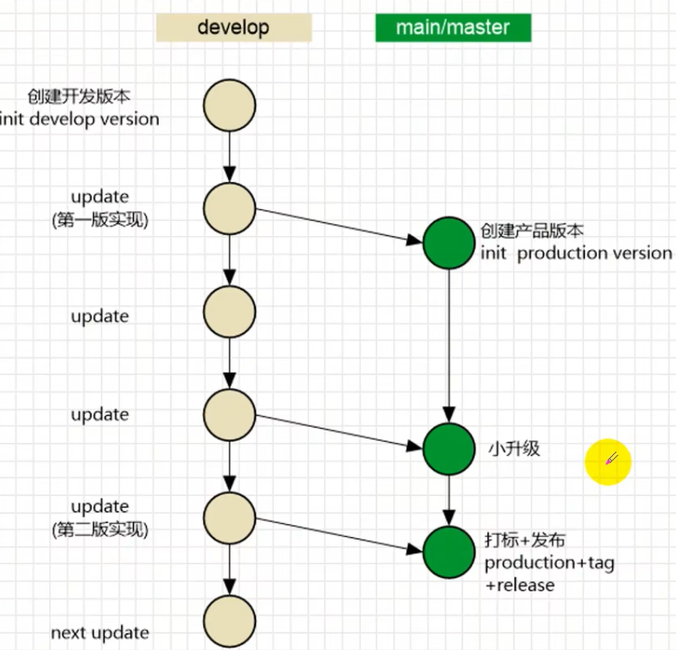
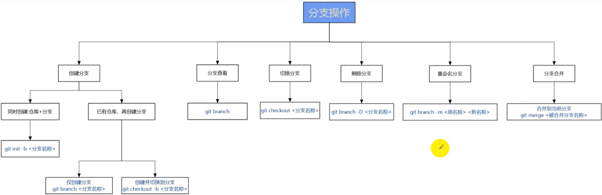
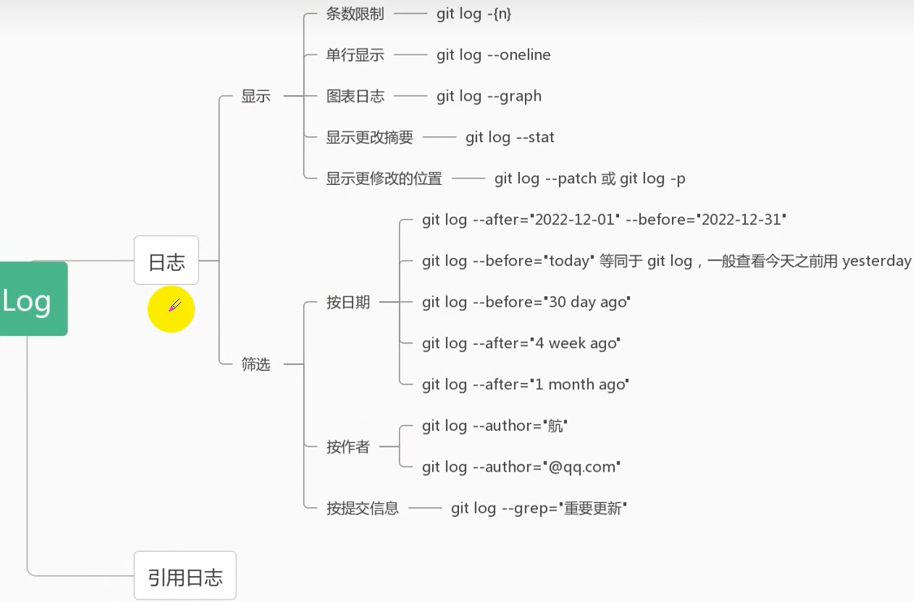
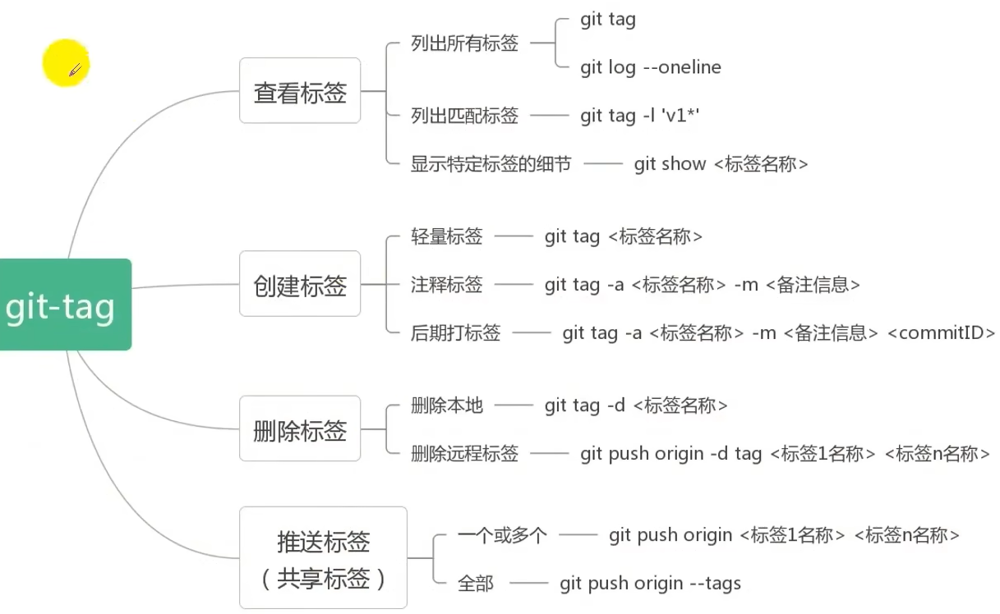
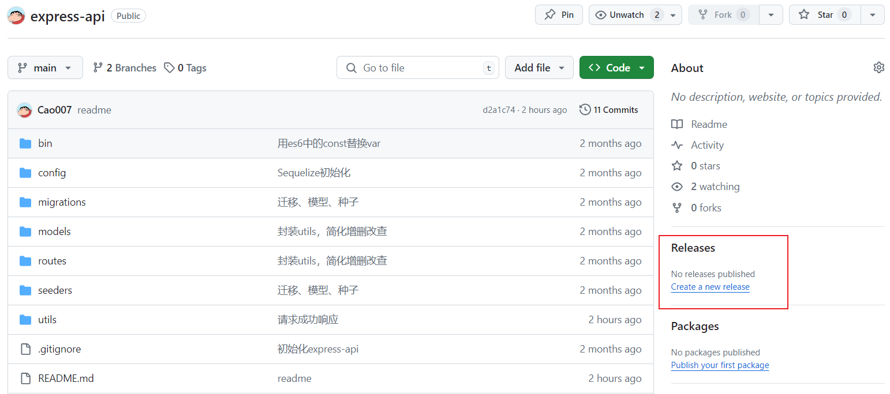
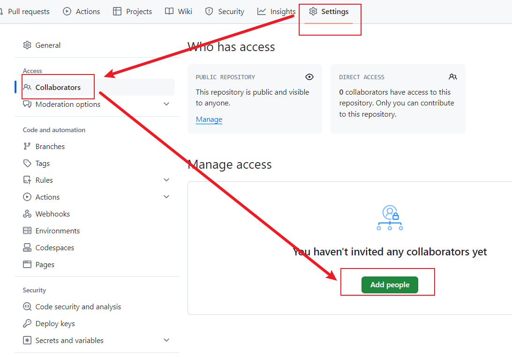

# git命令

## 配置用户信息

~~~
git config --global user.name "xxx"
git config --global user.email "xxx"
~~~

## 查看配置文件

~~~
git config --list --global
~~~

## 仓库状态

## 回溯

## 分支

~~~bash
# 查看所有分支
git branch -a
# 创建并切换到dev分支
git checkout -b dev

# 在dev分支上进行一些更改
git add .
git commit -m "修改..."
git push -u origin dev

# 切换回main分支
git checkout main
# 更新main分支
git pull origin main
# 合并dev分支到main分支
git merge dev
# 推送更新的main分支到远程仓库
git push origin main
~~~

## 远程仓库操作

~~~bash
# 查看本地关联的所有远程仓库
git remote -v
~~~

## 提交修正

1. 多个小的commit提交，产生冗余
2. 漏提交文件等等

~~~bash
git commit --amend -m "修正后再次提交"
~~~

## git日志

~~~bash
# 引用日志
# 保存在本地，记录了仓库的所有改变
git reflog
~~~

## 打标签及发行版

创建发行版

# Github

## 创建仓库

创建新仓库

~~~bash
echo "# learn" >> README.md
git init
git add README.md
git commit -m "first commit"
git branch -M main
git remote add origin https://github.com/Cao007/learn.git
git push -u origin main
~~~

推送已存在的仓库

~~~bash
git remote add origin https://github.com/Cao007/learn.git
git branch -M main
git push -u origin main
~~~

使用代理服务器

~~~bash
# 设置代理服务器
git config --global http.proxy http://127.0.0.1:7890

# 取消代理服务器
git config --global --unset http.proxy
git config --global --unset https.proxy

# 查看设置
git config --global --list
~~~

## 修改文件后提交

~~~bash
# 拉取最新代码
git pull

# 查看文件状态
git status -s

# 1.提交到暂存区
git add .

# 2.提交到本地分支
git commit -m "修改后"

# 3.提交到远程仓库的分支
git push
~~~

## clone项目

### https

~~~bash
git clone https://github.com/Cao007/learn.git
~~~

### SSH

~~~bash
# 1.生成公钥、私钥。一路回车
ssh-keygen
~~~

2.将公钥复制到github中的ssh中

~~~bash
# 测试ssh连通性
ssh -T git@github.com
~~~

3.使用ssh地址clone项目

~~~bash
git clone git@github.com:Cao007/learn.git
~~~

## 项目常见操作

### 项目面板

### 邀请成员

### fork与PR

1.fork项目到自己的仓库

2.clone项目到本地，修改项目

~~~bash
# 克隆你的fork仓库到本地
git clone https://github.com/your-username/your-forked-repo.git
cd your-forked-repo

# 添加上游仓库作为远程仓库
git remote add upstream https://github.com/original-owner/original-repo.git

# 切换到main分支
git checkout main

# 获取并合并上游仓库的main分支到本地main分支
git pull upstream main

# 如果有冲突，解决冲突后添加文件并提交
# git add <conflicted-file>
# git commit

# 将更新推送到你的远程fork仓库
git push origin main
~~~

3.pull request

### 删除仓库

## GitHub Pages

https://pages.github.com/

### 用户页面

1.创建仓库

- 用户名.github.io

~~~bash
# 2.clone到本地
git clone https://github.com/username/username.github.io

# 3.本地写项目

# 4.https://username.github.io
https://Cao007.github.io
~~~

### 项目页面

