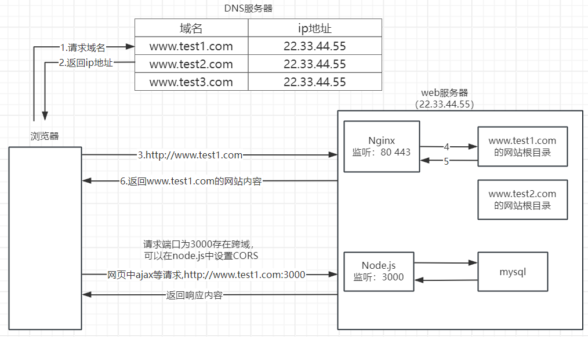
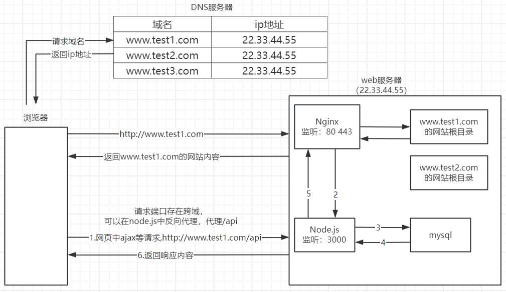
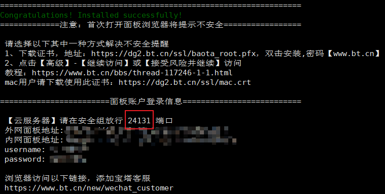
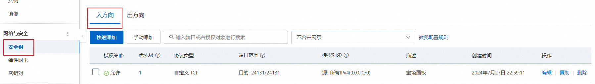

# 服务器部署

## 网站运行机制



在Node.js中设置反向代理




## 域名

1.配置域名解析


2.测试域名解析是否完成

~~~bash
nslookup www.superblog.top
~~~


## 远程连接服务器

~~~bash
ssh 用户名@域名或ip地址
~~~


## 安装服务器相关软件

### cenos开发者工具包

~~~bash
# 安装cenos开发者相关包
yum groupinstall 'Development tools'
~~~

### nginx

~~~bash
# 1.安装nginx源
sudo yum install epel-release

# 2.安装nginx
sudo yum install nginx

# 3.启动nginx
sudo systemctl start nginx

# 4.配置防火墙
sudo firewall-cmd --permanent --zone=public --add-service=http 
sudo firewall-cmd --permanent --zone=public --add-service=https
sudo firewall-cmd --reload
~~~

### node.js

~~~bash
# yum源中没有node.js，获取node资源
curl -fsSL https://rpm.nodesource.com/setup_20.x | sudo bash -

# 安装node
sudo yum install -y nsolid

# 查看版本
node -v

# 安装pm2 node.js程序管理工具
npm i pm2 -g

# 使用pm2 启动node.js项目
pm2 start 文件名或者id

# 停止
pm2 stop 文件名或者id

# 从pm2的管理列表中删除
pm2 delete 文件名或者id
~~~

### mysql

~~~bash
# 下载并安装 MySQL 源
wget https://dev.mysql.com/get/mysql80-community-release-el7-3.noarch.rpm
sudo yum localinstall mysql80-community-release-el7-3.noarch.rpm

# 安装 MySQL
sudo yum install mysql-community-server -y

# 如果上一步报错 执行下面的语句 之后 再次执行一下上面的安装Mysql的语句
sudo yum module disable mysql

# 启动MySQL
sudo systemctl start mysqld

# 找到默认密码
# MySQL安装完毕之后会自动设置一个默认密码，我们需要找到默认密码
grep 'temporary password' /var/log/mysqld.log

# 连接到MySQL数据库，修改密码
mysql -uroot -p

ALTER USER 'root'@'localhost' IDENTIFIED BY 'newpassword';
~~~

## 上传网站资源

~~~bash
scp 本地文件 root@域名:远程路径

# 在服务器创建文件夹
mkdir /home/nginx/

# 把网页文件移动到创建好的文件夹里
mv ./dist.zip /home/nginx/

# 解压压缩文件
cd /home/ningx
unzip ./dist.zip

# 修改文件夹名字
mv dist superblog
# 结果就是  /home/nginx/superblog  这个文件夹中放的就是我们的网页文件了
~~~

## 配置nginx

创建一个superblog.conf文件

```bash
cd /etc/nginx/conf.d
# 创建配置文件
touch superblog.conf
vim superblog.conf
# 按i键 进出插入模式
# 复制下面的内容，粘贴进去
# 保存退出
# 按一下esc退出编辑模式
# 然后输入 下面的内容 敲回车
:wq
```


superblog.conf

```bash
server {
    listen       80;
    server_name  superblog.top;

    location / {
        root   /home/nginx/superblog;
        index  index.html index.htm;
    }
  
}
```


# 使用宝塔部署

## 宝塔管理

~~~bash
# 安装宝塔linux版
url=https://download.bt.cn/install/install_lts.sh;if [ -f /usr/bin/curl ];then curl -sSO $url;else wget -O install_lts.sh $url;fi;bash install_lts.sh ed8484bec

#
~~~

查看网址、账号信息



在云服务器的安全组中开放指定的端口

