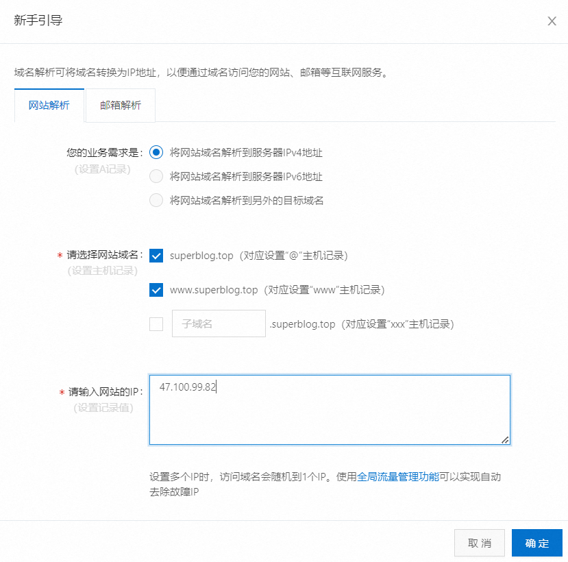

# 服务器部署

## 网站运行机制


在Node.js中设置反向代理


## 域名

1.配置域名解析



2.测试域名解析是否完成

~~~bash
nslookup www.superblog.top
~~~


## 远程连接服务器

~~~bash
ssh 用户名@域名或ip地址
~~~


## 宝塔

### 安装宝塔

1.安装宝塔linux版

~~~bash
url=https://download.bt.cn/install/install_lts.sh;if [ -f /usr/bin/curl ];then curl -sSO $url;else wget -O install_lts.sh $url;fi;bash install_lts.sh ed8484bec
~~~

2.查看网址、账号信息


3.在云服务器的安全组中开放指定的端口


### node和pm2

#### 安装node和pm2


### nginx

#### 安装nginx


#### 配置nginx

创建一个superblog.conf文件

```bash
cd /etc/nginx/conf.d
# 创建配置文件
touch superblog.conf
vim superblog.conf
# 按i键 进出插入模式
# 复制下面的内容，粘贴进去
# 保存退出
# 按一下esc退出编辑模式
# 然后输入 下面的内容 敲回车
:wq
```


superblog.conf

```bash
server {
    listen       80;
    server_name  superblog.top;

    location / {
        root   /home/nginx/superblog;
        index  index.html index.htm;
    }
  
}
```


### mysql

#### 安装mysql


### 上传代码

从github仓库上克隆代码


刷新界面


下载依赖


### 配置环境变量

将`.env.example`文件拷贝为`.env`文件，并修改配置。

```
NODE_ENV=development
PORT=3000
SECRET=你的秘钥
```

- `NODE_ENV`配置为开发环境，如部署在生产环境可改为`production`。
- `PORT`配置为服务端口
- `SECRET`配置为秘钥。


**生成秘钥：**

在命令行中运行

```
node
```

进入交互模式后，运行

```
const crypto = require('crypto');
console.log(crypto.randomBytes(32).toString('hex'));
```

复制得到的秘钥，并填写到`.env`文件中的`SECRET`配置。

> PS：可以使用 `ctrl + c` 退出交互模式。


### 配置数据库

1.获取数据库密码


2.找到数据库配置的`config/config.json`


3.创建数据库、表、数据

在项目根目录下执行：

~~~shell
# 创建数据库
npx sequelize-cli db:create --charset utf8mb4 --collate utf8mb4_general_ci --env production

# 运行迁移，自动建表
npx sequelize-cli db:migrate --env production

# 运行种子，填充初始数据
npx sequelize-cli db:seed:all --env production
~~~

4.连接到客户端


### 添加站点

1.域名解析


2.开放端口


3.添加站点


4.SSL证书


Apifox正式环境


### 更新部署

~~~bash
# 1.在项目根目录下
git pull

# 2.重启网站
~~~


### 项目跟随系统重启


### 部署多个项目

端口：

- `.env`文件，例如，修改为`PORT=3001`
- 宝塔里，`项目端口`，也改为`3001`

域名：

- 域名再做一个的解析，例如，解析`api2.superblog.top`到当前服务器公网 IP 地址上。
- 宝塔里，`项目域名`，也要对应的改为：`api2.superblog.top`
