# 安装和启动

~~~bash
pnpm add -D vitepress
pnpm vitepress init
pnpm run docs:dev
~~~

# 在md中使用vue

## 全局组件

1.编写vue组件

2.注册全局组件：

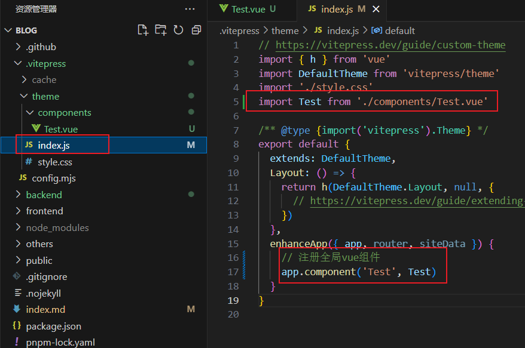

3.在md文章中使用

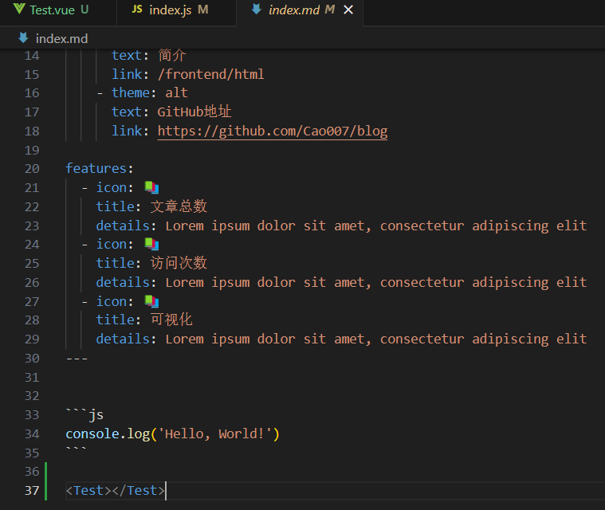

## 布局插槽

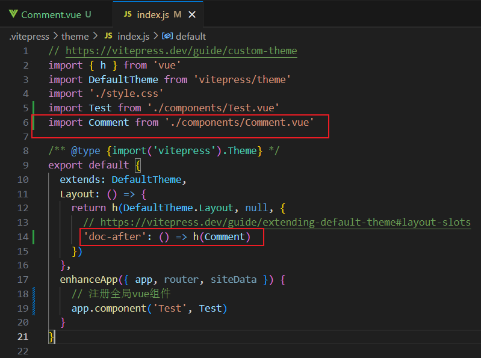

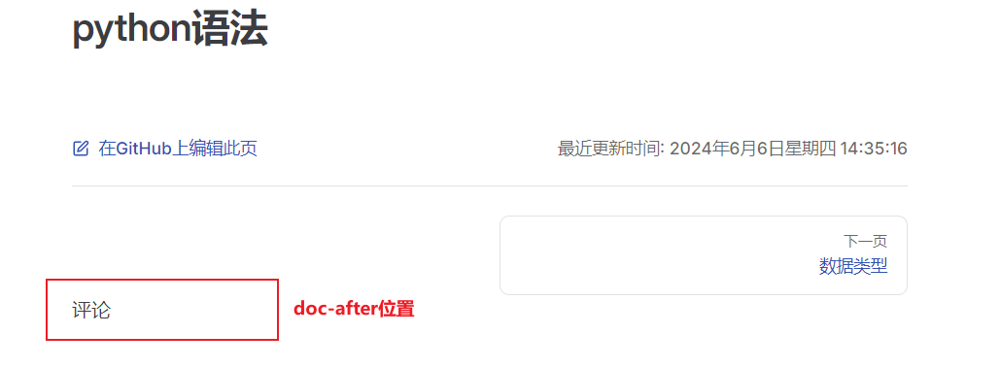

# 评论系统

## giscus

1.安装giscus

~~~bash
 pnpm i @giscus/vue 
~~~

2.在仓库的 `Settings` -> `General` -> `Features` -> `Discussions` 中开启 Discussions 功能

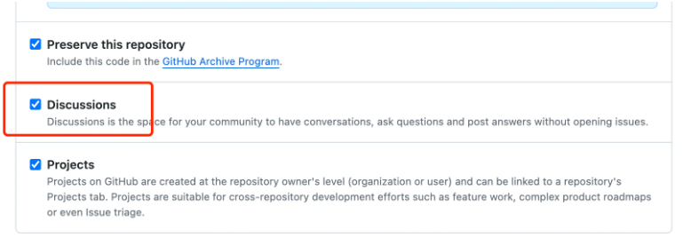

3.在GitHub插件市场搜索Giscus并安装

https://github.com/marketplace

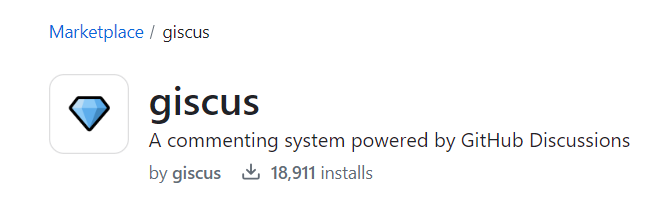

在Settings的App中查看已安装的插件

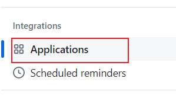

4.配置giscus

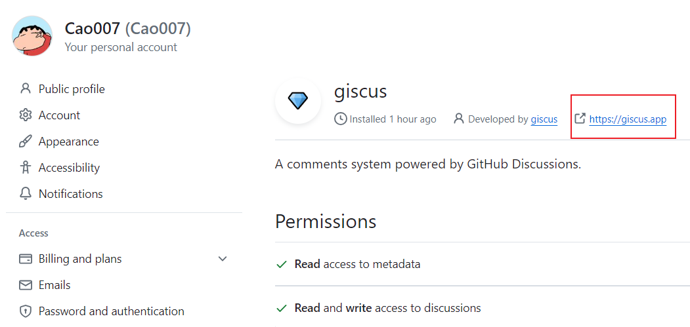

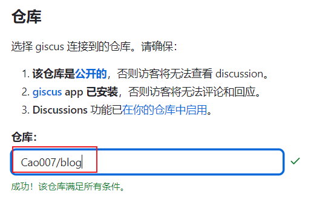

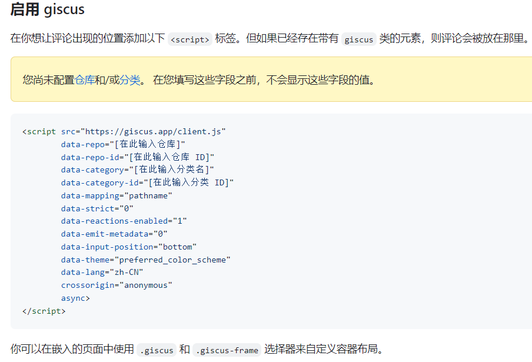

5.新建vue文件

在 `.vitepress/theme/components` 目录下新建 `Comment.vue` 文件，内容如下：

~~~vue
<template>
    

        <Giscus
            id="comments"
            repo="Cao007/blog"
            repoid="R_kgDOMFRFTg"
            category="General"
            categoryid="DIC_kwDOMFRFTs4CgCRv"
            mapping="pathname"
            term="Welcome to giscus!"
            reactionsenabled="1"
            emitmetadata="0"
            inputposition="top"
            loading="lazy"
            :theme="isDark ? 'dark' : 'light'"
            :key="route.path"
            lang="zh-CN"
        ></Giscus>
    

</template>

~~~

6.在 `.vitepress/index.js` 中引入 Comment 组件

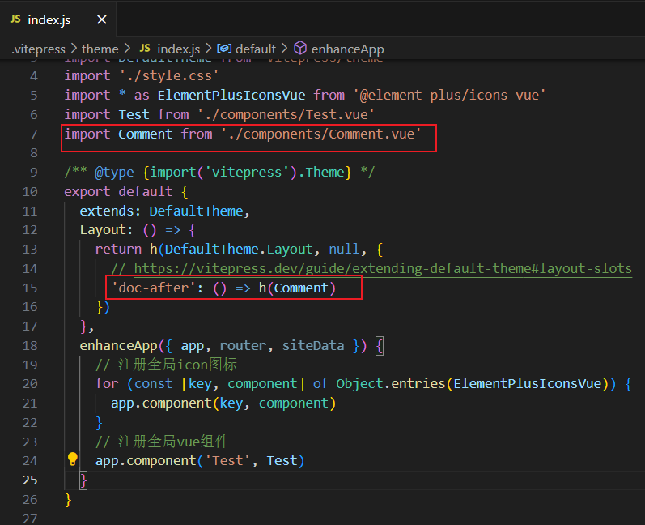

# 图片

## 图片路径问题

不缩放的路径:

~~~bash

~~~

缩放的路径:

~~~bash

~~~

- 注意：缩放的路径要以 ./ 相对路径开头，不然会报路径错误

## 图片缩放

1.安装medium-zoom

~~~bash
pnpm add -D medium-zoom
~~~

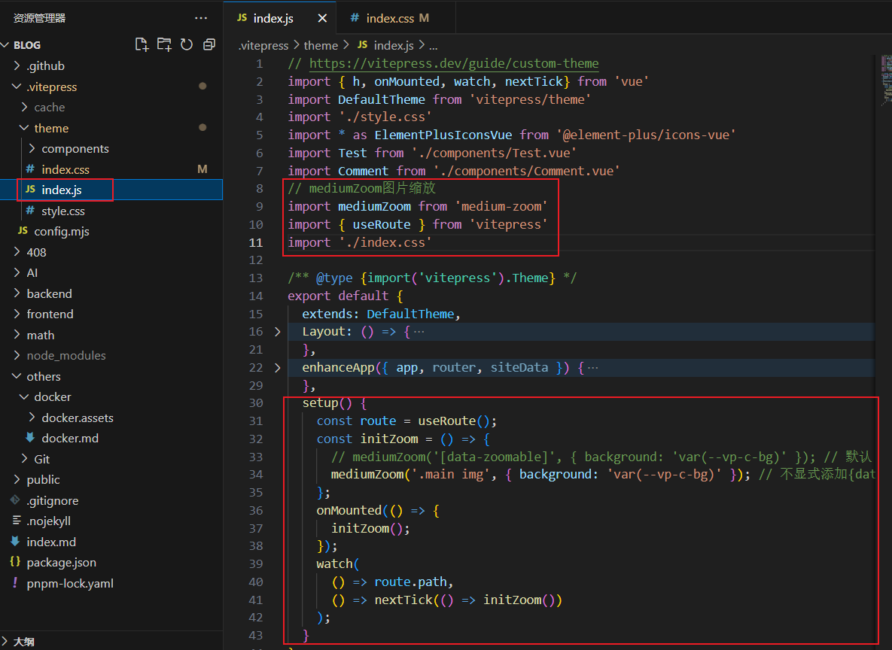

~~~js
// https://vitepress.dev/guide/custom-theme
import { h, onMounted, watch, nextTick} from 'vue'
import DefaultTheme from 'vitepress/theme'
import './style.css'
import * as ElementPlusIconsVue from '@element-plus/icons-vue'
import Test from './components/Test.vue'
import Comment from './components/Comment.vue'
// mediumZoom图片缩放
import mediumZoom from 'medium-zoom'
import { useRoute } from 'vitepress'
import './index.css'

/** @type {import('vitepress').Theme} */
export default {
  extends: DefaultTheme,
  Layout: () => {
    return h(DefaultTheme.Layout, null, {
      // https://vitepress.dev/guide/extending-default-theme#layout-slots
      'doc-after': () => h(Comment)
    })
  },
  enhanceApp({ app, router, siteData }) {
    // 注册全局icon图标
    for (const [key, component] of Object.entries(ElementPlusIconsVue)) {
      app.component(key, component)
    }
    // 注册全局vue组件
    app.component('Test', Test)
  },
  setup() {
    const route = useRoute();
    const initZoom = () => {
      // mediumZoom('[data-zoomable]', { background: 'var(--vp-c-bg)' }); // 默认
      mediumZoom('.main img', { background: 'var(--vp-c-bg)' }); // 不显式添加{data-zoomable}的情况下为所有图像启用此功能
    };
    onMounted(() => {
      initZoom();
    });
    watch(
      () => route.path,
      () => nextTick(() => initZoom())
    );
  }
}
~~~

2.引入样式

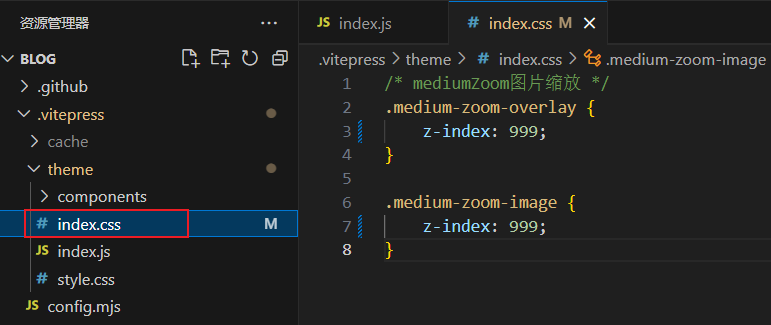

~~~css
/* mediumZoom图片缩放 */
.medium-zoom-overlay {
    z-index: 999;
}

.medium-zoom-image {
    z-index: 999;
}
~~~

# ToDo

## 自动提取md标题作为sidebar

- 自动提取md文件的h1~h6标题，生成可折叠的sidebar

- 配合后台管理系统，管理博客
  - 博客上传
  - 博客导出
  - 博客删除
  - 博客修改

## 集成ChatGpt

1.创建项目秘钥
https://platform.openai.com/api-keys

2.为所有项目设置秘钥

打开cmd，输入：

~~~bash
setx OPENAI_API_KEY "秘钥"
~~~

3.添加环境变量，永久存储秘钥

在“系统变量”部分，单击“新建...”，然后输入 OPENAI_API_KEY 作为变量名称，输入您的 API 密钥作为变量值

验证：

~~~bash
echo %OPENAI_API_KEY%
~~~

**配置代理服务器？？？？**

## 后台管理系统

# 部署

## git actions

1.构建

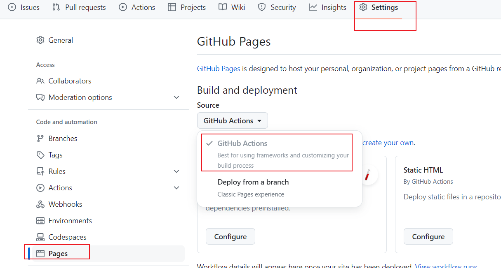

2.设置工作流

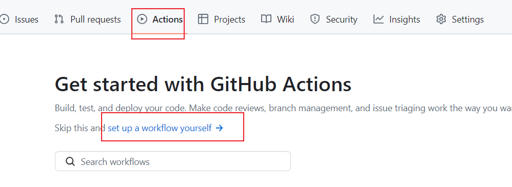

4.yml文件

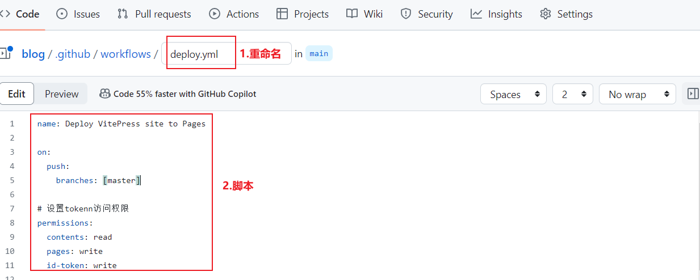

~~~yaml
# 构建 VitePress 站点并将其部署到 GitHub Pages 的示例工作流程
#
name: Deploy VitePress site to Pages

on:
  # 在针对 `main` 分支的推送上运行。如果你
  # 使用 `master` 分支作为默认分支，请将其更改为 `master`
  push:
    branches: [main]

  # 允许你从 Actions 选项卡手动运行此工作流程
  workflow_dispatch:

# 设置 GITHUB_TOKEN 的权限，以允许部署到 GitHub Pages
permissions:
  contents: read
  pages: write
  id-token: write

# 只允许同时进行一次部署，跳过正在运行和最新队列之间的运行队列
# 但是，不要取消正在进行的运行，因为我们希望允许这些生产部署完成
concurrency:
  group: pages
  cancel-in-progress: false

jobs:
  # 构建工作
  build:
    runs-on: ubuntu-latest
    steps:
      - name: Checkout
        uses: actions/checkout@v4
        with:
          fetch-depth: 0 # 如果未启用 lastUpdated，则不需要
      - uses: pnpm/action-setup@v3 # 如果使用 pnpm，请取消注释
        with:
          version: 9.1.4
      # - uses: oven-sh/setup-bun@v1 # 如果使用 Bun，请取消注释
      - name: Setup Node
        uses: actions/setup-node@v4
        with:
          node-version: 18
          cache: pnpm # 或 pnpm / yarn
      - name: Setup Pages
        uses: actions/configure-pages@v4
      - name: Install dependencies
        run: pnpm install # 或 pnpm install / yarn install / bun install
      - name: Build with VitePress
        run: pnpm run docs:build # 或 pnpm docs:build / yarn docs:build / bun run docs:build
      - name: Upload artifact
        uses: actions/upload-pages-artifact@v3
        with:
          path: .vitepress/dist

  # 部署工作
  deploy:
    environment:
      name: github-pages
      url: ${{ steps.deployment.outputs.page_url }}
    needs: build
    runs-on: ubuntu-latest
    name: Deploy
    steps:
      - name: Deploy to GitHub Pages
        id: deployment
        uses: actions/deploy-pages@v4
~~~

## css样式丢失

1.项目根目录下添加 .nojekyll 空文件

2.添加base

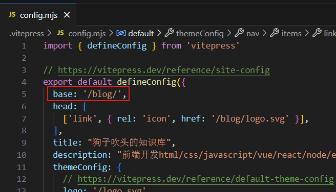