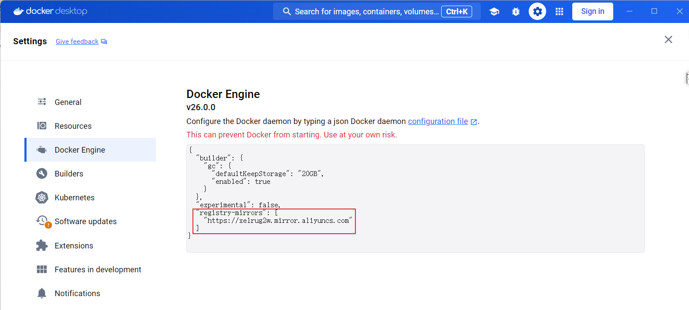
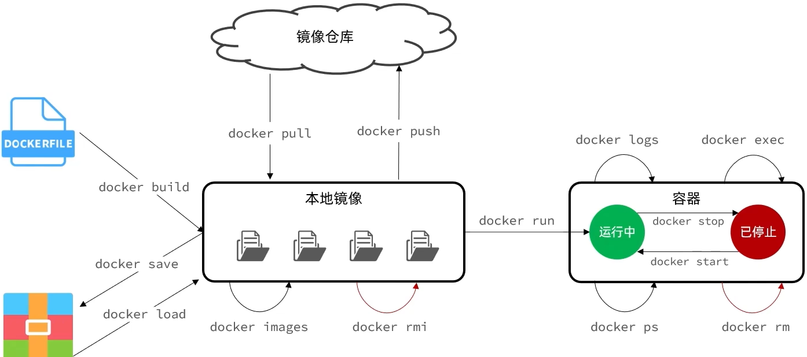
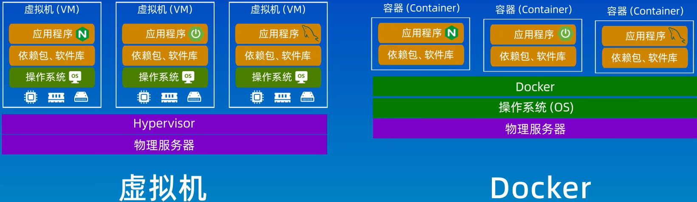
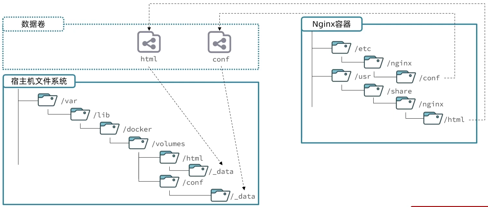
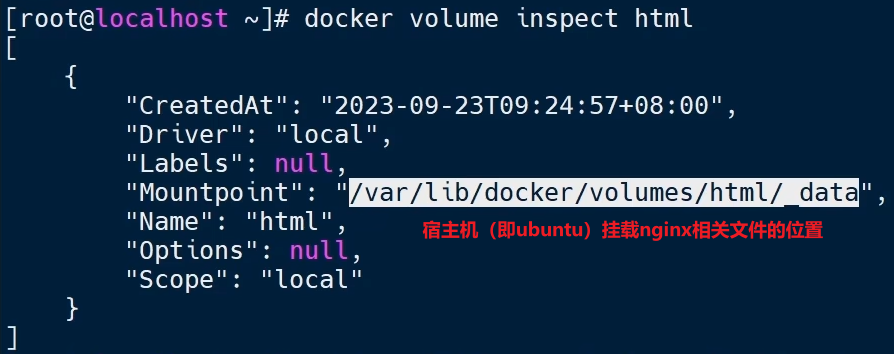

# WSL

启动、关闭wsl：

~~~bash
# 设置默认运行的linux版本
wsl --set-default <Distribution Name>

# 启动wsl，默认启动为默认运行的linux版本（如ubuntu）
wsl

# 关闭wsl
wsl --shutdown

# 查看wsl状态
wsl --status
~~~

安装、删除linux发行版：

~~~bash
# 查看所有可用的linux发行版
wsl --list --online

# 安装linux，-d指定版本
wsl --install -d <Distribution Name>

# 列出已经安装的linux版本
wsl --list --verbose

# 删除linux版本
wsl --unregister <Distribution Name>
~~~

修改默认安装目录

~~~bash
# 导出linux为tar压缩文件
wsl --export Ubuntu d:\wsl-ubuntu.tar

# 注销当前linux版本
wsl --unregister Ubuntu

# 重新导入并安装WSL在d:\wsl-ubuntu
wsl --import Ubuntu d:\wsl-ubuntu d:\wsl-ubuntu.tar --version 2

# 设置默认登陆用户为安装时用户名
ubuntu config --default-user Username
~~~

# docker安装以及配置

## 安装Docker Engine

https://docs.docker.com/engine/install/ubuntu/

## 配置国内镜像

linux中使用阿里云镜像加速:

https://cr.console.aliyun.com/cn-hangzhou/instances/mirrors

docker客户端工具：

~~~bash
"registry-mirrors": [
  "https://xelrug2w.mirror.aliyuncs.com"
]

~~~

# docker命令

## 常用命令

~~~bash
# 查看命令的帮助信息
docker 命名 --help
~~~

## 镜像管理

**镜像**：就是像是我们装机时候需要的系统盘或者系统镜像文件iso，这里它负责创建docker容器的，有很多官方现成的镜像：node、mysql、monogo、nginx可以从远程仓库下载

~~~bash
# 在DockerHub上搜索镜像
docker search [image_name]

# 获取镜像
# 获取的镜像，存放在/var/lib/docker 目录下
docker pull [image_name]

# 列出所有的本地的images(包括已删除的镜像记录)
docker images -a

# 重命名镜像名和版本号
docker tag [old_image]:[old_version] [new_image]:[new_version]

# 镜像保存到本地（会保存镜像的所有历史记录和元数据信息）
docker save -o [包文件.tar] [image_name]
docker save [image_name1]... [image_namen] > [包文件.tar]

# 删除镜像
docker rmi [image_id/image_name:image_version]

# 导入镜像
docker load < [image.tar_name]
~~~

## 容器管理

**容器**：容器类似一个虚拟机，容器中运行着一个操作系统，而且这个操作系统启动了某些服务。 这里的容器指的是运行起来的一个 Docker 镜像

~~~bash
# 显示正在运行的容器（-a显示所有，包括已经不运行的容器）
docker ps -a

# 守护进程的方式运行镜像，同时会创建并且启动容器
docker run -d \
	--name [container_name] \
	-p  [宿主机端口]:[容器中该进程的端口] \
	-e k1=v1 \
	-e k2=v2 \
	[image_name]:[tag]

# 关闭容器
docker stop [container_id]

# 启动已终止的容器
docker start [container_id]

# 删除容器
docker rm [container_id]

# 进入正在运行的容器（如含有mysql的容器，能执行mysql命令）
docker exec -it [container_id] bash

# 退出容器
exit

# 查看容器运行日志
docker logs [container_id]
# -f flow流
docker logs -f [container_id]
# 查看容器全部信息
docker inspect [container_id]
# 查看容器网络信息
docker inspect --format='{{range .NetworkSettings.Networks}}{{.IPAddress}}{{end}}' [container_id]

# 查看所有开机自启的容器
docker inspect -f '{{.Name}} {{.HostConfig.RestartPolicy.Name}}' $(docker ps -aq)
# 设置容器开机自启
docker update --restart unless-stopped [container_id]
# 取消容器的开机自启
docker update --restart no [container_id]
~~~

**例子：mysql部署**

~~~bash
docker run -d \
	--name [container_name] \
	-p  [自定义宿主机的端口]:[容器中该进程的端口] \
	-v [自定义数据卷的名称]:[容器中的目录]
	-e k1=v1 \
	-e k2=v2 \
	[image_name]:[tag]
~~~

- -d 在后台运行（守护进程）
- --name 指定（唯一的）容器名
- -v 数据卷的挂载
- -p 设置端口映射
- -e 环境变量配置，在官方镜像中查看配置

- `[image_name]:[tag]`查找镜像名和指定的版本

~~~bash
docker run -d \
	--name mysql \
	-p  3306:3306 \
	-e TZ=Asain/Shanghai \
	-e MYSQL_ROOT_PASSWORD=root \
	mysql
~~~

- 省略tag，则默认安装最新版

## 仓库管理

**仓库**：仓库就像是github那样的，我们可以制作镜像然后push 提交到云端的仓库，也可以从仓库 pull 下载镜像

Docker 的仓库有三大类：

- 公有仓库：Docker hub、Docker cloud、等
- 私有仓库：registry、harbor 等
- 本地仓库：在当前主机存储镜像的地方

~~~bash
docker login [仓库名称]
docker search [镜像名称]
docker pull [镜像名称]
docker push [镜像名称]
~~~

## 数据卷挂载

- 数据卷（volume）：是一个虚拟目录，是容器目录与宿主机目录之间映射的桥梁
- 宿主机下的文件目录会自动创建，宿主机和容器之间**双向绑定**

**例子：nginx**

启动容器时，挂载数据卷：

~~~bash
docker run -d \
	--name [container_name] \
	-p  [自定义宿主机的端口]:[容器中该进程的端口] \
	-v [自定义数据卷的名称]:[容器中的目录]
	-e k1=v1 \
	-e k2=v2 \
	[image_name]:[tag]
~~~

- -d 在后台运行（守护进程）
- --name 指定（唯一的）容器名
- -v 数据卷的挂载
- -p 设置端口映射
- -e 环境变量配置，在官方镜像中查看配置

- `[image_name]:[tag]`查找镜像名和指定的版本

例子：将nginx下的`/usr/share/nginx/html`挂载到数据卷`html`

~~~bash
# 创建容器的同时，-v创建数据卷
docker run -d --name nginx -p  80:80 -v html:/usr/share/nginx/html nginx
	
# 查看所有数据卷
docker volume ls

# 查看数据卷详情
# docker volume inspect [数据卷名]
docker volume inspect html

# 删除指定数据卷
docker volume rm [数据卷名]
~~~

**windows环境下**数据卷的存放路径：`\\wsl.localhost\Ubuntu\var\lib\docker\volumes\html\_data`

**linux环境下**数据卷的存放路径：

## 本地目录挂载

# Dockerfile 

# 常见部署

## nginx

~~~bash
# 查看版本
nginx -v

# 查看是否启动
service nginx status

# 在浏览器中访问
http://localhost:80
~~~

~~~bash
# 进入nginx配置文件
cd /etc/nginx

# 备份配置文件nginx.conf

~~~

