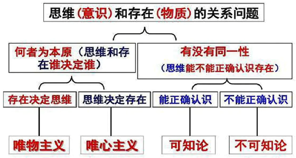
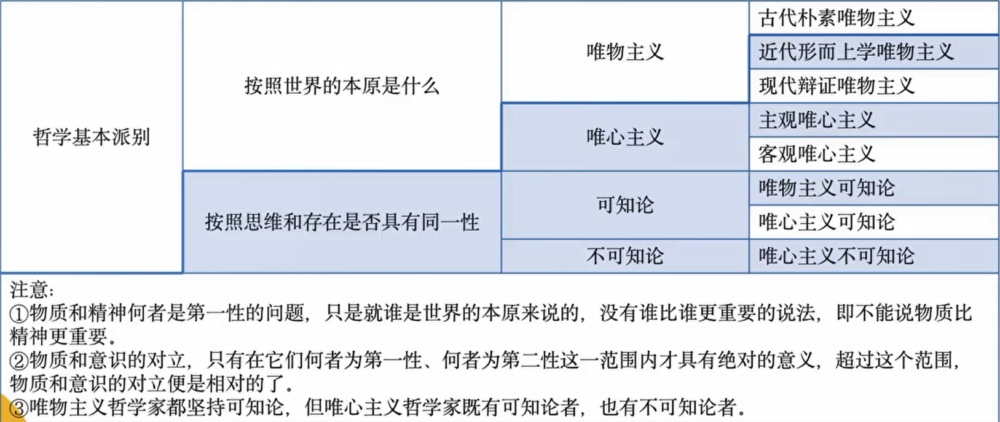
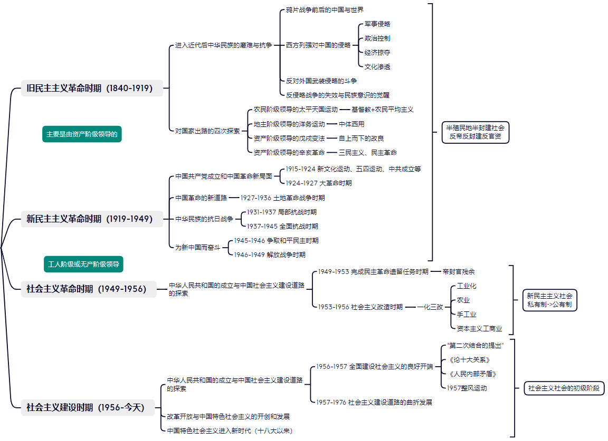

## 马原

### 哲学概念

**哲学的概念**：哲学是系统化、理论化的世界观和方法论。有科学和非科学之分

**哲学与具体知识的关系**：共性与个性、一般与个别的关系

**哲学基本问题**：哲学根本问题又称哲学的基本问题、哲学的最高问题，它是指思维和存在、意识和物质的关系问题。

**哲学基本问题的两个方面**：

1. 思维和存在何者为第一性、何者为第二性，即思维和存在谁是世界的本原，这是划分唯物主义和唯心主义的唯一标准。
   - 唯物主义坚持把世界的本原归结为物质，主张物质第一性，意识第二性
   - 唯心主义坚持把世界的本原归结为精神，主张意识第一性，物质第二性
2. 思维和存在有无同一性，即思维能否正确认识存在，这是划分可知论和不可知论的唯一标准。
   - 可知论：意识可以认识物质
   - 不可知论：意识不能或不能完全认识物质

### 马克思

**马克思主义哲学的直接理论来源**：德国古典哲学，主要是黑格尔的辩证法和费尔巴哈的唯物主义。

**马克思一生的两大发现**：

1. 唯物史观：揭示了人类历史的发展规律

2. 剩余价值学说：揭示了资本主义生产方式及其社会形态的运动规律。正是由于这两大发现，社会主义才从空想变成了科学。

**马克思恩格斯的经典著作**：

1. 1844 年 2 月，马克思和恩格斯发表在《德法年鉴》上的论文表明，他们完成了从唯心主义向唯物主义、从革命民主主义向共产主义的转变，为创立马克思主义奠定了思想前提。
2. 1844 年至 1846 年，马克思、恩格斯先是在巴黎合写了《神圣家族》，接着又合写了《德意志意识形态》，其首次系统阐述了历史唯物主义的基本观点，实现了历史观上的伟大变革。
3. 1848 年 2 月，马克思和恩格斯为世界上第一个无产阶级政党——共产主义者同盟，起草了党纲《共产党宣言》，这标志着马克思主义的公开问世。
4. 1867 年，《资本论》第一卷的出版，系统阐述了剩余价值学说，揭示了资本主义生产关系的秘密，被誉为“工人阶级的圣经”。

### 唯物主义和唯心主义

**唯物主义的三种形态**：唯物主义将世界的本原归结为物质，主张物质第一性，意识第二性，认为意识是物质的产物。物质范畴是唯物主义哲学理解世界本原和统一性的前提，是唯物主义世界观的基石。依据对“物质”认识的深度和广度可将唯物主义区分为三种形态：

1. 古代朴素唯物主义：从具体的物质形态出发说明世界，把物质等同于物质的具体形态，对世界物质性的理解和把握具有直观性和朴素性
2. 近代形而上学唯物主义：根据当时自然科学关于原子是物质最小单
   位的认识，把物质归结为原子，认为原子的属性就是一切物质形态的共同属性。
3. 现代辩证唯物主义：从无限多样的物质现象中抽象出共同的特性，从哲学上做了最高概括，指出客观实在性是物质的本质规定。

**唯心主义的两种基本形式**：唯心主义将世界的本原归结为精神，主张意识、理念（法则）等第一性，物质第二性，物质是意识的产物。根据世界本原的意识是本我的意识还是独立于“我”之外的客观精神，唯心主义可以划分为客观唯心主义和主观唯心主义。

1. 客观唯心主义：作为世界本源的意识是独立于人之外的客观精神
2. 主观唯心主义：作为世界本源的意识是人的意识

**意识的含义和本质**：意识是物质世界长期发展的产物，是人脑的机能和属性，是物质世界的主观映象。意识是物质的产物，但又不是物质本身，意识是人脑的机能和属性。意识从其本质来看，是客观内容和主观形式的统一

**意识的起源和三个发展阶段**：从其起源来看，意识首先是自然界长期发展的产物。意识的形成经历了三个发展阶段：

1. 第一个阶段是一切物质所具有的反应特性到低等生物所具有的刺
   激感应性阶段

2. 第二个阶段是高等动物所具有的感觉和心理阶段

3. 第三个阶段是最终发展为人类的意识阶段

**物质与意识的辩证关系**：物质决定意识，意识依赖于物质并反作用于物质。

**物质对意识的决定作用**：

1. 从起源上看，意识是自然界和人类社会(二者之和叫物质世界)
   的产物。
2. 从本质上看，意识是人脑(高级物质、特殊物质)的机能和属性，是对客观世界的主观反映。
3. 从作用上看，意识能动性的发挥必须以尊重物质世界的客观规律为前提。

**意识的能动作用**：即意识的反作用，是指人的意识所特有的积极认识世界与改造世界的能力和活动。主要表现为：

1. 意识反映世界具有自觉性、目的性和计划性。
2. 意识活动具有创造性。
3. 意识具有指导实践改造客观世界的作用。
4. 意识具有指导、控制人的行为和生理活动的作用

### 联系和发展

**唯物辩证法的总特征**：联系和发展的观点是唯物辩证法的总观点，集中体现了唯物辩证法的总特征

**联系的特点**：联系是指事物内部各要素之间和事物之间相互影响、相互制约和相互作用的关系，具有客观性、普遍性、多样性、条件性等一系列特点

1. 客观性：联系是客观存在的，是事物本身固有的，不以人的意志为转移
2. 普遍性：事物内部有联系、事物之间有联系、整个世界都是一个普遍联系的整体
3. 多样性：内部的、外部的、直接的、间接的等等

4. 条件性：

**发展的实质**：发展是前进上升的运动，发展的实质是新事物的产生和旧事物的灭亡

1. 新事物是指合乎历史前进方向、具有远大前途的东西
2. 旧事物是指丧失历史必然性、日趋灭亡的东西

**发展的过程性**：一切事物只有经过一定的过程才能实现自身的发展。所谓过程是指一切事物都有其产生、发展和转化为其他事物的历史，都有它的过去、现在和未来。

**辩证法**：坚持用联系的、发展的观点看世界，认为发展的根本原因在于事物的内部矛盾。

**形而上学**：坚持用孤立的、静止的观点看世界，否认事物内部矛盾的存在和作用。

## 思道法

**我国发展新的历史方位**：新时代

- 历史阶段没变，依然是社会主义初级阶段

**新时代我国社会主要矛盾**：中国特色社会主义进入新时代，我国社会主要矛盾已经转化为人民日益增长的美好生活需要和不平衡不充分的发展之间的矛盾

**新时代的内涵**：

1. 这个新时代是承前启后、继往开来，在新的历史条件下继续夺取中国特色社会主义伟大胜利的时代。
2. 这个新时代是决胜全面建成小康社会、进而全面建设社会主义现代化强国的时代。
3. 这个新时代是全国各族人民团结奋斗、不断创造美好生活、逐步实现全体人民共同富裕的时代。
4. 这个新时代是全体中华儿女勠力同心、奋力实现中华民族伟大复兴中国梦的时代。
5. 这个新时代是我国日益走近世界舞台中央、不断为人类作出更大贡献的时代。

**新时代的战略安排**：党的十九大在接续全面建成小康社会的基础上，将实现第二个百年奋斗目标分两个阶段来安排：

1. 第一个阶段，从2020年到2035年，在全面建成小康社会的基础上，再奋斗十五年，基本实现社会主义现代化。
2. 第二个阶段，从2035年到本世纪中叶，在基本实现现代化的基础上，再奋斗十五年，把我国建成富强民主文明和谐美丽的社会主义现代化强国

**世界观的内涵**：世界观是人们对生活在其中的世界以及人与世界的关系的总体看法和根本观点

**人生观的内涵**：人生观是人们在实践中形成的对于人生目的和意义的根本看法。

**爱国主义的内涵**：爱国主义体现了人们对自己祖国的深厚感情，揭示了个人对祖国的依存关系，是人们对自己家园以及民族和文化的归属感、认同感、尊严感与荣誉感的统一，是调节个人与祖国之间关系的道德要求、政治原则和法律规范。

**中国革命道德的发展和形成**：中国革命道德萌芽于五四运动前后，发端于中国共产党成立以后蓬勃发展的伟大工人运动和农民运动，经过土地革命战争、抗日战争、解放战争以及社会主义革命、建设与改革的长期发展，逐渐形成并不断发扬光大。

**中国革命道德的主要内容**：

1. 为实现社会主义和共产主义理想而奋斗。坚持社会主义、共产主义理想和信念的不屈不挠的精神，是革命道德的灵魂。
2. 全心全意为人民服务。全心全意为人民服务作为贯穿中国革命道德始终的一根红线。
3. 始终把革命利益放在首位。
4. 树立社会新风，建立新型人际关系。
5. 修身自律，保持节操。

**个人品德的内涵**：个人品德是通过社会道德教育和个人自觉的道德修养所形成的稳定的心理状态和行为习惯。

**个人品德的作用**：个人品德在社会道德建设中具有基础性的作用。社会公德、职业道德和家庭美德建设，最终都要落实到个人品德的养成上。

**法律的内涵**：法律是由国家制定或认可并由国家强制力保证实施的，反映由特定社会物质生活条件所决定的统治阶级意志的规范体系。

**我国宪法的地位**：宪法是中华人民共和国的根本大法，规定拥有最高法律效力。宪法是治国安邦的总章程，是党和人民意志的集中体现，是中国特色社会主义法律体系的核心，在全民依法治国中具有突出地位和重要作用。

## 当代

**联合国的宗旨**：维护国际和平与安全；发展国际间以尊重各国人民平等权利及自决原则为基础的友好关系；进行国际合作，以解决国际间经济、社会、文化和人道主义性质的问题，并促进对于全体人类的人权和基本自由的尊重。

**在后疫情时代，联合国需要发挥的作用**：

1. 主持公道。
2. 厉行法治。
3. 促进合作。
4. 聚焦行动。

**中国恢复联合国合法席位及其意义**：1971 年 10 月 25 日，中国恢复在联合国合法地位。中国重返联合国是中国外交史上的重大事件。中国恢复在联合国的合法席位，是我国外交史上的一次伟大胜利。从此，中华人民共和国正式作为联合国安全理事会 5 个常任理事国之一，登上世界政治大舞台，大大改变了联合国及安理会投票的意志和愿望，为实现联合国宪章的宗旨，更好地维护世界和平、促进世界的发展作出自己的不懈努力。

**中国的和平发展道路**：走和平发展道路，就是要把中国国内发展与对外开放统一起来，把中国的发展与世界的发展联系起来，把中国人民的根本利益与世界人民的共同利益结合起来。

**和平共处五项原则的内容**：互相尊重主权和领土完整、互不侵犯、互不干涉内政、平等互利、和平共处。

**中国和平崛起的来源**：

1. 中国走和平发展道路的自信和自觉，来源于中华文明的深厚渊源。
2. 中国走和平发展道路的自信和自觉，来源于对实现中国发展目标条件的认知。
3. 中国走和平发展道路的自信和自觉，来源于对世界发展大势的把握。

**一带一路的内涵**：“一带一路”是“丝绸之路经济带”和“21 世纪海上丝绸之路”的简称。

**一带一路的原则理念**：坚持共商、共建、共享，坚持开放、绿色、廉洁，坚持高标准、惠民生、可持续。

**人类命运共同体思想的提出**：2015 年 9 月，习近平在纽约联合国总部发表重要讲话指出：“当今世界，各国相互依存、休戚与共。我们要继承和弘扬联合国宪章的宗旨和原则，构建以合作共赢为核心的新型国际关系，打造人类命运共同体。”

**构建人类命运共同体思想的重大意义**：构建人类命运共同体思想顺应了历史潮流，回应了时代要求，凝聚了各国共识，为人类社会实现共同发展、持续繁荣、长治久安绘制了蓝图。这一思想继承和发展了新中国不同时期重大外交思想和主张，反映了中外优秀文化和全人类共同价值追求，适应了新时代中国与世界关系的历史性变化，成为中国引领时代潮流和人类文明进步方向的鲜明旗帜，已被多次写入联合国文件，对中国的和平发展、世界的繁荣进步都具有重大和深远的意义。

## 毛中特

### 马克思主义中国化

**总论**：

1. 又叫马克思主义中国化时代化
2. 两个结合：马克思主义与中国具体实际相结合、与中国优秀传统文化相结合
3. 马克思主义中国化的飞跃
   - 第一次飞跃：毛泽东思想
   - 第二次飞跃：中国特色社会主义理论体系
   - 新的飞跃（考试中出现第三次飞跃也正确）：习近平新时代中国特色社会主义思想

**马克思主义为什么要中国化（必要性/必然性）**:

1. 中国的具体实际有需要（需要理论指导）
2. 马克思主义的理论有需要（需要结合实际）

**马克思主义在中国的发展历程**：

1. 传入中国：19世纪莫20世纪初
2. 系统传播阶段：李大钊的《我的马克思主义观》
3. 广泛传播阶段：五四运动
4. 指导中国革命
5. 教条主义错误
6. 提出马克思主义中国化的命题：1938年马泽东在六届六中全会发表《论新阶段》

**马克思主义中国化的可能性**：

1. 中国革命、建设和改革的实践需要马克思主义的指导
2. 马克思主义需要与实践相结合
3. 马克思主义与中华传统文化具有**相容性（相似、互补）**

### **马克思主义中国化的哲学分析**

本命题体现的最核心的哲学观点：共性与个性、普遍性与特殊性

### 马克思主义中国化的理论成果

**1.新民主主义革命理论**（—1949）

以1919五四运动为分界线，分为旧民主主义革命和新民主主义革命

旧民主主义革命

- 领导阶级：资产阶级
- 革命性质：资产阶级革命

新民主主义革命

- 领导阶级：无产阶级
- 革命性质：资产阶级革命

由无产阶级领导的革命性质为什么是资产阶级革命？

1. 决定革命性质的因素：革命任务和革命对象。

2. 当时的革命对象：反对帝国主义、封建主义、官僚资本主义

为什么是无产阶级领导？

1. 资产阶级自身的软弱，无法承担革命任务

2. 无产阶级最先进，能承担革命任务

**2.社会主义改造理论**（1949—1956）

- 革命性质：社会主义革命
- 革命任务：反资反私
- 革命对象：民族资产阶级

**3.社会主义建设的初步探索**（1956—1976）

**4.邓三科**

**邓小平理论**

- 解决问题：什么是社会主义、怎么建设社会主义？
- 问题背景：对什么是社会主义没搞清楚

一般的社会主义：公有制、计划经济、平均分配

特色的社会主义：公私并存、市场经济、共同富裕

**“三个代表”重要思想**

- 解决问题：建设什么样的党，怎么建设党？
- 问题背景：苏东剧变。一大批社会主义国家变为资本主义，原因是党自身出现问题，导致亡党亡国

**科学发展观**

- 解决问题：实现什么样的发展，怎么发展？
- 问题背景：进入新世纪，中国快速发展，但也暴露出许多问题

**5.习近平新时代中国特色社会主义思想**

**1.中特进入新时代（背景）**

（1）方向与道路：中国式现代化方向、中国特色社会主义道路

（2）核心与中心：以党的领导为核心，以人民为中心

（3）特征与动力：全面深化改革开放

**2.全方位布局（做什么）**

（1）经济：经济发展与战略支撑

（2）政治：民主政治与法治

（3）文化：中华民族现代文明与文化强国

（4）社会：改善民生与社会治理

（5）生态：社会主义生态文明

**3.内部和外部条件（怎么做）**

国家安全、军队国防、一国两制与祖国统一、中国外交、从严治党

### 马克思主义中国化的途径

“两个结合”

1. 与中国具体实际相结合
2. 与中华优秀传统文化相结合

结合的可能：二者相互协调

结合的结果：二者相互成就——为对方开辟创新空间，筑牢道路根基，拓展历史纵深

### 新发展阶段

2021年，我们实现了第一个百年奋斗目标，继而向第二个百年奋斗目标进军，标志着我国进入了新发展阶段。

- 历史阶段没有变，仍然处于社会主义初级阶段

- 第二个百年奋斗目标进军的战略规划：
  - 2021-2025年，**基本**建成社会主义现代化强国
  - 2035年-21世纪中叶，建成社会主义现代化强国

### 新发展理念

1. 创新：创新是引领发展的**第一动力**，创新发展注重解决发展动力问题，创新摆在国家发展全局的核心位置
   - 我国已经进入创新型国家行列
   - 我国将于2035年进入创新型国家前列
2. 协调：协调是持续健康发展的内在要求，**协调发展注重解决发展不平衡问题**
3. 绿色：绿色是永续发展的必要条件和人民对美好生活追求的重要体现，绿色发展注重解决人与自然和谐共生问题
4. 开放：开放是国家繁荣发展的必由之路，开放是国家繁荣富强的**根本途径**，开放发展注重解决发展内外联动问题
5. 共享：共享是中国特色社会主义的本质要求，共享发展注重解决社会公平正义问题，坚持全民共享、全面共享、共建共享、渐进共享

### 新发展格局

**新发展格局**：以国内大循环为主，国内国际双循环

**为什么要构建新发展格局**：提升我国经济发展水平的战略抉择，塑造

我国国际经济合作和竞争新优势的战略抉择

**怎样构建新发展格局**：构建新发展格局**关键**在于经济循环的畅通无阻，坚持深化供给侧结构性改革这条**主线**，完成“三去一降一补”的重要任务

- 去产能
- 去库存
- 去杠杆
- 降成本
- 补短板

### 社会主义基本经济制度

1.所有制：公有制为主体、多种所有制经济共同发展

- 社会主义经济：公有
- 社会主义市场经济：公有、非公有
- 我国经济社会发展的重要基础：公有、非公有

2.分配制：按劳分配为主体、多种分配方式并存

- 因果关系：所有制决定分配制
- 公有制决定按劳分配、多种经济成分决定多种分配方式，多种分配方式就是按生产要素分配

3.资源配置：社会主义市场经济体制

- 关键处理好政府和市场关系：市场在资源配置中处决定性作用，政府也要更好发挥作用
- 资源配置是看不见的手（市场）和看得见的手（政府）两手抓

### 供给侧结构性改革

1.供给和需求是市场经济内在关系的两个基本方面

2.需求侧三个部分：消费、投资、出口

3.供给侧结构性改革是主线、是重点，需求侧手段仍然存在，供给侧与需求侧两头都抓

### 全过程人民民主

**1.核心逻辑**

把握社会主义民主与其他民主的区别：突破西方民主的束缚，构建自己对民主的定义权

**2.全过程人民民主**

- 表现形式：基层民主
- 重要载体：人民代表大会制度
- 实现形式：协商民主

### 社会主义核心价值观

社会主义核心价值观的地位

1. 社会主义文化强国的内核

2. 对重大问题存在基本共识

注：社会主义核心价值观≠全人类的价值观≠普世价值观

## 近现代史纲要

